# INFORME LABORATORIO 10
## Lista de Participantes - Grupo 9

- Andrea Razuri Madrid
- Isabel Leon Luna
- Johanni Bohorquez Gutierrez
- Claudia Camacho Grimaldi
- Jaime Arista Cutipa 

## Tabla de Contenidos

1. [Introducción](#1-introducción)
2. [Metodología](#2-metodología)
3. [Resultados](#3-resultados)
4. [Discusión](#4-discusión)
5. [Conclusión](#5-conclusión)
6. [Bibliografía](#6-bibliografía)

## 1. Introducción

El analisis de señales EEG es esencial en la investigacion en neurociencia, sin embargo EEG mullticanal presenta a menudo resultados difusos de la actividad cerebral, dificultando el analisis de estos datos [o]. El filtrado espacial es usado para separar la señal deseada de las fuentes de ruido y artefactos.
Los principales beneficios son la mejora de la relacion SNR (signal-noise ratio) en reduccion de artefactos [p][q].

El análisis de componentes independientes (ICA, por sus siglas en inglés) es una poderosa técnica utilizada para transformar vectores aleatorios multidimensionales observados en componentes que son estadísticamente lo más independientes posible entre sí, siendo aplicada en diversos campos como la separación ciega de fuentes y la extracción de características [a]. Esto se debe a el metodo tiene una ventaja por encima de otros tipos de filtrado espacial para separar los compnentes independientes y artefactos de la señal deseada ademas de ser facil de personalizar para la señal que se esta trabajando [b] [c].

## 2. Metodología

### 2.1. Dataset
La señal con la que se trabajó pertenece a PhysioNet de acuerdo a registros de EEG de sujetos antes y durante la realización de tareas de artimética mental. Los EEG se registraron de forma monopolar usando el sistema internacional 10/20 de 23 cananles. Se utilizó un filtro paso alto con una frecuencia de corte de 30 Hz para obtener una señal sin artefactos de 60 segundos de duración. En la etapa de procesamiento, se utilizó el Análisis de Componentes Independientes (ICA) para eliminar artefactos (músculos, ojos, superposición cardíaca, ect.). La tarea aritmética constaba de realizar la resta en serie de dos números, en donde cada prueba comenzó con la comunicación oral de número de 4 dígitos y 2 dígitos. 

### 2.2. Análisis de componentes independientes (ICA)

Para el análisis de los datos de EEG, se utilizó el método de Análisis de Componentes Independientes (ICA) con el objetivo de identificar y eliminar componentes artefactuales. Inicialmente, se realizó una evaluación visual de los componentes ICA utilizando tres criterios principales: pendiente espectral, perifericidad y suavidad espacial, tal como se describe en la literatura [x].

- Pendiente Espectral: Este criterio mide la pendiente del espectro de potencia de un componente independiente en el rango de frecuencias de 7 a 75 Hz. Los componentes de origen muscular tienden a tener pendientes positivas debido a la alta potencia en frecuencias típicas de EMG, mientras que los componentes de origen neural muestran pendientes negativas.

- Perifericidad: Este criterio evalúa la fuerza de un componente en cada electrodo ponderada por la distancia desde el vértice de la cabeza. Los componentes que tienen origen cerca del borde del casco son más probables de ser artefactos musculares, mientras que los componentes de origen neural se encuentran más cerca del centro del casco.

- Suavidad Espacial: Este criterio calcula la diferencia relativa en magnitud entre pares de electrodos ponderados por la distancia entre ellos. Los componentes que representan una mezcla de varias fuentes tienden a tener grandes variaciones locales y, por lo tanto, altos valores de suavidad espacial.

Después de la evaluación visual, se implementó un proceso de detección automática de artefactos utilizando el método find_bads_muscle de la librería mne [y]. Este método proporciona una identificación automática de componentes contaminados por EMG, basándose en un análisis más robusto de las características espectrales y espaciales.

Finalmente, se decidió tomar en cuenta el método automático para la exclusión de componentes debido a su mayor precisión en la identificación de artefactos; además, se añadió uno de los identificados en la inspección visual. Los componentes identificados como artefactos fueron excluidos del conjunto de datos utilizando la función apply de mne, y los datos corregidos se almacenaron en un nuevo archivo en formato .edf para su posterior análisis.

### 2.3 Preprocesamiento: normalización y alineamiento de la señal

#### 2.3.1 Normalización de la Señal:

Se llevó a cabo una normalización de la señal mediante la técnica de normalización z-score. Este proceso consistió en restar la media y dividir por la desviación estándar de cada canal, lo que permite estandarizar los datos y hacer que tengan media cero y desviación estándar uno. Esta normalización facilita la comparación entre diferentes canales y sujetos, eliminando sesgos debido a diferentes escalas o unidades de medida. Además, la normalización z-score ayuda a detectar outliers y mejora el rendimiento de muchos algoritmos de análisis que suponen que los datos están normalizados.

#### 2.3.2 Alineación de la Señal:

Se realizó un resampleo de la señal a una frecuencia de muestreo de 100 Hz. Este paso asegura que la señal tenga una tasa de muestreo uniforme, lo cual es importante para muchos métodos de análisis que asumen una temporalidad constante en los datos. El resampleo permite la sincronización precisa de eventos en los datos, mejora la comparabilidad entre señales y facilita la aplicación de técnicas de procesamiento y análisis que requieren una frecuencia de muestreo constante.

### 2.4 Extracción de características [h]

Se extrae las características de las señales EEG utilizando la Transformada Discreta de Wavelet (DWT) y por valores evocados obtenidos.

#### 2.4.1 Análisis por descomposición Wavelet

##### Paso 1: Preprocesamiento de Datos
- **Filtrado**: Se aplica un filtro de paso banda para eliminar el ruido y retener las frecuencias de interés (1-40 Hz).
- **Eliminación de Artefactos**: Se empleaa la señal previamente filtrada por Análisis de Componentes Independientes (ICA).

##### Paso 2: Descomposición Wavelet
- **Transformada Wavelet**: Se aplica la Transformada Discreta de Wavelet (DWT) utilizando la wavelet Daubechies 2 (db2).
- **Niveles de Descomposición**: Se descompone la señal en 4 niveles para capturar diferentes bandas de frecuencia:
  - Nivel 1 (D1): Gamma (30-100 Hz)
  - Nivel 2 (D2): Beta (12-30 Hz)
  - Nivel 3 (D3): Alfa (8-12 Hz)
  - Nivel 4 (D4): Theta (4-7 Hz)
  - Aproximación del Nivel 4 (A4): Delta (0.1-3 Hz)

##### Paso 3: Extracción de Características
Se extraen las características estadísticas de los coeficientes de detalle y aproximación en cada nivel:
- Mínimo
- Máximo
- Media
- Desviación Estándar (Std)
- Mediana
- Varianza
- Raíz Cuadrada Media (RMS)
- Asimetría (Skewness)
- Curtosis (Kurtosis)
- Entropía
- Cruces por Cero
- Cruces por la Media
- Percentiles (5º, 25º, 75º, 95º)

##### Paso 4: Agregación
- Se agrega las características a través de todos los canales para el análisis.

##### Paso 5: Visualización
- Se crea gráficos de caja y bigotes para visualizar la distribución de las características en diferentes condiciones (por ejemplo, sanos vs. epilépticos).

#### 2.4.1 Análisis por valores evocados
En este análisis, hemos procesado datos de EEG (Electroencefalografía) para estudiar las respuestas evocadas bajo diferentes condiciones experimentales. El objetivo es comprender cómo el cerebro responde a distintos tipos de estímulos presentados durante el experimento. A continuación, se detallan los pasos principales realizados en el análisis:
- Se han generado eventos ficticios a intervalos regulares (cada 2 segundos) para segmentar los datos continuos en épocas (epochs)
- Se han definido cuatro condiciones experimentales que simulan diferentes tipos de estímulos: auditivos y visuales presentados en los lados izquierdo y derecho (aud/left, aud/right, vis/left, vis/right).
- Para cada condición, se ha calculado una respuesta evocada promediada (Evoked). Esto implica promediar las épocas correspondientes a cada condición para obtener una representación limpia de la respuesta cerebral a ese tipo de estímulo

El análisis revela cómo el cerebro responde de manera diferenciada a los estímulos auditivos y visuales presentados en diferentes lados. Las respuestas evocadas proporcionan información valiosa sobre los patrones de activación cerebral asociados con cada tipo de estímulo, facilitando la identificación de diferencias significativas en las respuestas neurológicas

## 3. Resultados

### 3.1. Filtrado espacial

<table>
  <tr>
    <td>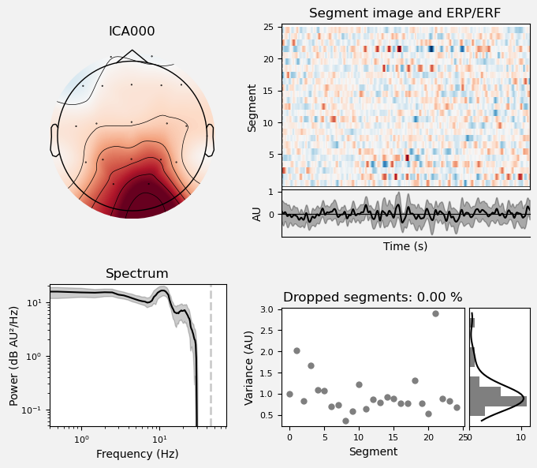</td>
    <td>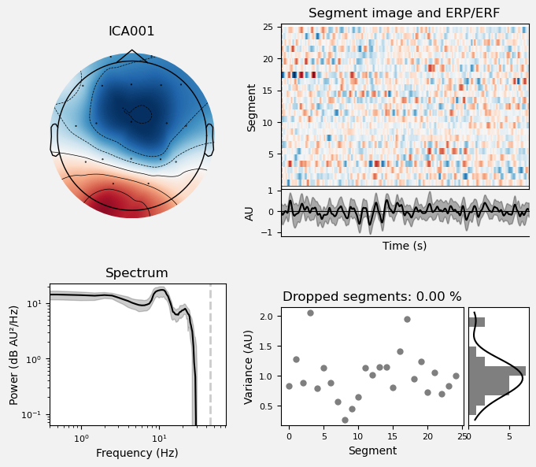</td>
    <td>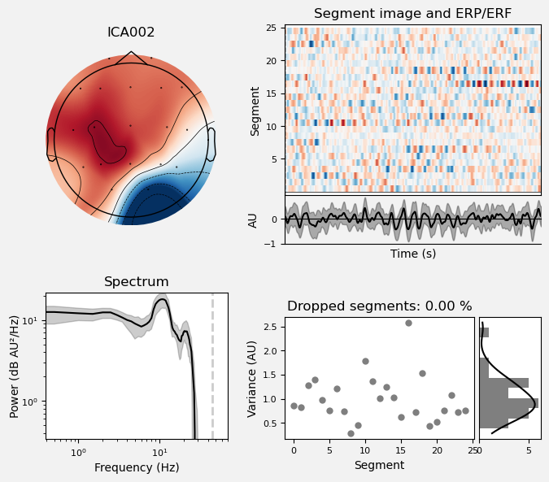</td>
  </tr>
  <tr>
    <td>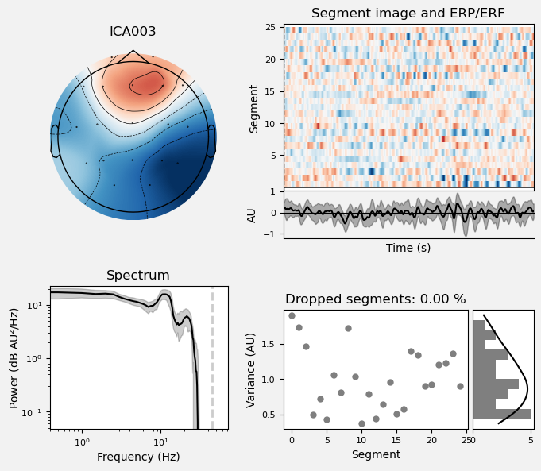</td>
    <td>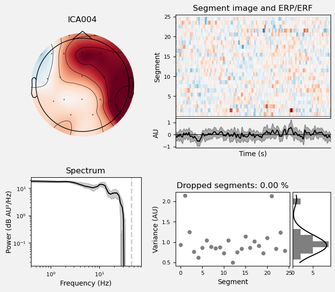</td>
    <td>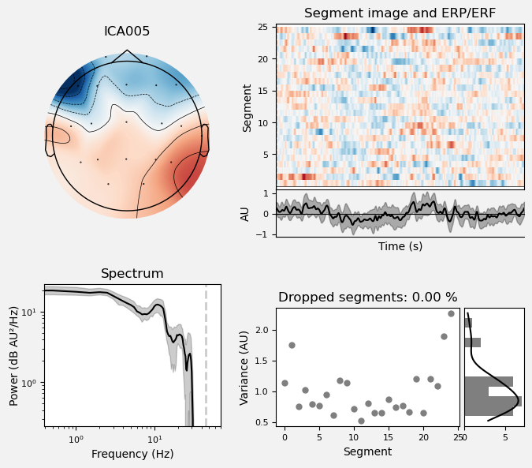</td>
  </tr>
  <tr>
    <td>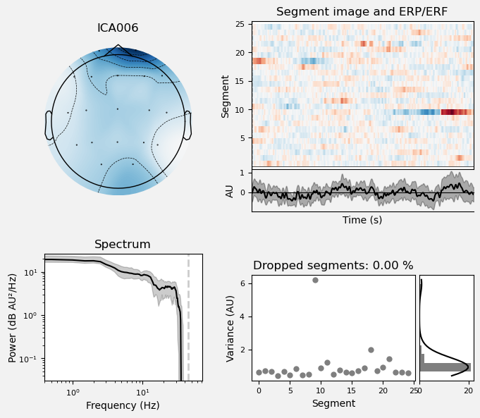</td>
    <td>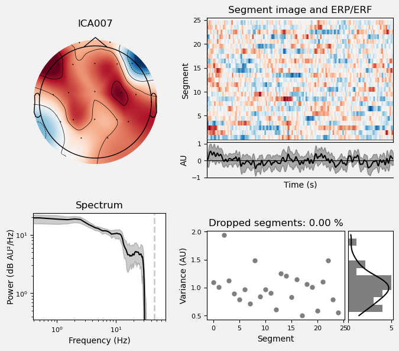</td>
    <td>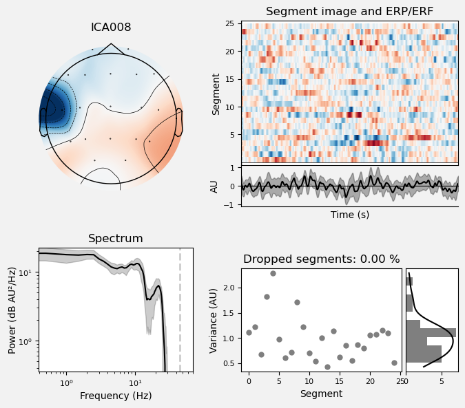</td>
  </tr>
  <tr>
    <td>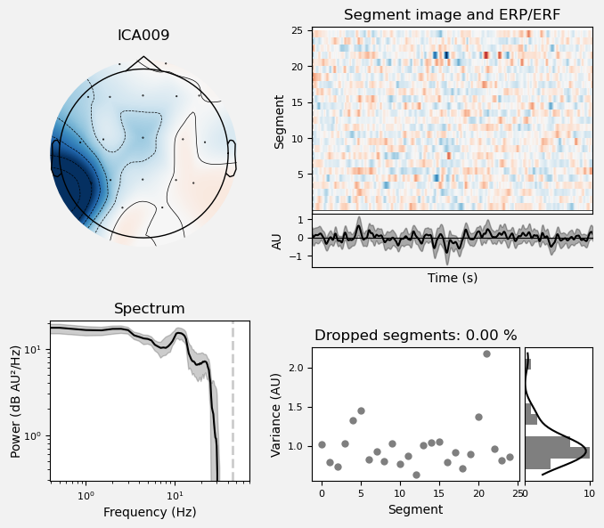</td>
    <td>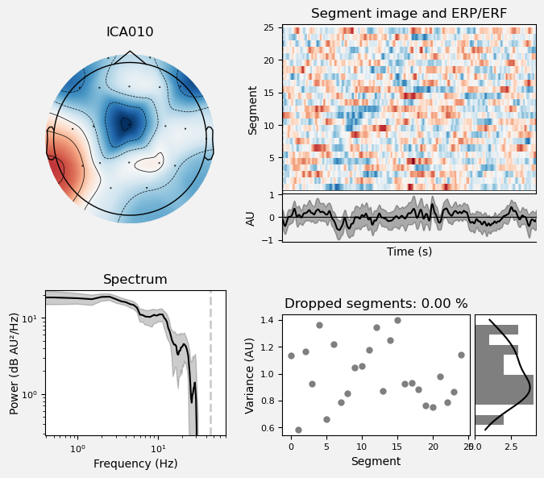</td>
    <td>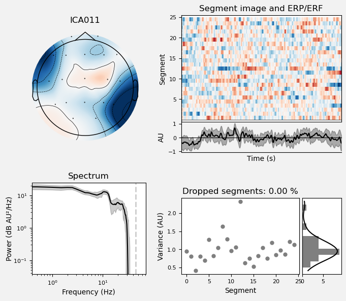</td>
  </tr>
  <tr>
    <td>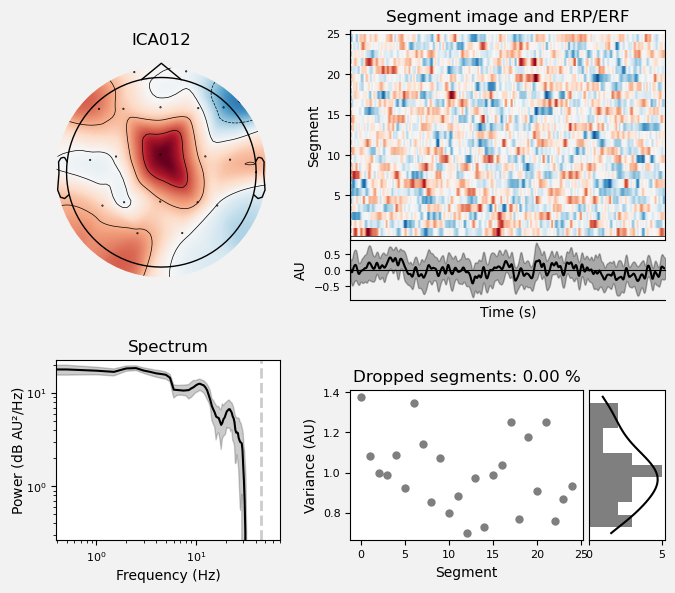</td>
    <td>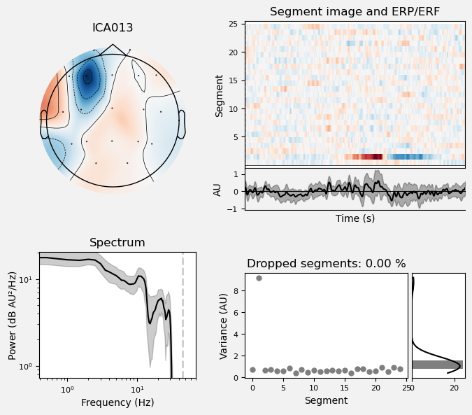</td>
    <td>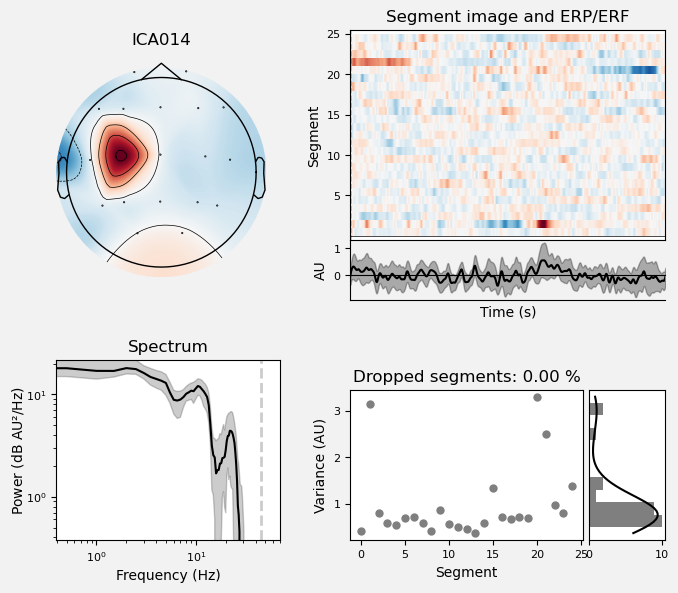</td>
  </tr>
</table>

Siguiendo los 3 criterios establecidos en la metodología, se eligió las ICAs 6, 8, 9 y 14:
 - ICA006: debido a la posición muy cerca del contorno puede considerarse un artefacto o una combinación de esto y una señal.
 - ICA008: debido a su posición cerca del borde, la poca expansión del punto de fuente y el pulso en el espectro de poder dentro del rango de 7 a 75 Hz.
 - ICA009: debido a la poca expansión del punto de fuente.
 - ICA014: debido a la poca expansión del punto de fuente y el pico en el espectro de poder entre el rango de 7 a 75 Hz.

Además, se usó la función de find_band_muscles de la librería MNE para obtener de forma automática las ICAs a eliminar:

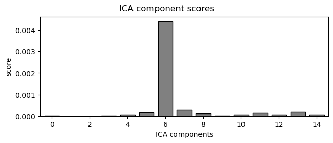 

Finalmente, después de esto se decidió eliminar ICA006 y ICA014, ya que la primera coincide con la inspección visual y la determinación automática, y la segunda visualmente es la que más probailidad tiene de ser un artefacto.

### 3.2. Señal procesada

Según los resultados que se muestran en la imagen de las señales EEG después del preprocesamiento. Cada línea horizontal representa un canal de EEG diferente, etiquetado según el sistema internacional 10-20 (Fp1, Fp2, F3, F4, F7, F8, T7, T8, C3, C4).

#### Visualización de las Épocas (epochs.plot())
1. Eje Y (Vertical):
   * Representa los distintos canales de EEG (Fp1, Fp2, F3, F4, etc)
   * Cada línea corresponde a la señal registrada por un canal específico.
2. Eje X (Horizontal):
   * Reresenta el tiempo en segundos.
   * La escala va desde 0 hasta 50 segundos.
3. Señal EEG:
   * Las oscilaciones en las líneas muestran la actividad eléctrica cerebral registrada por los electrodos en el tiempo
   * Se observan patrones rítmicos y oscilaciones regulares, lo que es típico de las señales EEG 
4. Escala de Amplitud:
   *Indica por el valor en microvoltios (µV) en la parte superior izquierda del gráfico.
   <td>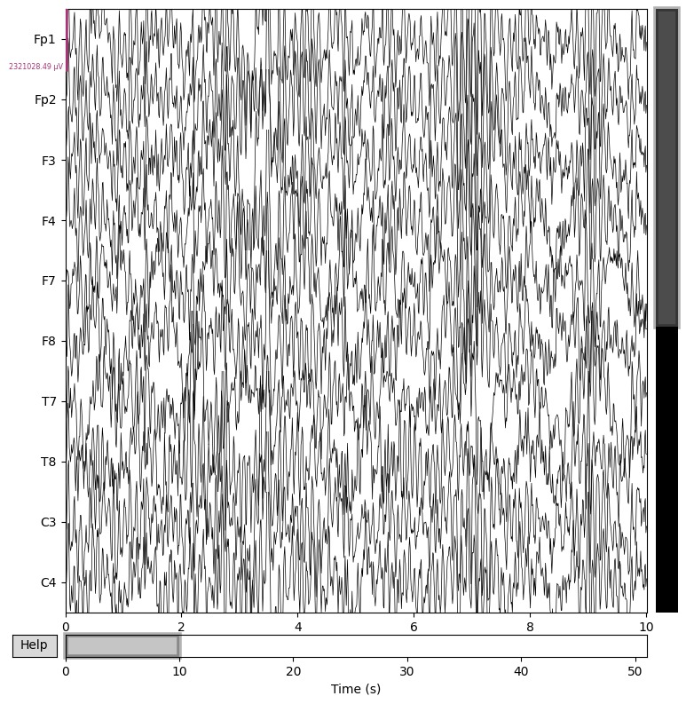</td>

### 3.3 Extracción de características
- Mean
<td>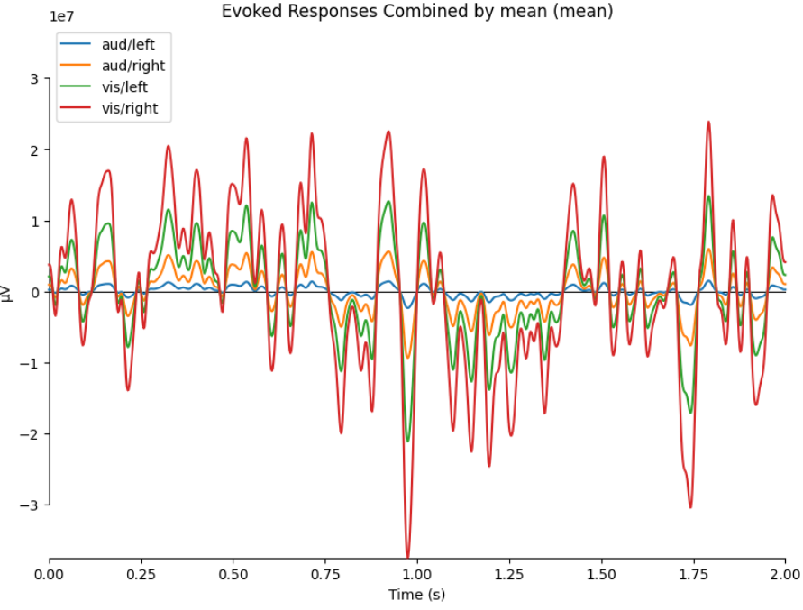</td>

- Median
<td>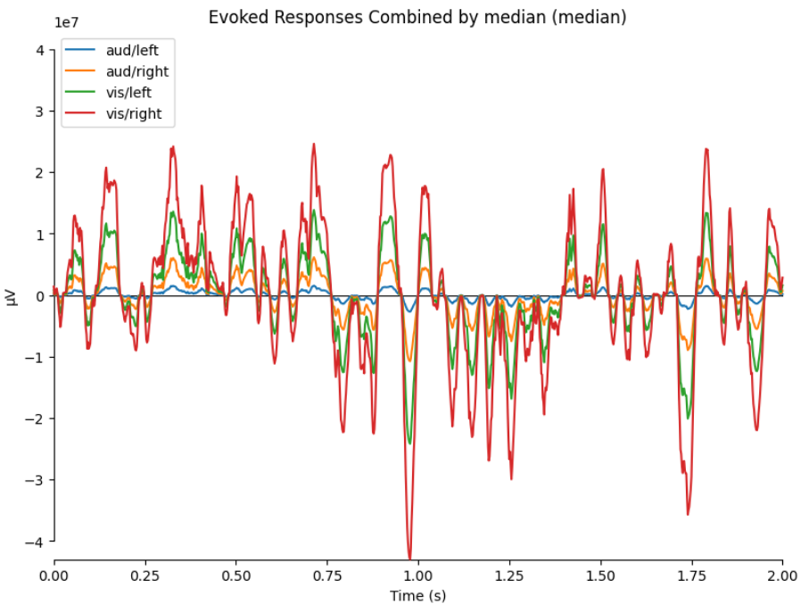</td>

- GFP
<td>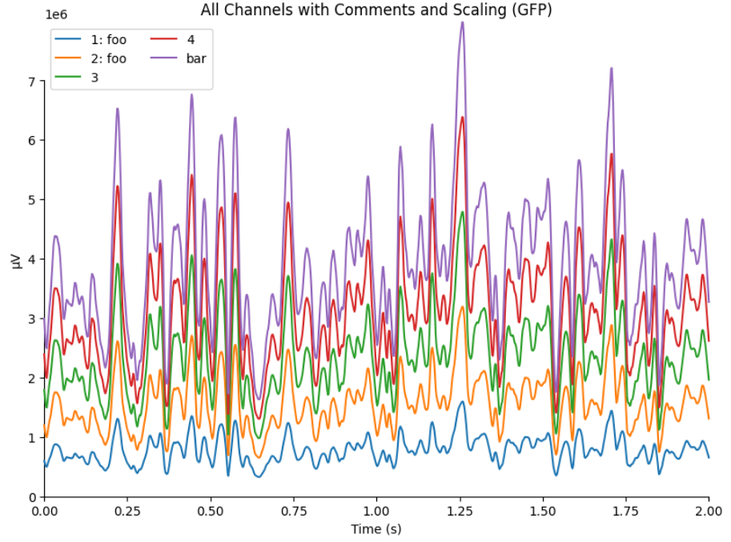</td>

### 3.4 Extracción de características Wavelet

- A continuación se muuestran las gráficas de caja y bigote por cada nivel.
  
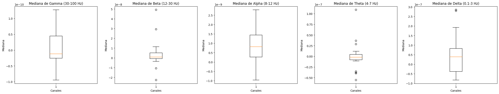</td>

## 4. Discusión

### 4.1. Análisis de filtrado espacial y procesamiento 

### 4.2 Análisis de características extraídas

* Actividad Cerebral: Las señales muestran una actividad continua y rítmica a lo largo del tiempo registrado.
* Diferencias entre los Canales: Se observan diferencias en la amplitud y la frecuencia de las oscilaciones entre los diferentes canales, lo que sugiere diferencias en la actividad cerebral subyacente en diferentes regiones.
* Patrones Temporales: Algunas señales, como Fp1 y Fp2, muestran una actividad más prominente en las frecuencias más bajas (ondas lentas), mientras que otras, como F7 y F8, exhiben oscilaciones más rápidas y de mayor frecuencias.

Dado que tus datos provienen de un estudio en PhysioNet sobre la actividad cerebral durante tareas de aritmética mental, cada época puede corresponder a un segmento donde los sujetos estaban realizando cálculos. El filtro paso alto y el uso de ICA para eliminar artefactos son técnicas estándar para limpiar los datos y asegurar que las señales que estás analizando representen la actividad cerebral relevante.

## 5. Conclusión

## 6. Bibliografía

[o] H. Cecotti, M. Eckstein, and B. Giesbrecht, "Single-Trial Classification of Event-Related Potentials in Rapid Serial Visual Presentation Tasks Using Supervised Spatial Filtering," IEEE Transactions on Neural Networks and Learning Systems, vol. 25, no. 11, pp. 2030-2042, 2014, doi: 10.1109/TNNLS.2014.2302898.

[p] S. Boudet, L. Peyrodie, G. Forzy, A. Pinti, H. Toumi, and P. Gallois, "Improvements of Adaptive Filtering by Optimal Projection to filter different artifact types on long duration EEG recordings," Computer Methods and Programs in Biomedicine, vol. 108, no. 1, pp. 234-249, 2012, doi: 10.1016/j.cmpb.2012.04.005. Enlace

[q] A. Napoli and I. Obeid, "Combined Common Spatial Pattern and spectral filtering for EEG-based BCIs," in 2011 5th International IEEE/EMBS Conference on Neural Engineering, 2011, pp. 449-452, doi: 10.1109/NER.2011.5910583. Enlace

[a] A. Hyvärinen, "Fast and robust fixed-point algorithms for independent component analysis," IEEE Transactions on Neural Networks, vol. 10, no. 3, pp. 626-634, 1999, doi: 10.1109/72.761722.

[b] M. Divjak, D. Zazula, and A. Holobar, "Assessment of artefact suppression by ICA and spatial filtering on reduced sets of EEG signals," in 2011 Annual International Conference of the IEEE Engineering in Medicine and Biology Society, 2011, pp. 4422-4425, doi: 10.1109/IEMBS.2011.6091097.

[c] C. Brunner, M. Naeem, R. Leeb, B. Graimann, and G. Pfurtscheller, "Spatial filtering and selection of optimized components in four class motor imagery EEG data using independent components analysis," Pattern Recognition Letters, vol. 28, no. 8, pp. 957-964, 2007, doi: 10.1016/j.patrec.2007.01.002.

[x]  Dhani Dharmaprani, H. K. Nguyen, T. W. Lewis, D. DeLosAngeles, J. O. Willoughby, and K. J. Pope, “A comparison of independent component analysis algorithms and measures to discriminate between EEG and artifact components,” PubMed, Aug. 2016, doi: https://doi.org/10.1109/embc.2016.7590828.
‌

[y] “mne.preprocessing.ICA — MNE 1.8.0.dev67+g69f7d88f2 documentation,” Mne.tools, Jun. 13, 2024. https://mne.tools/dev/generated/mne.preprocessing.ICA.html#mne.preprocessing.ICA.find_bads_ecg (accessed Jun. 15, 2024).
‌
[h] Ibrahim Aliyu and Chang Gyoon Lim, “Selection of optimal wavelet features for epileptic EEG signal classification with LSTM,” Neural computing & applications, vol. 35, no. 2, pp. 1077–1097, Jan. 2021, doi: https://doi.org/10.1007/s00521-020-05666-0.
‌
