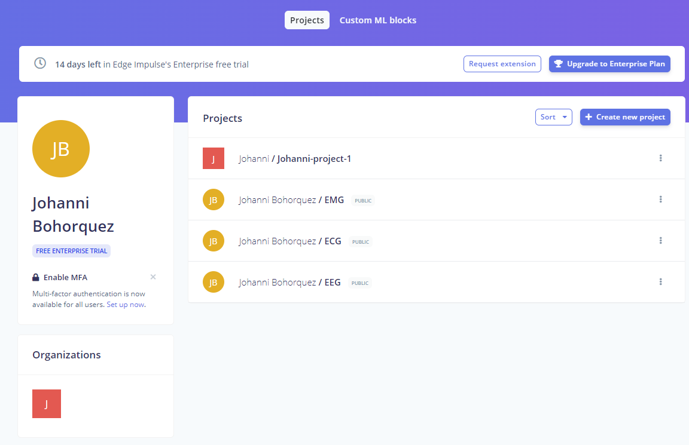
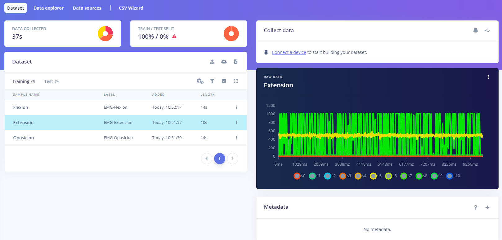
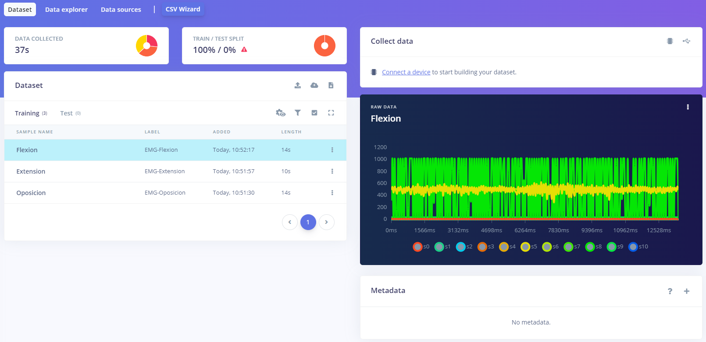
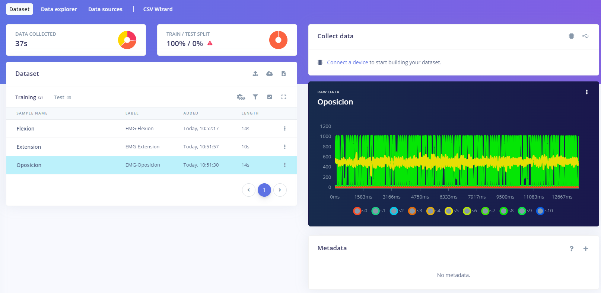

# Repossitorio Edge Impulse - Johanni

## Tabla de Contenidos

1. [Repositorio EMG](#1-RepositorioEMG)
2. [Repositorio ECG](#2-ReositorioECG)
3. [Repositorio EEG](#3-RepositorioEEG)

 

## 1. Repositorio EMG

### 1.1 Código

### 1.2 Señales

| Señal   | Imagen                                                                                         |
|-------------|------------------------------------------------------------------------------------------------|
| Extensión   | |
| Flexión     |   |
| Oposición   | |

## 2. Repositorio ECG

### 2.1 Código

### 2.2 Señales

## 3. Repositorio EEG

### 3.1 Código

### 3.2 Señales
