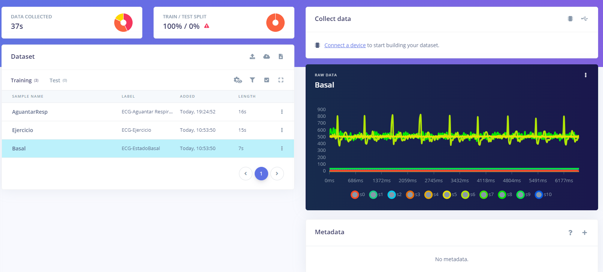
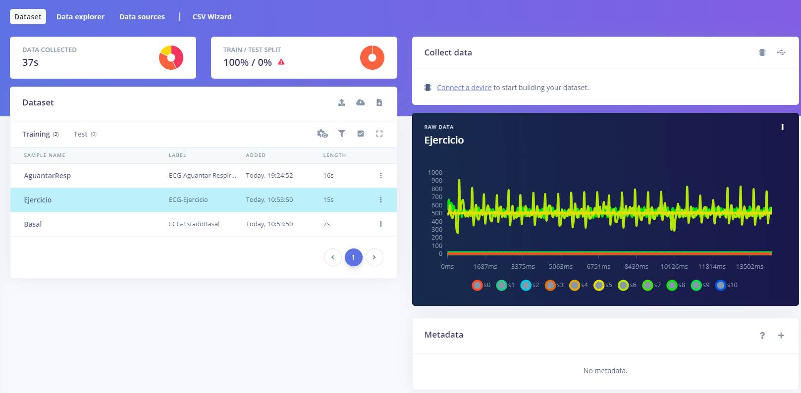
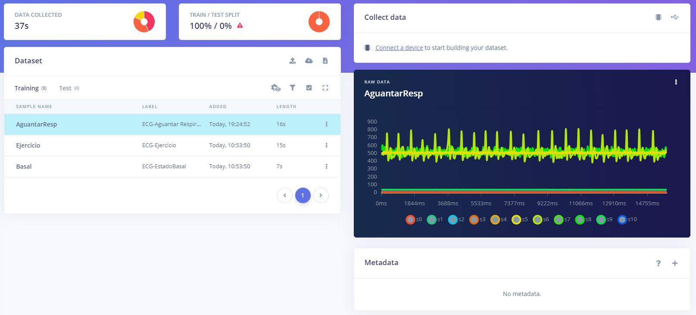
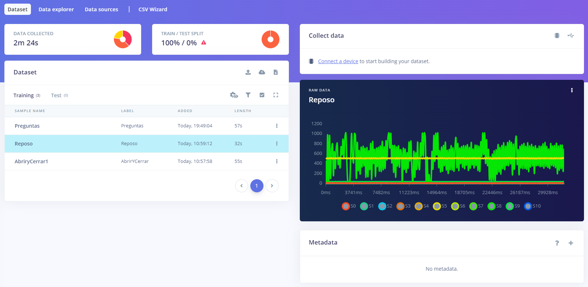
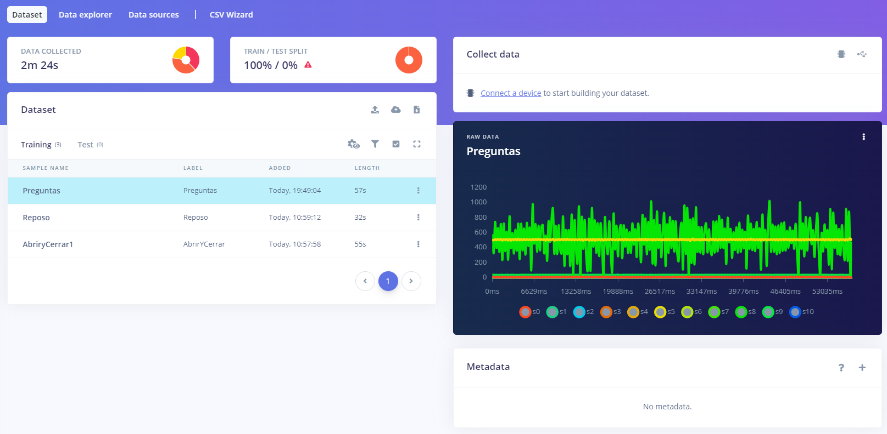
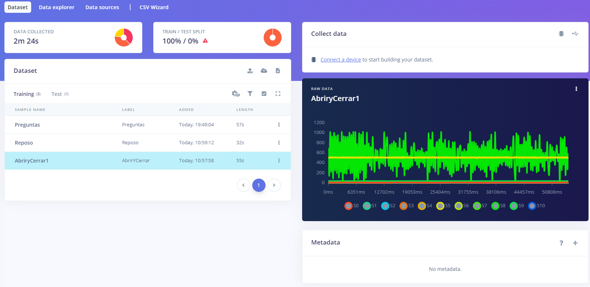

# Repossitorio Edge Impulse - Johanni

## Tabla de Contenidos

1. [Repositorio EMG](#1-RepositorioEMG)
2. [Repositorio ECG](#2-ReositorioECG)
3. [Repositorio EEG](#3-RepositorioEEG)


 


## 1. Repositorio EMG

### 1.1 Código

```python

import requests
import os

api_key = 'ei_7c1bc6149d3e9151a694c1064b9bab7d7f5f5013e600c9b2fa63bedd51f67224'

files = [
    'Flexion.csv',
]

label = 'EMG-Flexion'
# Upload the file to Edge Impulse using the API, and print the response.
res = requests.post(url='https://ingestion.edgeimpulse.com/api/training/files',
                    headers={
                        'x-label': label,
                        'x-api-key': api_key,
                    },
                    # Creating the data payload for the request.
                    files=(('data', (os.path.basename(i), open(
                        i, 'rb'), 'aplication/csv')) for i in files)
                    )

if (res.status_code == 200):
    print('Uploaded file(s) to Edge Impulse\n', res.status_code, res.content)
else:
    print('Failed to upload file(s) to Edge Impulse\n',
          res.status_code, res.content)

```

### 1.2 Señales


| Señal   | Imagen                                                                                         |
|-------------|------------------------------------------------------------------------------------------------|
| Extensión   | |
| Flexión     |   |
| Oposición   | |


## 2. Repositorio ECG

### 2.1 Código

```python
import requests
import os

api_key = 'ei_3ee72fbbb956ca026196f0f5ff9e057afa07f61538b44790259d1da30c76d349'
# Add the files you want to upload to Edge Impulse
files = [
    'AguantarResp.csv',
]
# # Replace the label with your own.
label = 'ECG-Aguantar Respiración'
# Upload the file to Edge Impulse using the API, and print the response.
res = requests.post(url='https://ingestion.edgeimpulse.com/api/training/files',
                    headers={
                        'x-label': label,
                        'x-api-key': api_key,
                    },
                    # Creating the data payload for the request.
                    files=(('data', (os.path.basename(i), open(
                        i, 'rb'), 'aplication/csv')) for i in files)
                    )

if (res.status_code == 200):
    print('Uploaded file(s) to Edge Impulse\n', res.status_code, res.content)
else:
    print('Failed to upload file(s) to Edge Impulse\n',
          res.status_code, res.content)

```

### 2.2 Señales

| Señal   | Imagen                                                                                         |
|-------------|------------------------------------------------------------------------------------------------|
| Basal   | |
| Ejercicio     |   |
| Aguantar Respiración   | |


## 3. Repositorio EEG

### 3.1 Código

```python
import requests
import os

api_key = 'ei_053b3fd2ced2188bc3ae52bfb502527ef3187e39bf0b97c236eb6dcb8db75ea8'
# Add the files you want to upload to Edge Impulse
files = [
    'Preguntas.csv',
]
# # Replace the label with your own.
label = 'Preguntas'
# Upload the file to Edge Impulse using the API, and print the response.
res = requests.post(url='https://ingestion.edgeimpulse.com/api/training/files',
                    headers={
                        'x-label': label,
                        'x-api-key': api_key,
                    },
                    # Creating the data payload for the request.
                    files=(('data', (os.path.basename(i), open(
                        i, 'rb'), 'aplication/csv')) for i in files)
                    )

if (res.status_code == 200):
    print('Uploaded file(s) to Edge Impulse\n', res.status_code, res.content)
else:
    print('Failed to upload file(s) to Edge Impulse\n',
          res.status_code, res.content)

```

### 3.2 Señales

| Señal   | Imagen                                                                                         |
|-------------|------------------------------------------------------------------------------------------------|
| Reposo   | |
| Preguntas matemáticas     |   |
| Ciclos de parpadeo   | |

