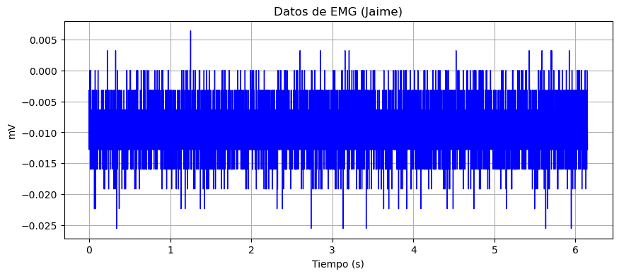

# INFORME LABORATORIO 3

## Tabla de contenidos

1. [Introducción](#1-introducción)
2. [Objetivos](#2-objetivos)
3. [Materiales y equipos](#3-materiales-y-equipos)
4. [Características de los sujetos de prueba](#4-características-de-los-sujetos-de-prueba)
5. [Metodología](#5-metodología)
6. [Resultados](#6-resultados)
   - [Sujeto 1-Jaime](#sujeto-1-jaime)
   - [Sujeto 2- Johanni](#sujeto-2--johanni)
7. [Discusión](#7-discusión)
8. [Conclusiones](#8-conclusiones)
9. [Bibliografía](#9-bibliografía)

## 1. Introducción

En este informe se hace uso del dispositivo BITalino, el cual sirve para adquirir y analizar señales biomédicas específicas: electromiografía (EMG) y electrocardiografía (ECG). Los estudiantes aprenderán a configurar el hardware y el software necesario, realizar conexiones correctas, y extraer información valiosa de las señales biomédicas utilizando el software OpenSignals (r)evolution. Además, se enfatiza la importancia de seguir procedimientos de seguridad adecuados e instrucciones detalladas para el uso del software y la toma de los datos.

## 2. Objetivos

- Obtener señales biomédicas de electromiografía (EMG).
- Configurar adecuadamente el dispositivo BiTalino.
- Extraer datos de las señales EMG utilizando el software OpenSignals (r)evolution.

## 3. Materiales y equipos

|   Modelo      | Descripción   | Cantidad |
|---------------|---------------|----------|
| (R)EVOLUTION  | Kit BITalino  | 1        |
|       -       | Laptop o PC   | 1        |

## 4. Características de los sujetos de prueba

| Nombre  | Edad | Sexo | Frec. act. física | Intensidad act. | Condición Física | IMC  |
|---------|------|------|-------------------|-----------------|------------------|------|
| Jaime   | 23   | M    | 3                 | Media           | Sano             | 30.6 |
| Johanni | 22   | F    | 5                 | Media           | Sana             | 25   |

## 5. Metodología

- **Instalación de OpenSignals**: El software diseñado para la visualización de la señales del BITalino.

  

- **Uso de BITalino**: El dispositivo cuenta con un procesador ATMEGA328P, y funciona de manera inalámbrica gracias a su módulo Bluetooth.
- **Instalación de OpenSignals**: El software diseñado para la visualización de la señales del BITalino.

<table style="width:100%">
  <tr>
    <!-- Columna para la primera imagen -->
    <td style="width:50%">
      
      
Bitalino

    </td>
    <!-- Columna para la segunda imagen -->
    <td style="width:50%">
      
      
Bitalino conexiones y carcasa

    </td>
  </tr>
</table>

- **Posición de los electrodos**:
  - Se tomaron en consideración artículos enfocados en estimación del movimiento de mano usando redes neuronales artificiales y mediciones electromiográficas. Para el desarrollo de las mediciones, se realizaron por medio de dos canales del módulo para obtener el registro en modo diferencial de tres electrodos superficiales (dos electrodos por canal y un solo electrodo de referencia para ambos canales).
  - Se colocaron los electrodos positivo y negativo en la parte delantera del brazo, y el electrodo de referencia cerca al grupo muscular posterior del brazo.
  <table style="width:100%">
      <tr>
        <td style="width:100%; vertical-align:top;">
          

            

              
              
Fig.1. Posición de los electrodos para la adquisición de las señales EMG [1]

            

            

              

                
                
              

              
Fig.2-3. Posición de los electrodos para la adquisición de las señales EMG en el laboratorio

            

          

        </td>
      </tr>
    </table>

<table style="width:100%; border-collapse: collapse; border: 1px solid #ccc;">
  <tr>
    <th colspan="2" style="text-align:center; padding: 8px; font-size: 15px;">En reposo</th>
  </tr>
  <tr>
    <td colspan="2" style="padding: 12px; border-bottom: 1px solid #ccc; text-align: justify;">
      En la primera prueba se tomó la señal en reposo, el brazo tenía un soporte. Teniendo la conexión a tierra un poco por encima del codo.
    </td>
  </tr>
  <tr>
    <td style="width:50%; vertical-align:top; text-align:center; padding: 10px; border-right: 1px solid #ccc;">
      <h3 style="margin-top: 0;">Johanni Reposo</h3>
      <video width="100%" controls>
        <source src="https://youtu.be/L0g9XQ-Uvy4" type="video/mp4">
        Tu navegador no soporta videos HTML5.
      </video>
    </td>
    <td style="width:50%; vertical-align:top; text-align:center; padding: 10px;">
      <h3 style="margin-top: 0;">Jaime Reposo</h3>
      <video width="100%" controls>
        <source src="videos_imagenes/jaimereposo.mp4" type="video/mp4">
        Tu navegador no soporta videos HTML5.
      </video>
    </td>
  </tr>
</table>

<table style="width:100%; border-collapse: collapse; border: 1px solid #ccc;">
  <tr>
    <th colspan="2" style="text-align:center; padding: 8px; font-size: 15px;">En extensión</th>
  </tr>
  <tr>
    <td colspan="2" style="padding: 12px; border-bottom: 1px solid #ccc; text-align: justify;">
      La segunda prueba se realizó haciendo una extensión de codo. El brazo se encontraba suspendido en el aire.
    </td>
  </tr>
  <tr>
    <td style="width:50%; vertical-align:top; text-align:center; padding: 10px; border-right: 1px solid #ccc;">
      <h4 style="margin-top: 0;">Johanni Extensión</h4>
      <video width="100%" controls>
        <source src="videos_imagenes/johanniextension.mp4" type="video/mp4">
        Tu navegador no soporta videos HTML5.
      </video>
    </td>
    <td style="width:50%; vertical-align:top; text-align:center; padding: 10px;">
      <h4 style="margin-top: 0;">Jaime Extensión</h4>
      <video width="100%" controls>
        <source src="videos_imagenes/jaimeextension.mp4" type="video/mp4">
        Tu navegador no soporta videos HTML5.
      </video>
    </td>
  </tr>
</table>

 <table style="width:100%; border-collapse: collapse; border: 1px solid #ccc;">
  <tr>
    <th colspan="2" style="text-align:center; padding: 8px; font-size: 15px;">En flexión</th>
  </tr>
  <tr>
    <td colspan="2" style="padding: 12px; border-bottom: 1px solid #ccc; text-align: justify;">
      En la tercera prueba se tomó la señal haciendo una flexión del bíceps, teniendo la conexión tierra a la altura un poco por encima del codo.
    </td>
  </tr>
  <tr>
    <td style="width:50%; vertical-align:top; text-align:center; padding: 10px; border-right: 1px solid #ccc;">
      <h4 style="margin-top: 0;">Johanni Flexión</h4>
      <video width="100%" controls>
        <source src="videos_imagenes/johanniflexion.mp4" type="video/mp4">
        Tu navegador no soporta videos HTML5.
      </video>
    </td>
    <td style="width:50%; vertical-align:top; text-align:center; padding: 10px;">
      <h4 style="margin-top: 0;">Jaime Flexión</h4>
      <video width="100%" controls>
        <source src="videos_imagenes/jaimeflexion.mp4" type="video/mp4">
        Tu navegador no soporta videos HTML5.
      </video>
    </td>
  </tr>
</table>

<table style="width:100%; border-collapse: collapse; border: 1px solid #ccc;">
  <tr>
    <th colspan="2" style="text-align:center; padding: 8px; font-size: 15px;">En oposición</th>
  </tr>
  <tr>
    <td colspan="2" style="padding: 12px; border-bottom: 1px solid #ccc; text-align: justify;">
      En la cuarta prueba se tomó la señal del brazo haciendo oposición a una fuerza (en este caso, pusimos una oposición aplicando fuerza al brazo del compañero de prueba).
    </td>
  </tr>
  <tr>
    <td style="width:50%; vertical-align:top; text-align:center; padding: 10px; border-right: 1px solid #ccc;">
      <h4 style="margin-top: 0;">Johanni Oposición</h4>
      <video width="100%" controls>
        <source src="videos_imagenes/johanniflexionoppo.mp4" type="video/mp4">
        Tu navegador no soporta videos HTML5.
      </video>
    </td>
    <td style="width:50%; vertical-align:top; text-align:center; padding: 10px;">
      <h4 style="margin-top: 0;">Jaime Oposición</h4>
      <video width="100%" controls>
        <source src="videos_imagenes/jaimeflexionoppo.mp4" type="video/mp4">
        Tu navegador no soporta videos HTML5.
      </video>
    </td>
  </tr>
</table>

## 6. Resultados

En la gráfica de electromiografía (EMG), se optó por centrar el enfoque en el intervalo de tiempo de 6 a 7 segundos. Este ajuste se realizó para ampliar la imagen de la gráfica durante este periodo crítico, permitiendo una visualización detallada y clara de los datos. Este enfoque específico ayuda a analizar con mayor precisión las fluctuaciones y características de la señal EMG, facilitando así una interpretación más precisa de la actividad muscular registrada.

### Sujeto 1-Jaime

- Reposo

- Extensión

- Flexión

- Oposición

### Sujeto 2- Johanni

- Reposo

- Extensión

- Flexión

- Oposición

## 7. Discusión

- Los valores obtenidos cuando el bíceps está en reposo son dentro del rango de -0.025 mV a 0.005 mV, lo cual es coherente ya que durante el reposo muscular provoca señales eléctricas muy débiles o fluctuaciones cercanas a cero, dado que los músculos no están generando mucha actividad eléctrica. Algo a tomar en cuenta son los factores como, la posición en estado de reposo basal debería ser con la persona acostada; sin embargo, esto se tomaría como una limitación, ya que los sujetos en esta experimentación se encontraban sentados. Además, otro factor son los artefactos electrónicos cercanos a la toma de muestra, lo que conduciría a posibles variaciones y ruido.
- Durante la etapa de extensión del músculo, obtenemos un rango de -0.3 mV a 0.15 mV. Los músculos no están generando una actividad eléctrica significativa, en este punto el músculo sólo se encuentra levantado.
- Los valores obtenidos cuando se está flexionando o se ejerce una oposición al movimiento, son dentro del rango de -0.7 mV a 0.75 mV. Esto se debe a que, durante la contracción muscular, las unidades motoras generan potenciales de acción que son captados por los electrodos, los cuales son generados por la despolarización de todas las fibras musculares internadas por cada axón.
- La amplitud de estas señales de EMG varían de acuerdo a la intensidad de la contracción y la fuerza muscular de los dos usuarios de prueba.
- La frecuencia utilizada para estudiar el músculo del bíceps es desde los 20 a 450 Hz, los cuales se usan típicamente para superficie EMG [2]. Este dato nos ayuda también a eliminar fuentes de ruido no deseadas o limitar la salida del sensor. Tomando en consideración una tasa de muestreo de 1000Hz se cumple la ley de Nyquist y garantizando una buena tasa de.

## 8. Conclusiones

- La correcta configuración del dispositivo BITalino y la instalación adecuada de los electrodos son cruciales para adquirir señales biomédicas claras y precisas. Esto se demostró al obtener registros detallados de la actividad muscular durante diferentes acciones como reposo, extensión, flexión y oposición.
- En reposo los valores muy bajos de mV indican silencio eléctrico, lo cual es esperado durante el reposo muscular, mostrando que los músculos no generan actividad eléctrica significativa en este estado.
- Durante la actividad muscular (Extensión y Flexión) los potenciales de unidad motora durante la extensión y flexión indican una despolarización clara de las fibras musculares. Los rangos de mV obtenidos reflejan la actividad eléctrica asociada con contracciones musculares leves a moderadas.
- A primera vista, no se aprecia diferencia entre las muestras de ambos sujetos debido a su género; además, las señales se encuentran sin procesamiento para eliminar el ruido e interferencias, por lo que no se podría concluir algo al respecto.
- El enfoque en el intervalo de 6 a 7 segundos en la gráfica EMG ilustra la importancia de examinar momentos específicos para una evaluación detallada de la actividad muscular, permitiendo identificar características y fluctuaciones que podrían pasar desapercibidas en análisis más generales.

## 9. Bibliografía

[1] R. Lopez, M. A. López, J. Enrique, and L. Correa, “IMPLEMENTACIÓN EN FPGA DE UN CLASIFICADOR DE MOVIMIENTOS DE LA MANO USANDO SEÑALES EMG,” Udistrital.edu.co, Sep. 2015, doi: <https://revistas.udistrital.edu.co/index.php/REDES/article/view/8178>.
[2] BITalino (r)evolution Lab Guide. (2021, 15 de febrero). BITalino. <https://support.pluxbiosignals.com/wp-content/uploads/2022/04/HomeGuide1_EMG.pdf>
[3] PROCESAMIENTO DE SEÑALES DE ELECTROMIOGRAFÍA SUPERFICIAL PARA LA DETECCIÓN DE MOVIMIENTO DE DOS DEDOS DE LA MANO. (2012). UNIVERSIDAD RICARDO PALMA. <https://repositorio.urp.edu.pe/bitstream/handle/20.500.14138/416/Alva_ca.pdf?sequence=1&amp;isAllowed=y>
