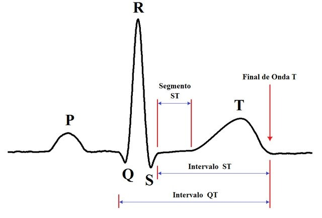
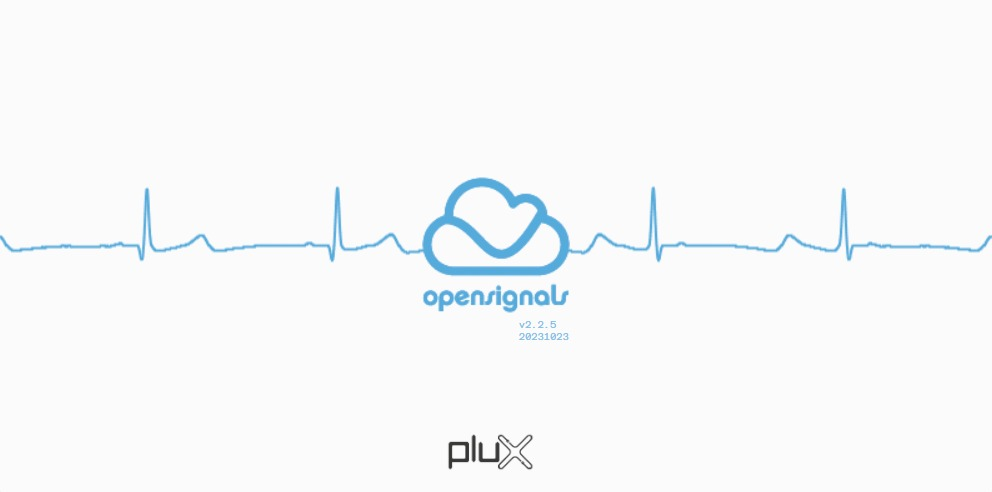
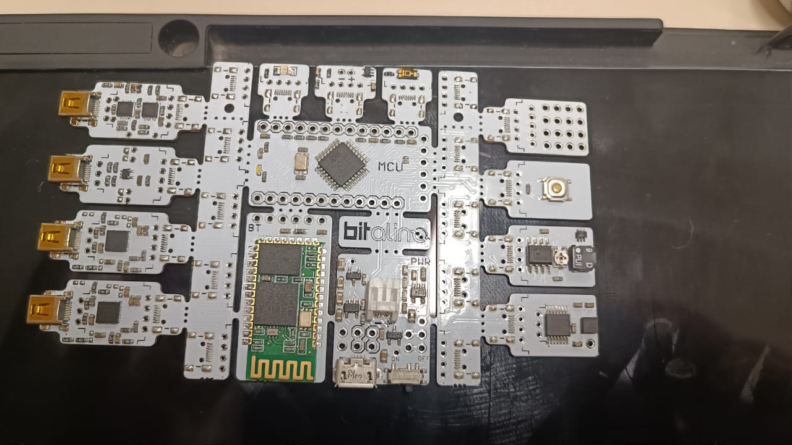
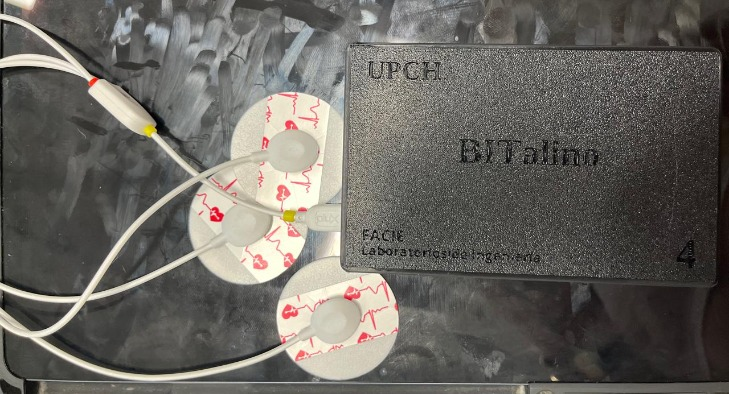
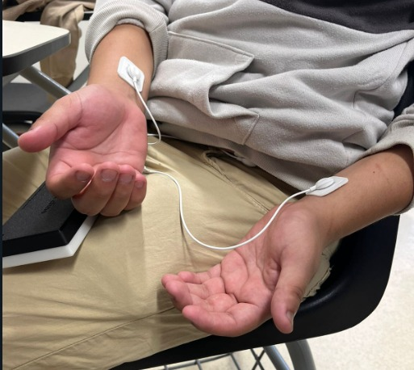
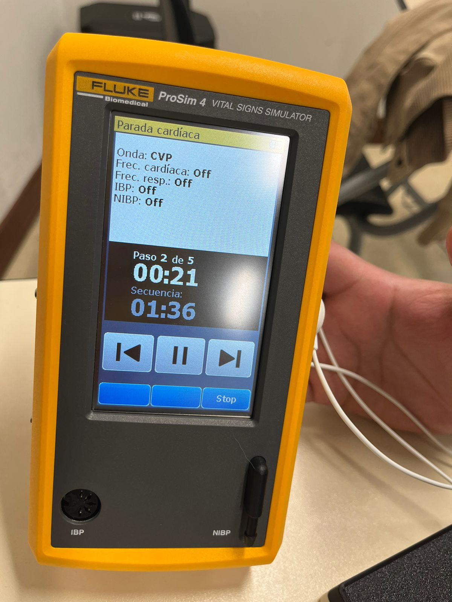
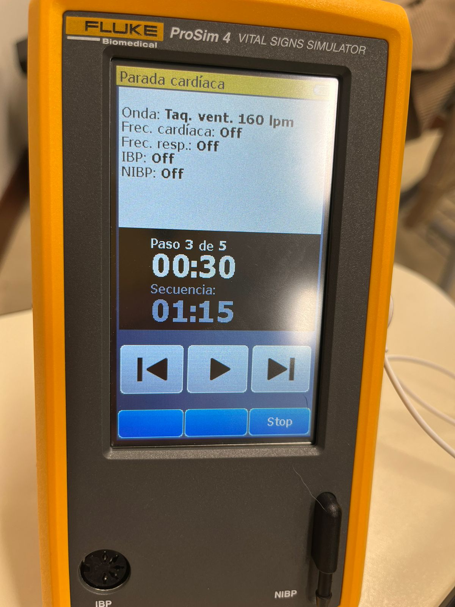
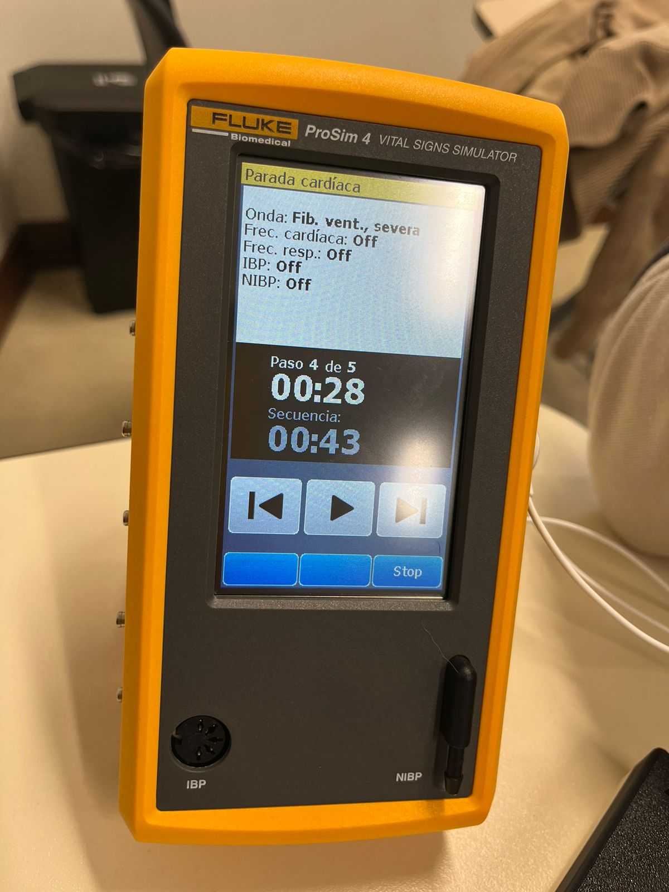
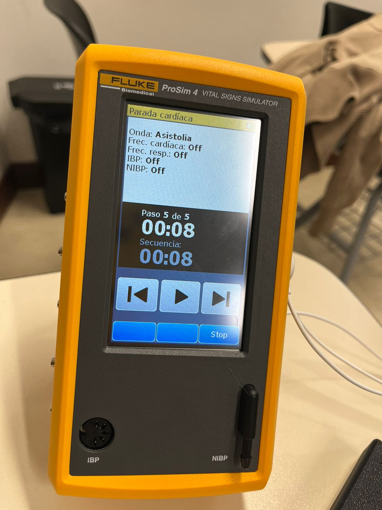

# INFORME LABORATORIO 4
## Lista de Participantes - Grupo 7

- Andrea Razuri Madrid
- Isabel Leon Luna
- Johanni Bohorquez Gutierrez
- Claudia Camacho Grimaldi
- Jaime Arista Cutipa 

## Tabla de contenidos

1. [Introducción](#1-introducción)
2. [Objetivos](#2-objetivos)
3. [Materiales y equipos](#3-materiales-y-equipos)
4. [Características de los sujetos de prueba](#4-características-de-los-sujetos-de-prueba)
5. [Metodología](#5-metodología)
6. [Resultados](#6-resultados)
   - [Sujeto 1-Jaime](#sujeto-1-jaime)
   - [Sujeto 2- Johanni](#sujeto-2--johanni)
7. [Discusión](#7-discusión)
8. [Conclusiones](#8-conclusiones)
9. [Bibliografía](#9-bibliografía)

## 1. INTRODUCCIÓN A LA ELECTROCARDIOGRAFÍA (ECG)

La electrocardiografía (ECG) es una técnica esencial en el campo de la medicina que nos permite evaluar la actividad eléctrica del corazón de manera no invasiva. En nuestro laboratorio, empleamos electrodos para capturar y analizar estas señales eléctricas, proporcionando información vital sobre la salud cardiovascular de los pacientes.

### ¿Qué es un Electrocardiograma?

La ECG es un procedimiento que registra la actividad eléctrica del corazón a través de electrodos colocados en la piel. Estos registros ayudan a detectar irregularidades cardíacas, monitorizar la salud del corazón y diagnosticar diversas condiciones médicas. El corazón genera impulsos eléctricos que se propagan a través del tejido cardíaco y se detectan en la superficie de la piel. Cada latido produce un patrón característico en el electrocardiograma, que puede ser  analizado para evaluar el estado del corazón [1].

### ¿Cómo funciona el corazón?

El corazón es un órgano muscular que funciona como una bomba, enviando sangre oxigenada a todo el cuerpo y retornando la sangre desoxigenada en los pulmones para su oxigenación. La actividad eléctrica del corazón se inicia en el nodo sinoauricular, que actúa como marcapasos natural del corazón, y se propaga a través de las cámaras cardíacas, lo que resulta en su contracción y relajación rítmicas [1]. 

### Aplicaciones del ECG

El ECG es fundamental para detectar arritmias, infartos de miocardio, y otras condiciones patológicas del corazón. Además, es utilizado en chequeos rutinarios, en pruebas de esfuerzo o para monitorizar los efectos de ciertos medicamentos en el corazón. También puede proporcionar información sobre la variabilidad del ritmo cardíaco (HRV), que es un indicador importante de la salud cardiovascular y la respuesta autonómica del cuerpo [1].

### Decepción de la Señal de ECG

El electrocardiograma es una representación gráfica de la actividad eléctrica del corazón medida en el tiempo. Cada ciclo cardíaco produce una serie de ondas en el ECG que corresponden a diferentes fases de actividad cardíaca. A continuación, se describen los componentes principales de la señal de ECG:

  
   
  <strong>Fig 1. Señal ECG con diferentes intervalos que la componen [2]</strong>

   - **Onda P:** Representa la despolarización de las aurículas, es decir, el proceso eléctrico que precede a la contracción auricular. Esta onda es la primera deflexión positiva del ECG y es crucial para reevaluar la función auricular.
   - **Complejo QRS:** Sigue a la onda P y representa la despolarización de los ventrículos, que es el proceso eléctrico que precede a la contracción ventricular, la cual es responsable de bombear la sangre hacia los pulmones y el resto del cuerpo. Este complejo está compuesto por tres partes:
     - Onda Q: Primera deflexión negativa después de P
     - Onda R: Deflexión positiva prominente
     - Onda S: Deflexión negativa de después de la onda R
   - **Intervalo PR:** Es el período desde el inicio de la onda P hasta el inicio del complejo QRS. Este intervalo refleja el tiempo que el impulso eléctrico tarda en viajar desde las aurículas hasta los ventrículos. 
   - **Segmento ST:** Es el segmento desde el final complejo QRS hasta el inicio de la onda T. Este segmento es crucial para evaluar si hay un suministro de sangre adecuado al corazón o si existe alguna lesión miocárdica.
   - **Onda T:** Representa la repolarización ventricular, o el proceso de recuperación eléctrica que prepara a los ventrículos para el siguiente ciclo de contracción.
   - **Intervalo QT:** Es el tiempo desde el inicio del complejo QRS hasta el final de la onda T. Este intervalo es un indicador importante del estado de repolarización de los ventrículos y es ajustado según la frecuencia cardíaca.

## 2. Objetivos
- Obtener señales biomédicas de electrocardiografía (ECG).
- Configurar adecuadamente el dispositivo BiTalino.
- Extraer datos de las señales ECG utilizando el software OpenSignals (r)evolution.

## 3. Materiales y equipos

|   Modelo      | Descripción   | Cantidad |
|---------------|---------------|----------|
| (R)EVOLUTION  | Kit BITalino  | 1        |
|       -       | Laptop o PC   | 1        |

## 4. Características de los sujetos de prueba

| Nombre  | Edad | Sexo | Frec. act. física | Intensidad act. | Condición Física | IMC  |
|---------|------|------|-------------------|-----------------|------------------|------|
| Jaime   | 23   | M    | 3                 | Media           | Sano             | 30.6 |

## 5. Metodología

- **Empleo de OpenSignals**: El software diseñado para la visualización de la señales del BITalino.

  

- **Uso de BITalino**: El dispositivo cuenta con un procesador ATMEGA328P, y funciona de manera inalámbrica gracias a su módulo Bluetooth.
 

- **Posición de los electrodos**:
  - Se consideró la polarización de los electrodos al enfocarnos en la primera derivación bipolar.
  - Se colocó el electrodo negativo en el brazo derecho, el electrodo positivo en el brazo izquierdo, y el electrodo de referencia cerca a la cresta ilíaca.

  
   
  <strong>Fig.2. Posición de los electrodos para la adquisición de las señales ECG [3]</strong>

  
   
  <strong>Fig 3. Posicionamiento de los electrodos en el sujeto de prueba.</strong>

- **Sujeto 1- Jaime**:
  - Estado Basal
    - En la primera prueba se tomó la señal en reposo, los electrodos se colocaron en los antebrazos con un punto de referencia en la cresta ilíaca.
  - Respiración prolongada
    - La segunda prueba se realizó conteniendo la respiración por 30 segundos. La persona se encontraba sentada.
  - Haciendo ejercicio
    - En la tercera prueba se realizaron ejercicios aeróbicos durante 1 minuto para tomar las señales por el BiTalino.
      
- **Pro-sim**:
  ## Simulación de Pruebas Cardíacas

| Paso | Descripción | Foto | Enlace al Video |
|------|-------------|------|-----------------|
| 2 | Onda CVP (Contracciones ventriculares prematuras) |  | [Ver video](https://youtu.be/29PwQj-pjZU) |
| 3 | Taquicardia ventricular 160 lpm |  | [Ver video](https://youtu.be/cv6lpsEO8ZQ) |
| 4 | Fibrilación ventricular severa | | [Ver video](https://youtu.be/9j0LWFMWJuM) |
| 5 | Asistolia | | [Ver video](https://youtu.be/bHxz2DLPJss) |

## 6. Resultados

En la gráfica de electromiografía (EMG), se optó por centrar el enfoque en el intervalo de tiempo de 6 a 7 segundos. Este ajuste se realizó para ampliar la imagen de la gráfica durante este periodo crítico, permitiendo una visualización detallada y clara de los datos. Este enfoque específico ayuda a analizar con mayor precisión las fluctuaciones y características de la señal EMG, facilitando así una interpretación más precisa de la actividad muscular registrada.

### Sujeto 1-Jaime

- Reposo

- Extensión

- Flexión

- Oposición

### Sujeto 2- Johanni

## 7. Discusión

- 

## 8. Conclusiones

- 

## 9. Bibliografía

