# INFORME LABORATORIO 4
## Lista de Participantes - Grupo 7

- Andrea Razuri Madrid
- Isabel Leon Luna
- Johanni Bohorquez Gutierrez
- Claudia Camacho Grimaldi
- Jaime Arista Cutipa 

## Tabla de Contenidos

- [Introducción a la Electrocardiografía (ECG)](#introducción-a-la-electrocardiografía-ecg)
  - [¿Qué es un Electrocardiograma?](#qué-es-un-electrocardiograma)
  - [¿Cómo funciona el corazón?](#cómo-funciona-el-corazón)
  - [Aplicaciones del ECG](#aplicaciones-del-ecg)
  - [Decepción de la Señal de ECG](#decepción-de-la-señal-de-ecg)
- [Objetivos](#objetivos)
- [Materiales y Equipos](#materiales-y-equipos)
- [Características de los Sujetos de Prueba](#características-de-los-sujetos-de-prueba)
- [Metodología](#metodología)
  - [Empleo de OpenSignals](#empleo-de-opensignals)
  - [Uso de BITalino](#uso-de-bitalino)
  - [Posición de los Electrodos](#posición-de-los-electrodos)
- [Resultados](#resultados)
  - [Sujeto 1 - Jaime](#sujeto-1---jaime)
    - [Estado Basal](#estado-basal)
    - [Respiración Prolongada](#respiración-prolongada)
    - [Ejercicio Intenso](#ejercicio-intenso)
  - [Pro-sim](#pro-sim)
- [Discusión](#discusión)
- [Conclusiones](#conclusiones)
- [Bibliografía](#bibliografía)

## 1. INTRODUCCIÓN A LA ELECTROCARDIOGRAFÍA (ECG)

La electrocardiografía (ECG) es una técnica esencial en el campo de la medicina que nos permite evaluar la actividad eléctrica del corazón de manera no invasiva. En nuestro laboratorio, empleamos electrodos para capturar y analizar estas señales eléctricas, proporcionando información vital sobre la salud cardiovascular de los pacientes.

### ¿Qué es un Electrocardiograma?

La ECG es un procedimiento que registra la actividad eléctrica del corazón a través de electrodos colocados en la piel. Estos registros ayudan a detectar irregularidades cardíacas, monitorizar la salud del corazón y diagnosticar diversas condiciones médicas. El corazón genera impulsos eléctricos que se propagan a través del tejido cardíaco y se detectan en la superficie de la piel. Cada latido produce un patrón característico en el electrocardiograma, que puede ser  analizado para evaluar el estado del corazón [1].

### ¿Cómo funciona el corazón?

El corazón es un órgano muscular que funciona como una bomba, enviando sangre oxigenada a todo el cuerpo y retornando la sangre desoxigenada en los pulmones para su oxigenación. La actividad eléctrica del corazón se inicia en el nodo sinoauricular, que actúa como marcapasos natural del corazón, y se propaga a través de las cámaras cardíacas, lo que resulta en su contracción y relajación rítmicas [1]. 

### Aplicaciones del ECG

El ECG es fundamental para detectar arritmias, infartos de miocardio, y otras condiciones patológicas del corazón. Además, es utilizado en chequeos rutinarios, en pruebas de esfuerzo o para monitorizar los efectos de ciertos medicamentos en el corazón. También puede proporcionar información sobre la variabilidad del ritmo cardíaco (HRV), que es un indicador importante de la salud cardiovascular y la respuesta autonómica del cuerpo [1].

### Decepción de la Señal de ECG

El electrocardiograma es una representación gráfica de la actividad eléctrica del corazón medida en el tiempo. Cada ciclo cardíaco produce una serie de ondas en el ECG que corresponden a diferentes fases de actividad cardíaca. A continuación, se describen los componentes principales de la señal de ECG:

  
   
  <strong>Fig 1. Señal ECG con diferentes intervalos que la componen [2]</strong>

   - **Onda P:** Representa la despolarización de las aurículas, es decir, el proceso eléctrico que precede a la contracción auricular. Esta onda es la primera deflexión positiva del ECG y es crucial para reevaluar la función auricular.
   - **Complejo QRS:** Sigue a la onda P y representa la despolarización de los ventrículos, que es el proceso eléctrico que precede a la contracción ventricular, la cual es responsable de bombear la sangre hacia los pulmones y el resto del cuerpo. Este complejo está compuesto por tres partes:
     - Onda Q: Primera deflexión negativa después de P
     - Onda R: Deflexión positiva prominente
     - Onda S: Deflexión negativa de después de la onda R
   - **Intervalo PR:** Es el período desde el inicio de la onda P hasta el inicio del complejo QRS. Este intervalo refleja el tiempo que el impulso eléctrico tarda en viajar desde las aurículas hasta los ventrículos. 
   - **Segmento ST:** Es el segmento desde el final complejo QRS hasta el inicio de la onda T. Este segmento es crucial para evaluar si hay un suministro de sangre adecuado al corazón o si existe alguna lesión miocárdica.
   - **Onda T:** Representa la repolarización ventricular, o el proceso de recuperación eléctrica que prepara a los ventrículos para el siguiente ciclo de contracción.
   - **Intervalo QT:** Es el tiempo desde el inicio del complejo QRS hasta el final de la onda T. Este intervalo es un indicador importante del estado de repolarización de los ventrículos y es ajustado según la frecuencia cardíaca.

## 2. Objetivos
- Obtener señales biomédicas de electrocardiografía (ECG).
- Configurar adecuadamente el dispositivo BiTalino.
- Extraer datos de las señales ECG utilizando el software OpenSignals (r)evolution.

## 3. Materiales y equipos

|   Modelo      | Descripción   | Cantidad |
|---------------|---------------|----------|
| (R)EVOLUTION  | Kit BITalino  | 1        |
|       -       | Laptop o PC   | 1        |

## 4. Características de los sujetos de prueba

| Nombre  | Edad | Sexo | Frec. act. física | Intensidad act. | Condición Física | IMC  |
|---------|------|------|-------------------|-----------------|------------------|------|
| Jaime   | 23   | M    | 3                 | Media           | Sano             | 30.6 |

## 5. Metodología

- **Empleo de OpenSignals**: El software diseñado para la visualización de la señales del BITalino.

  

- **Uso de BITalino**: El dispositivo cuenta con un procesador ATMEGA328P, y funciona de manera inalámbrica gracias a su módulo Bluetooth.
 

- **Posición de los electrodos**:
  - Se consideró la polarización de los electrodos al enfocarnos en la primera derivación bipolar.
  - Se colocó el electrodo negativo en el brazo derecho, el electrodo positivo en el brazo izquierdo, y el electrodo de referencia cerca a la cresta ilíaca.

  
   
  <strong>Fig.2. Posición de los electrodos para la adquisición de las señales ECG [3]</strong>

  
   
  <strong>Fig 3. Posicionamiento de los electrodos en el sujeto de prueba.</strong>

- **Sujeto 1- Jaime**:
  - Estado Basal
    - En la primera prueba se tomó la señal en reposo, los electrodos se colocaron en los antebrazos con un punto de referencia en la cresta ilíaca.

      

  - Respiración prolongada
    - La segunda prueba se realizó conteniendo la respiración por 30 segundos. La persona se encontraba sentada.
      - Jaime - Aguantar respiración (durante)

        

      - Jaime - Aguantar respiración (después)

        

  - Haciendo ejercicio
    - En la tercera prueba se realizaron ejercicios aeróbicos durante 1 minuto para tomar las señales por el BiTalino.

      

- **Pro-sim**:
   Simulación de Pruebas Cardíacas

| Paso | Descripción | Foto | Enlace al Video |
|------|-------------|------|-----------------|
| 2 | Onda CVP (Contracciones ventriculares prematuras) |  | |
| 3 | Taquicardia ventricular 160 lpm |  | |
| 4 | Fibrilación ventricular severa | |   |
| 5 | Asistolia | |   |

## 6. Resultados

En la gráfica de electromiografía (EMG), se optó por centrar el enfoque en el intervalo de tiempo de 6 a 7 segundos. Este ajuste se realizó para ampliar la imagen de la gráfica durante este periodo crítico, permitiendo una visualización detallada y clara de los datos. Este enfoque específico ayuda a analizar con mayor precisión las fluctuaciones y características de la señal EMG, facilitando así una interpretación más precisa de la actividad muscular registrada.

### Sujeto 1-Jaime

- Estado basal

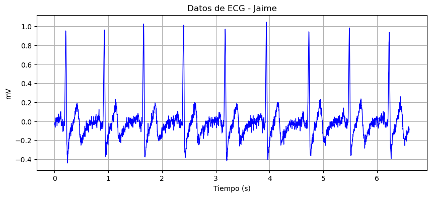  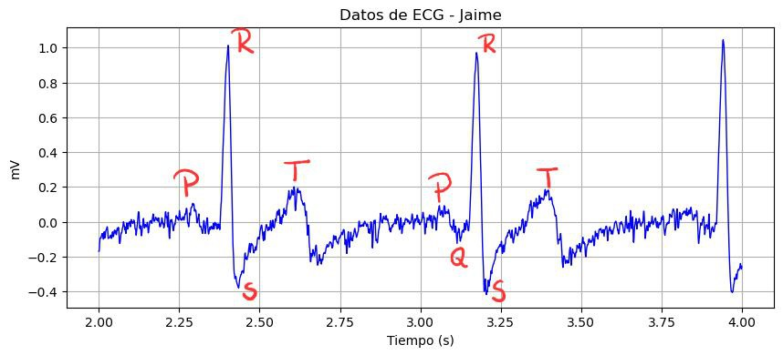
- Respiración prolongada
  - Durante
  
  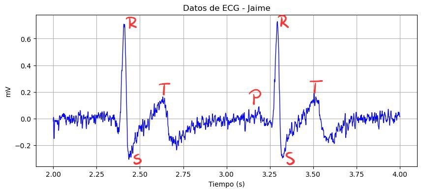
  - Después

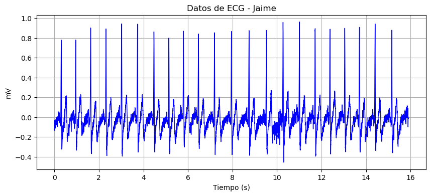  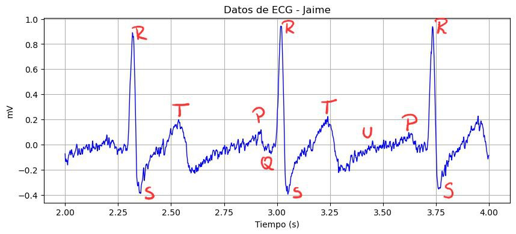
- Ejercicio intenso

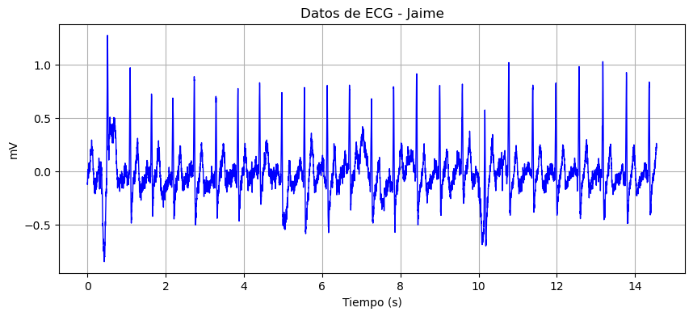  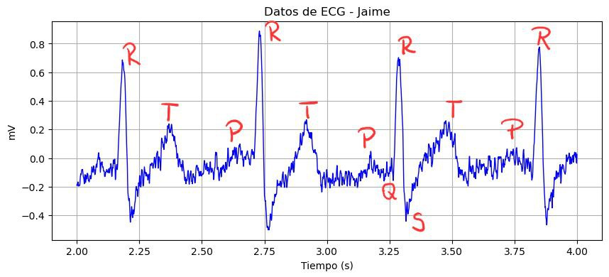

### Pro sim
- Paso 2: Onda CVP (Contracciones ventriculares prematuras)
Consiste en latidos adicionales que comienzan en una de las dos cavidades (ventrículos) inferiores de bombeo del corazón, los cuales alteran el ritmo cardíaco regular, lo que a veces provoca una sensación de interrupciones de los latidos.

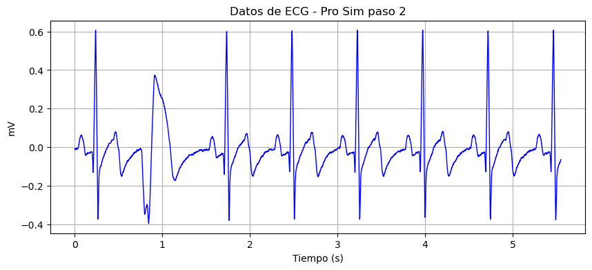  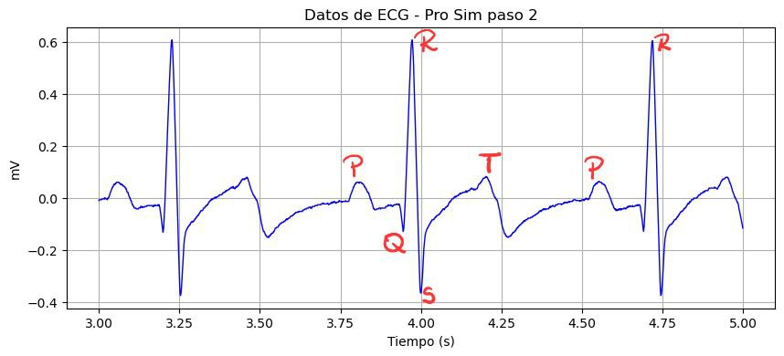
- Paso 3: Taquicardia ventricular 160 lpm
Es un tipo de arritmia que induce al corazón a empezar a latir muy fuerte, causada por señales eléctricas defectuosas de las fibras del músculo cardíaco. El corazón late más rápido de lo normal a 160 lpm. Por tanto, el corazón no puede bombear suficiente sangre al cuerpo y a los pulmones.

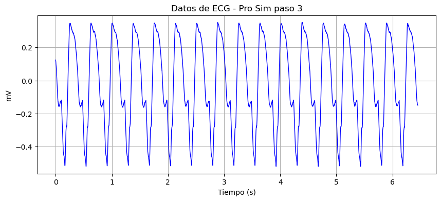  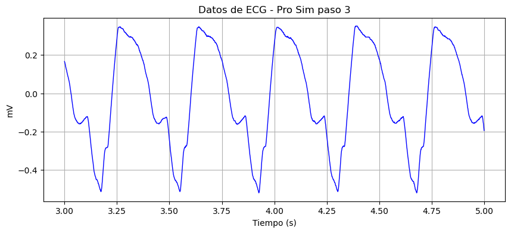
- Paso 4: Fibrilación ventricular severa
Consiste en un tipo de ritmo cardíaco irregular o arritmia, en donde las cámaras inferiores del corazón se contraen de forma muy rápida y descoordinada, por tanto, el corazón no está bombeando sangre y se convierte en una forma de paro cardíaco.

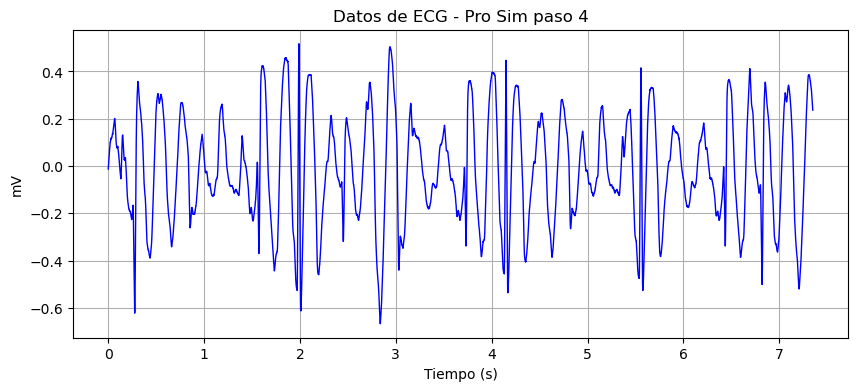  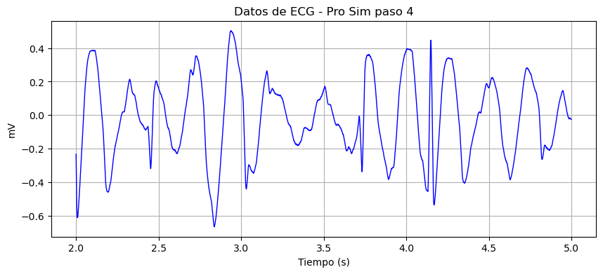
- Paso 5: Asistolia
Ausencia total de sístole cardíaca con pérdida completa de la actividad, se trata de un paro cardíaco.

  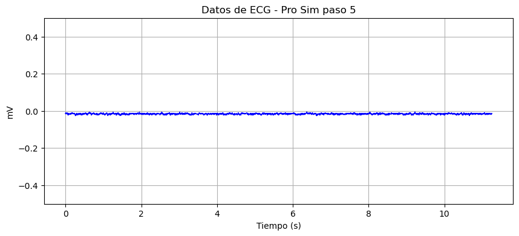
   

## 7. Discusión

El uso de métodos de reconocimiento de patrones para el análisis de señales ECG, el dispositivo BiTalino utiliza la configuración de Einthoven para evaluar diferentes estados de ritmos cardíacos y a una frecuencia de sampleo de 1000 Hz para su correcta conversión de ADC. Para el proceso de filtrado de la señal se suele utilizar un filtro Butterworth de paso de banda con frecuencias de corte de 10 y 450 Hz, la rectificación de la señal y la aplicación de otro filtro Butterworth de paso bajo con frecuencias de corte de 4 Hz, en donde estas mediciones cumplen con los Golden Standard. [5]

  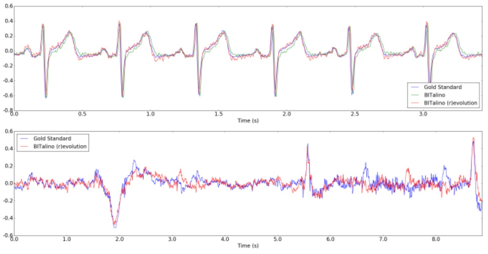
   
  <strong>Fig.4. Segmento de ECG (arriba) y segmento de EEG (abajo) adquiridos por el diferentes dispositivos. Segmentos normalizados para fines de visualización [5].</strong>

- Durante la simulación de un ataque cardíaco se evaluaron 4 pasos.
- Paso 2: CVP. contracciones ventriculares prematuras
- Se observa un complejo QRS anormal, en su forma y duración, seguido de una pausa compensatoria.

  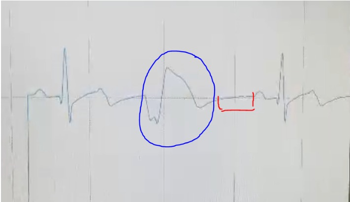
   

- En azul el complejo QRS deformado y ensanchado, en rojo la pausa compensatoria
- Paso 3: taquicardia ventricular, 160 lpm.
- Se puede observar un complejo QRS ancho, y con una frecuencia cardiaca mayor a 120 lpm en al menos 3 latidos consecutivos.

  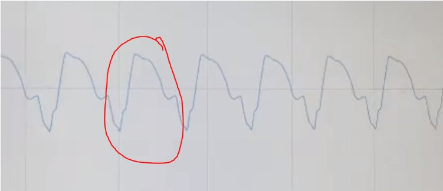
   

- En rojo complejo QRS ancho, se ven múltiples latidos consecutivos iguales.
- Paso 4: fibrilación ventricular
- Ritmo rápido, mayor a 250 lpm, irregular y de forma caótica.

  
   

- Se aprecian latidos erráticos y con alta frecuencia.
- Paso 5: Asistolia
- Las contracciones cardiacas se han detenido completamente, no hay señal electrica del corazon y no esta fluyendo la sangre.

  
   

- Se muestra en el ecg como una linea plana, no hay actividad electrica.

## 8. Conclusiones
- Para la toma de muestras de señales ECG con el BiTalino, consiste en la amplificación de señales eléctricas detectadas por los electrodos, para su posterior conversión a señal digital. Con la obtención de estas señales podemos estudiar y analizar patrones en la formación de ondas de ECG por medio de su frecuencia en el tiempo y su amplitud en milivoltios.
- Durante la medición del estado basal, se obtuvo una amplitud máxima de 0.6 mV dentro del complejo QRS y con un intervalo R-R de 0.75 que equivalen a 80 latidos por minuto, lo cual está dentro de los rangos normales para señales ecg en reposo. Podemos observar que la amplitud del complejo QRS nos muestra la despolarización ventricular junto a la magnitud de la señal eléctrica generada por cada contracción [4]. 
- En la segunda medición, durante respiración prolongada, obtenemos un aumento en la amplitud de 0.8 mV dentro del complejo QRS y con un intervalo R-R de 0.83 que equivale a 72 latidos por minuto. Se muestra la disminución en la frecuencia cardíaca y en los intervalos R-R por el aumento progresivo del flujo sanguíneo.
- En la tercera medición, obtuvimos una amplitud de 0.8 mV dentro del complejo QRS y un intervalo R-R de 0.55, lo que implica 109 latidos por minuto. Cuando se ha realizado ejercicio por un minuto, se aumentó la frecuencia cardíaca lo que nos resulta en la disminución del intervalo R-R, ya que el organismo necesita suministrar más oxígeno y nutrientes por medio del sistema nervioso autónomo.
- Se debe considerar que las señales obtenidas están sujetas a interferencias y ruidos provocados por contacto de los electrodos. Por lo que, se deberá aplicar un filtro para la eliminación parcial o total de estas interferencias para la correcta detección de patrones o anomalías en las señales EKG [4]. 

## 9. Bibliografía
[1] M. Proença y K. Mrotzeck, "BITalino (r)evolution Lab Guide," PLUX – Wireless Biosignals, S.A., Lisboa, Portugal, OD.LB.03.04, 15 de febrero de 2021.

[2] “(PDF) Avances en el Desarrollo de un Sistema de Espirometría con correlación ECGAR para la Detección Temprana de Enfermedades Cardiorrespiratorias,” ResearchGate, 2018. https://www.researchgate.net/publication/328080878_Avances_en_el_Desarrollo_de_un_Sistema_de_Espirometria_con_correlacion_ECGAR_para_la_Deteccion_Temprana_de_Enfermedades_Cardiorrespiratorias/figures  (accessed Apr. 19, 2024).

[3] “BITalino (r)evolution Lab Guide.” Available: https://support.pluxbiosignals.com/wp-content/uploads/2022/04/HomeGuide2_ECG.pdf

[4] Lorenzo Romero, J. (2015). Análisis De Señales Electrocardiográficas Usando Técnicas De Procesamiento Digital. Ingeniería Técnica De Telecomunicación. https://openaccess.uoc.edu/bitstream/10609/40186/6/jlorenzoroTFC0115memoria.pdf

[5] Batista, D., Silva, H., & Fred, A. (2017). Experimental Characterization and Analysis of the BITalino Platforms Against a Reference Device. Instituto de Telecomunicações, Instituto Superior Técnico. https://pubmed.ncbi.nlm.nih.gov/29060386/

