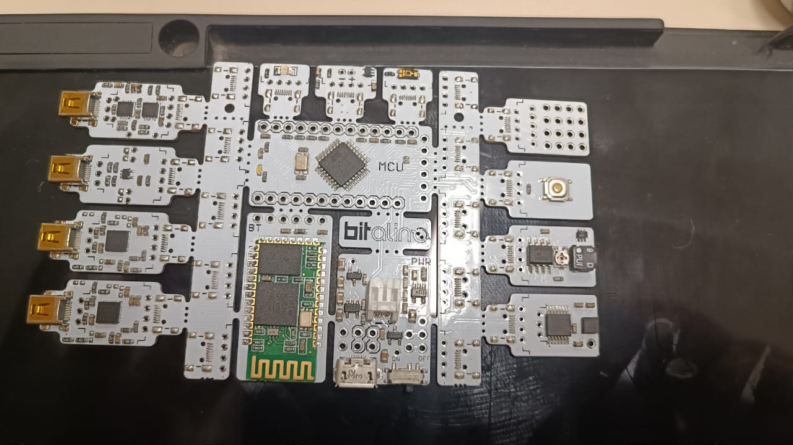
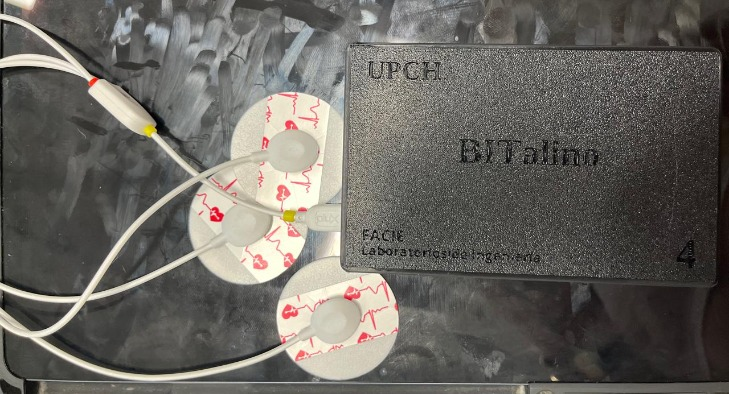
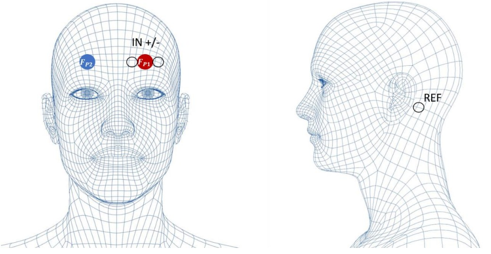
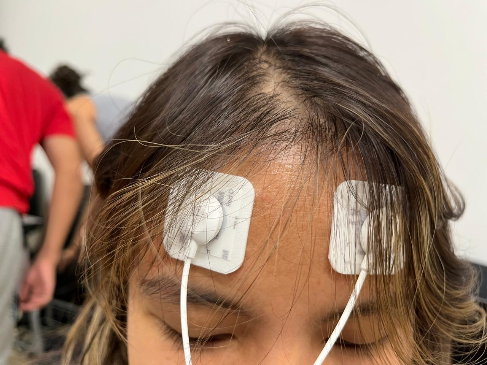
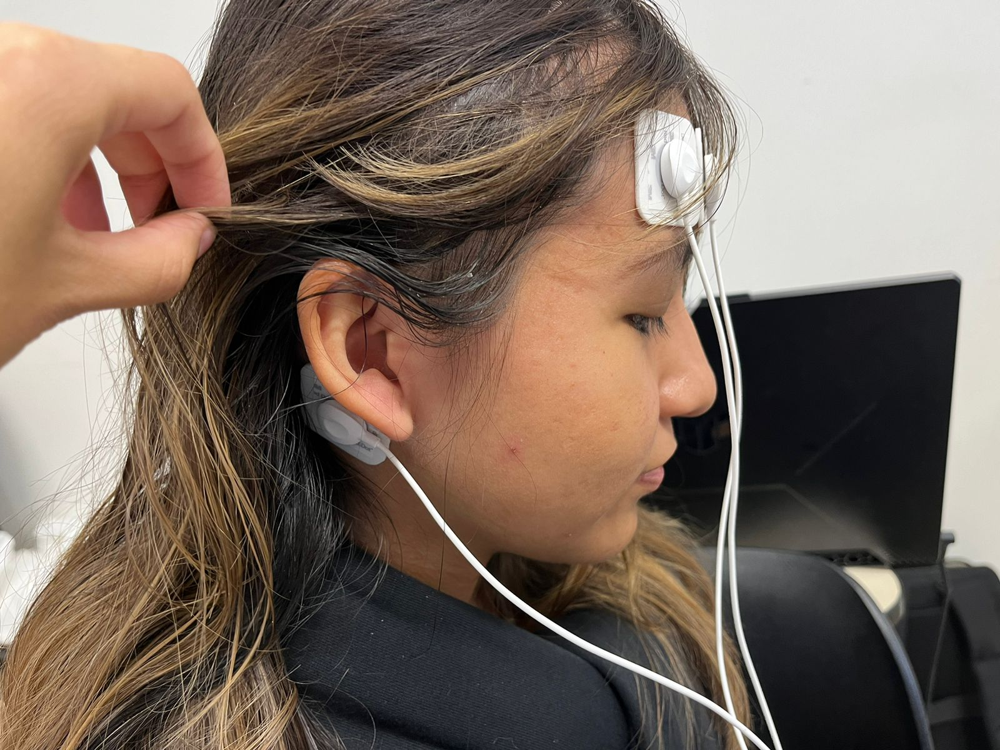

# INFORME LABORATORIO 5
## Lista de Participantes - Grupo 7

- Andrea Razuri Madrid
- Isabel Leon Luna
- Johanni Bohorquez Gutierrez
- Claudia Camacho Grimaldi
- Jaime Arista Cutipa 

## Tabla de Contenidos

- 

## 1. INTRODUCCIÓN A LA  (EEG)

## 2. Objetivos
- Obtener señales biomédicas de electroencefalografía (EEG).
- Configurar adecuadamente el dispositivo BiTalino.
- Extraer datos de las señales EEG utilizando el software OpenSignals (r)evolution.

## 3. Materiales y equipos

|   Modelo      | Descripción   | Cantidad |
|---------------|---------------|----------|
| (R)EVOLUTION  | Kit BITalino  | 1        |
|       -       | Laptop o PC   | 1        |

## 4. Metodología

- **Empleo de OpenSignals**: El software diseñado para la visualización de la señales del BITalino.

  

- **Uso de BITalino**: El dispositivo cuenta con un procesador ATMEGA328P, y funciona de manera inalámbrica gracias a su módulo Bluetooth.
 

- **Posición de los electrodos**:
  - Se consideró la polarización de los electrodos al enfocarnos en la primera derivación bipolar.
  - Se colocó el electrodo negativo en el brazo derecho, el electrodo positivo en el brazo izquierdo, y el electrodo de referencia cerca a la cresta ilíaca.

  
   
  <strong>Fig.2. Posición de los electrodos para la adquisición de las señales ECG [3]</strong>

    
   
  <strong>Fig 3. Posicionamiento de los electrodos en el sujeto de prueba.</strong>

- **Sujeto 1- Jaime**:

- **Pro-sim**:
   Simulación de Pruebas Cardíacas

## 5. Resultados

### Sujeto 

### Pro sim

  
   

## 6. Discusión
- 

## 7. Conclusiones
- 

## 9. Bibliografía
[1] 
