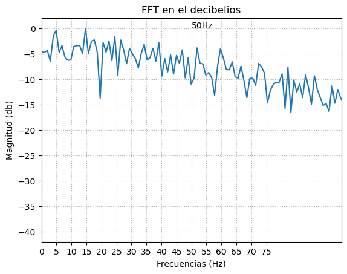

# INFORME LABORATORIO 5
## Lista de Participantes - Grupo 7

- Andrea Razuri Madrid
- Isabel Leon Luna
- Johanni Bohorquez Gutierrez
- Claudia Camacho Grimaldi
- Jaime Arista Cutipa 

## Tabla de Contenidos

- 

## 1. INTRODUCCIÓN A LA  (EEG)

## 2. Objetivos
- Obtener señales biomédicas de electroencefalografía (EEG).
- Configurar adecuadamente el dispositivo BiTalino.
- Extraer datos de las señales EEG utilizando el software OpenSignals (r)evolution.

## 3. Materiales y equipos

|   Modelo      | Descripción   | Cantidad |
|---------------|---------------|----------|
| (R)EVOLUTION  | Kit BITalino  | 1        |
|      -      |Electrodos con gel| 3|
|       -       | Laptop o PC   | 1        |
| OpenBCI |Ultracortex Mark IV EEG Headset |1|
| OpenBCI | OpenBCI Cyton 8-channel Board |1|

## 4. Metodología

- **Empleo de OpenSignals**: El software diseñado para la visualización de la señales del BITalino.

   

    
    

- **Uso de BITalino**: El dispositivo cuenta con un procesador ATMEGA328P, y funciona de manera inalámbrica gracias a su módulo Bluetooth.

 

    
    

  
- **Posición de los electrodos**:
  - Se consideró la polarización de los electrodos enfocándonos en la configuración bipolar. Se situó el electrodo negativo (negro) en la parte derecha de la frente, mientras que el electrodo positivo (rojo) se colocó en la parte izquierda de la frente. Adicionalmente, el electrodo de referencia (blanco) se posicionó en una área neutra, específicamente en el hueso detrás de la oreja [3].

  
   
  <strong>Fig.2. Posición de los electrodos para la adquisición de las señales EEG [3]</strong>

    
   
  <strong>Fig 3. Posicionamiento de los electrodos en el sujeto de prueba.</strong>

- **Procedimiento de registro EEG**:
  
| Etapa                 | Indicaciones                                                                                                       | Toma             |
|-----------------------|--------------------------------------------------------------------------------------------------------------------|-------------------|
| Reposo (30 segundos)  | Registrar una línea base de señal con poco ruido y sin movimientos (respiración normal, sin movimientos oculares/ojos cerrados) durante 30 segundos. |<video src="https://github.com/AndreaRazuriMadrid/intro-senales-biomedicas/assets/157930025/82d554cf-76bf-4a84-bcb8-3286cde2dcd5" width="80%" height="80%"></video> |
| Abrir y cerrar ojos   | Repetir un ciclo de OJOS ABIERTOS - OJOS CERRADOS cinco veces, manteniendo ambas fases durante cinco segundos.       | <video src="https://github.com/AndreaRazuriMadrid/intro-senales-biomedicas/assets/157930025/8a0fa139-4ad7-46d0-9675-700ebbd0c155" width="50%" height="50%"></video> |
| Reposo (30 segundos)  | Registre otra fase de referencia de 30 segundos                                                              | <video src="https://github.com/AndreaRazuriMadrid/intro-senales-biomedicas/assets/157930025/ad29e4ad-b436-4184-9fb4-75859c0570c3" width="50%" height="50%"></video> |
| Preguntas matemáticas | Que uno de tus compañeros lea en voz alta una serie de ejercicios matemáticos y resuelve cada uno de ellos mentalmente enfocando tu mirada en un punto específico para evitar artefactos. | <video src="https://github.com/AndreaRazuriMadrid/intro-senales-biomedicas/assets/157930025/e48396e2-c8de-45c2-9273-54a04c8cb4a1" width="50%" height="50%"></video> |

- **ULTRACORTEX**:
  

 
| Etapa                 | Toma               |
|-----------------------|--------------------|
| Reposo (30 segundos)  | <video src="https://github.com/AndreaRazuriMadrid/intro-senales-biomedicas/assets/157930025/3dab45b9-6547-4d54-873f-d5b4080d903e" width="50%" height="50%"></video>                   |
| Abrir y cerrar ojos   | <video src="https://github.com/AndreaRazuriMadrid/intro-senales-biomedicas/assets/157930025/bd46b3f8-b6a9-45f1-b235-2544335b8c86" width="50%" height="50%"></video>                   |
| Reposo (30 segundos)  | <video src="https://github.com/AndreaRazuriMadrid/intro-senales-biomedicas/assets/157930025/420e8521-14c6-4189-82ad-57cb3a3a3ba6" width="50%" height="50%"></video>                   |
| Preguntas matemáticas |      <video src="https://github.com/AndreaRazuriMadrid/intro-senales-biomedicas/assets/157930025/af04d08f-13e7-4b78-80a5-cb012320e098" width="50%" height="50%"></video>              |

## 5. Resultados

Ploteo de la señal en Python

Se usó una frecuencia de muestreo del bitalino de 1000Hz. Se usó el canal 8 para extraer la información de los archivos txt obtenidas del OpenSignal. 

| Etapa                 | Toma               |
|-----------------------|--------------------|
| Reposo 1 (30 segundos)  | |
| Abrir y cerrar ojos   |  |
| Reposo (30 segundos)  |   |
| Preguntas matemáticas |   |

Ploteo de FFT en algunas etapas

| Etapa                 | Toma               |
|-----------------------|--------------------|
| Reposo 1 (30 segundos)  | |
| Abrir y cerrar ojos entre 22-27 segundos |  |
| Abrir y cerrar ojos entre 27-32 segundos  |   |
| Preguntas matemáticas fáciles |   |
| Preguntas matemáticas difíciles |   |

## 6. Discusión
En nuestras pruebas usando el sensor eeg del bitalino, el arreglo utilizado en la frente nos permite leer la señal de lóbulo frontal del cerebro, se hizo siguiendo el sistema internacional 10-20, y se utilizó el método monopolar (dos electrodos en una área del cerebro y un electrodo de referencia). El biTalino utiliza una configuración bipolar, en donde señal medida es la diferencia amplificada entre las dos señales de medición que se filtra por paso de banda por 0.8-48 Hz para eliminar señales no deseadas y una alta ganancia de amplificación de 40000, lo que lo hace sensible a artefactos como la luz y los movimientos.

  
   
  <strong>Fig.4. Electrodos +/- se colocan en las posiciones azul y roja, y  la referencia detras de la oreja  [3]</strong>

Durante la medición de en reposo se pueden ver las ondas alfa de baja frecuencia pero contiene muchos artefactos y ruido. Con el análisis de frecuencia podemos ver que el ruido continua en las otras pruebas, haciendo más difícil poder leer la información. Este ruido se puede deber al posicionamiento de los electrodos y su referencia, además de que el sujeto se encontraba cerca de 2 laptops y tenía una joya de acero.

Para el reconocimiento de señales en el Ultra Cortex, se toma en cuenta la posición de los electrodos según el International 10-20 system en el cuero cabelludo, el cual consta de la distancia total entre el frente y la parte posterior, así como de derecha a izquierda. El 10 y 20 describen las distancias entre cada electrodo adyacente en porcentaje. Cada posición tiene una letra y un número que describen la ubicación en el lóbulo (frontal, temporal, central y occipital), en donde los número impares se refiere a la izquierda y los número pares a la derecha.

En el caso de la prueba con el ultra cortex se debe tener en cuenta que no se logró una buena toma de la señal, se pudo deber a diferentes factores como no haber logrado una buena conexión con el cuero cabelludo, los electrodos se encontraban algo secos, todo esto causó que solo 2 de los canales lograran una señal de calidad aceptable

## 7. Conclusiones
- En la medición en Reposo 1, se observa un aumento de amplitud de hasta 1.5mV. Sin embargo, esto puede deberse a factores de ruido o al movimiento involuntario de los ojos. Una medida más precisa se encuentra entre los 28 a 40s, en donde la amplitud es alrededor de 1 mV aproximadamente, esto sugiere que la actividad eléctrica cerebral es más estable en ese intervalo de tiempo y que la amplitud medida allí es más confiable.
- En la medición de abrir y cerrar los ojos, se muestra se observa una repetición de la señal. Cuando se abren los ojos se obtiene una amplitud de hasta 1.5 mV, pero cuando se cierran los ojos se muestra una amplitud alrededor de 1 mV, lo cual es consistente con la activación cortical asociada con la percepción visual y el procesamiento de la información visual entrante [1]. Este ciclo de repetición se da por ejemplo entre 12 a 22s. Se pueden visualizar las ondas alfa, debido a que en este ejercicio la persona se encuentra en un estado mentalmente relajado pero despierto [2]. 
- En la medición de preguntas matemáticas, se observan picos con una amplitud mayor a 1.5 mV cuando se razona la pregunta formulada. Para el caso de las preguntas con mayor dificultad, se observa una señal con mayor generación de picos mayores a 1.5 mV, debido a que el cerebro realiza un mayor esfuerzo. Se podría considerar que se está visualizando onda beta, debido a que se está implicando actividades mentales que demandan mayor velocidad de transmisión [2]. 
 
## 9. Bibliografía
[1] Gómez, L.J. (2016) Departamento de Automática, Ingeniería Eléctrica y Electrónica e Informática Industrial. Available at: https://oa.upm.es/44379/1/TFM_LEONARDO_JOSE_GOMEZ_FIGUEROA.pdf (Accessed: 26 April 2024).  
[2] Ramos, R. (2020) Análisis de espectrogramas de señales EEG, Facultad de Ciencias de la Computación. Available at: https://repositorioinstitucional.buap.mx/server/api/core/bitstreams/92e27f78-4f9d-4d2e-9d69-9f90cd87c0b1/content (Accessed: 26 April 2024). 

[3] “BITalino (r)evolution Lab Guide.” Accessed: Apr. 26, 2024. [Online]. Available: https://www.bitalino.com/storage/uploads/media/homeguide3-eeg.pdf

