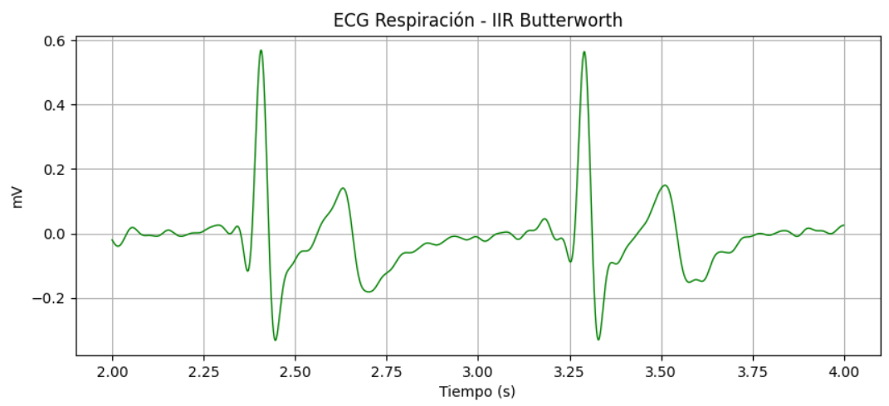
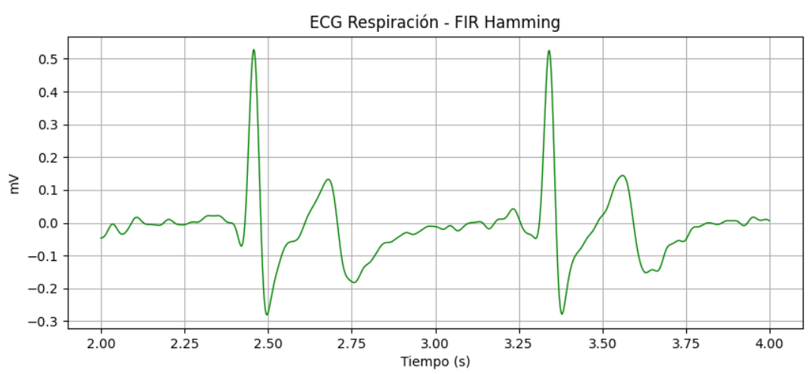
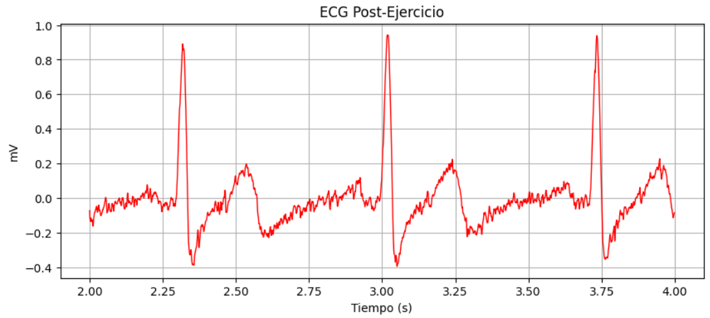

# INFORME LABORATORIO 6
## Lista de Participantes - Grupo 7

- Andrea Razuri Madrid
- Isabel Leon Luna
- Johanni Bohorquez Gutierrez
- Claudia Camacho Grimaldi
- Jaime Arista Cutipa 

## Tabla de Contenidos

1. [INTRODUCCIÓN](#1-introducción)
2. [Objetivos](#2-objetivos)
3. [Materiales y equipos](#3-materiales-y-equipos)
4. [Metodología](#4-metodología)
5. [Resultados](#5-resultados)
6. [Discusión](#6-discusión)
7. [Conclusiones](#7-conclusiones)
8. [Bibliografía](#8-bibliografía)

## 1. INTRODUCCIÓN 

## 2. Objetivos
- Crear un filtro IIR, seleccionando uno de los siguientes tipos: Bessel, Butterworth, Chebyshev, o Elíptico.
- Diseñar un filtro FIR utilizando dos de las siguientes técnicas de ventaneo: Hanning, Hamming, Bartlett, rectangular, o Blackman.
- Implementar filtros IIR y FIR en el procesamiento de señales ECG, EMG y EEG.
## 3. Materiales y equipos

|   Modelo      | Descripción   | Cantidad |
|---------------|---------------|----------|
| (R)EVOLUTION  | Kit BITalino  | 1        |
|      -      |Electrodos con gel| 3|
|       -       | Laptop o PC   | 1        |

## 4. Metodología

## 5. Resultados

**5.1. Análisis de Señales ECG:**
- Se analizaron las señales de electrocardiograma (ECG) con una frecuencia de muestreo de 1000 Hz. Utilizando Python, se extrajeron datos relevantes de la columna 6 de un archivo de texto. Estos datos, provenientes de un sistema de adquisición similar al biTalino, emplean una configuración bipolar para medir la diferencia amplificada entre dos puntos de medición.

- Los datos digitales se convirtieron a mV utilizando una fórmula basada en el voltaje de referencia (VCC) de 3.3V y una resolución de 10 bits. Luego, las señales se filtraron para reducir el ruido y mejorar la visibilidad de los componentes cardíacos significativos. Se utilizaron dos tipos de filtros: un filtro IIR Butterworth de orden 5 y un filtro FIR con ventana de Hamming, ambos con una frecuencia de corte de 20 Hz.

| Campos          | Señal cruda | Filtro IIR | Filtro FIR |
|-----------------|-------------|------------|------------|
| Basal |  |||
| Respiración     ||||
| Post ejercicio  ||||

## 6. Discusión

**6.1. Análisis de Señales ECG:**
- Elección del Filtro y Configuración:
  - Filtro IIR Butterworth: Se eligió un filtro Butterworth de orden 5 con una frecuencia de corte de 20 Hz, basado en su capacidad para ofrecer una respuesta de frecuencia plana en la banda de paso, lo que es crucial para no alterar las características esenciales de la señal de ECG. Este diseño se apoya en el estudio de S. Basu y S. Mamud, donde se examina cómo la variación del orden y la frecuencia de corte afecta la eliminación de ruido en las señales de ECG [1].
  - Filtro FIR con Ventana de Hamming: La elección de la ventana de Hamming para el diseño del filtro FIR se basa en su efectividad en la reducción de ruido mientras mantiene la integridad de la señal. Según un estudio reciente por M. Das, R. Kumar, y B. Sahana, el uso de una función de ventana híbrida que incorpora la ventana de Hamming en filtros FIR demuestra una mejora significativa en la desruidización de señales ECG, proporcionando una solución eficaz para aplicaciones clínicas donde la claridad de la señal es crucial [2].
- Análisis de las Señales Filtradas:
  - Las señales filtradas mostraron una notable reducción del ruido de alta frecuencia y los artefactos, validando la elección del orden del filtro y la frecuencia de corte. Y.A. Altay y A.S. Kremlev discuten en su estudio cómo los filtros polinomiales, incluidos los basados en Butterworth, mejoran la precisión del procesamiento de la señal de ECG, respaldando nuestras observaciones sobre la efectividad de los filtros elegidos [3].

## 7. Conclusiones
- La inspección visual de las señales filtradas versus las señales crudas demostró claramente la efectividad de ambos tipos de filtros en la mejora de la calidad de la señal ECG. En particular, el filtro FIR, con sus características de fase lineal, mostró ser superior para aplicaciones donde la integridad de la fase es crucial.

 
## 8. Bibliografía
[1] S. Basu y S. Mamud, "Comparative study on the effect of order and cut off frequency of Butterworth low pass filter for removal of noise in ECG signal," 2020 IEEE 1st International Conference for Convergence in Engineering, 2020. [En línea]. Disponible: https://ieeexplore.ieee.org/document/9290646

[2] M. Das, R. Kumar, y B. Sahana, "Implementation of effective hybrid window function for ECG signal denoising," Traitement du Signal, vol. 37, no. 2, pp. 305-312, 2020. [En línea]. Disponible: https://www.researchgate.net/publication/340100534_Implementation_of_Effective_Hybrid_Window_Function_for_ECG_Signal_Denoising

[3] Y. A. Altay y A. S. Kremlev, "Polynomial filtering of low-and high-frequency noise for improving the accuracy of ECG signal processing: new advancements," Cardiometry, 2020. [En línea]. Disponible: https://www.researchgate.net/publication/343295169_Polynomial_filtering_of_low-_and_high-_frequency_noise_for_improving_the_accuracy_of_ECG_signal_processing_new_advancements

