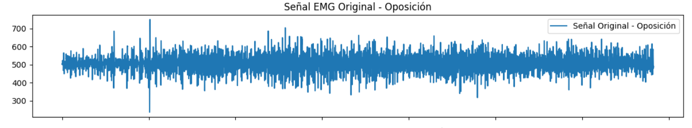
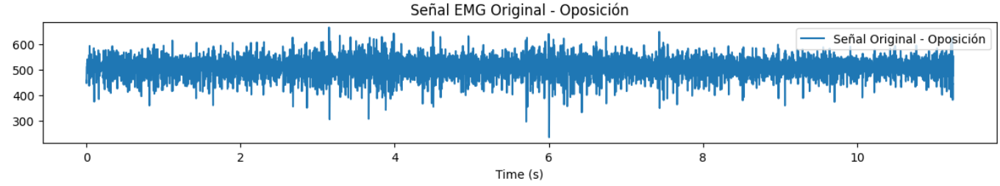
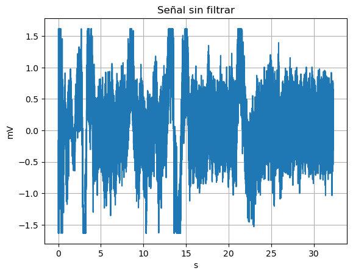
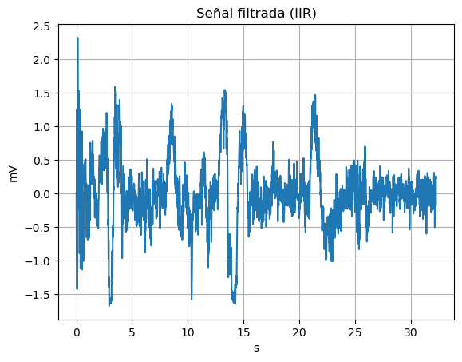
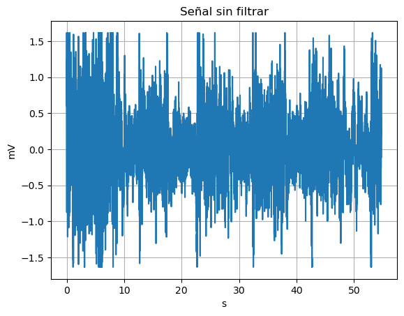
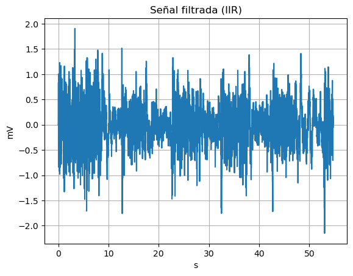
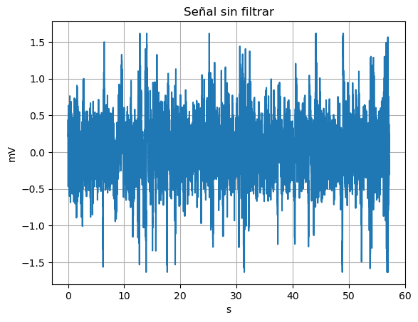
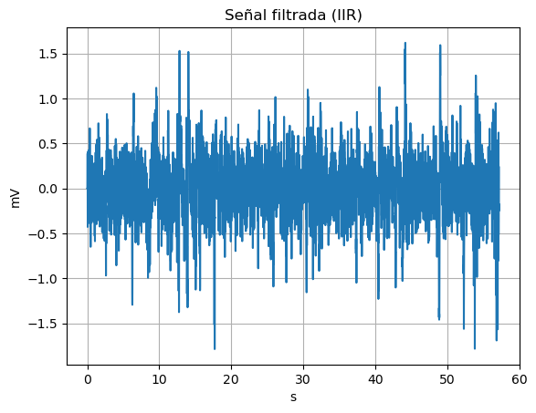

# INFORME LABORATORIO 7
## Lista de Participantes - Grupo 7

- Andrea Razuri Madrid
- Isabel Leon Luna
- Johanni Bohorquez Gutierrez
- Claudia Camacho Grimaldi
- Jaime Arista Cutipa 

## Tabla de Contenidos

1. [Introducción](#1-introducción)
2. [Objetivos](#2-objetivos)
3. [Materiales y equipos](#3-materiales-y-equipos)
4. [Metodología](#4-metodología)
5. [Resultados](#5-resultados)
6. [Discusión](#6-discusión)
7. [Conclusiones](#7-conclusiones)
8. [Bibliografía](#8-bibliografía)

## 1. Introducción

## 2. Objetivos
- 
- Implementar filtros Wavelet en el procesamiento de señales ECG, EMG y EEG.
## 3. Materiales y equipos

|   Modelo      | Descripción   | Cantidad |
|---------------|---------------|----------|
| (R)EVOLUTION  | Kit BITalino  | 1        |
|      -      |Electrodos con gel| 3|
|       -       | Laptop o PC   | 1        |

## 4. Metodología
**4.1. Análisis de Señales ECG:** 
- Las señales de electrocardiograma (ECG) se obtuvieron durante diferentes condiciones: en reposo basal, durante respiración controlada y después de ejercicio. Se almacenaron las señales en formato de texto y se muestrearon a una frecuencia de 1000 Hz, garantizando una captura adecuada de la dinámica cardíaca sin infracción del teorema de Nyquist.

- Las señales crudas y filtradas fueron visualizadas utilizando gráficos que mostraban segmentos de la señal en el tiempo. Esto permitió una comparación directa y visual de los efectos de cada filtro. Se prestó especial atención a la preservación de los picos y formas características del ECG, como los complejos QRS, los cuales son críticos para un diagnóstico clínico acertado.

**4.2. Análisis de Señales EMG:**

- Se obtuvieron las señales de EMG en diferentes actividades músculares: Oposición, Reposo, Extensión y Flexión. Las señales se almacenaron en formato de texto y se muestrearon a una frecuencia de 1000 Hz. Para analizar las señales y reducir el ruido inherente a las mediciones de EMG, se aplicaron dos tipos de filtros digitales: Filtro FIR (Respuesta Impulsiva Finita) y filtro IIR (Respuesta Impulsiva Infinita).

**4.3. Análisis de Señales EEG:**

- 

## 5. Resultados

**5.1. Análisis de Señales ECG:**
- Se analizaron las señales de electrocardiograma (ECG) con una frecuencia de muestreo de 1000 Hz. Utilizando Python, se extrajeron datos relevantes de la columna 6 de un archivo de texto. Estos datos, provenientes delvsistema biTalino, emplean una configuración bipolar para medir la diferencia amplificada entre dos puntos de medición.

- Los datos digitales se convirtieron a mV utilizando una fórmula basada en el voltaje de referencia (VCC) de 3.3V y una resolución de 10 bits. Luego, las señales se filtraron para reducir el ruido y mejorar la visibilidad de los componentes cardíacos significativos.

| Campos          | Señal cruda | Filtro Wavelet | 
|-----------------|-------------|------------|
| Basal |  ||
| Respiración     |||
| Post ejercicio  |||

**5.2. Análisis de Señales EMG:**

En este estudio se trabajaron con dos compañeros. Se utilizó una frecuencia de muestreo de 1000 Hz. En el filtro FIR utilizamos 'firwin' para la creación del filtro pasa alta. La configuración se ajustó a cada actividad. 

- Oposición: 3 coeficientes, frecuencia de corte de 300 Hz.
- Reposo: 100 coeficientes, frecuencia de corte de 400 Hz para reservar la señal eliminando los componentes de baja frecuencia.
- Extensión: 3 coeficientes, frecuencia de corte de 10 Hz.
- Flexión: 3 coeficientes, frecuencia de corte de 300 Hz.

Sin embargo trans probar estas frecuencias de corte no se noto ninguna diferencia asi que para simplificar el codigo utilizado se uso solo la frecuencia de corte de 200 Hz.

Mientras el que filtro IIR se utilizó Butterworth de pasa baja para obtener una respuesta más suave. El filtro se configuró con un orden de 5 y una frecuencia de corte de 200 Hz. El filtro IIR se aplicó a las mismas señales para comparar los efectos del filtrado FIR e IIR en la calidad de las señales procesadas.

- El primer compañero tuvo estos resultados cuando se le aplicó el filtro FIR:

| Ejercicio   | Señal original | Filtro Wavelet | 
|-----------------|-------------|------------|
| Oposición |   | | 
| Reposo |    | | 
| Extensión |   | |
| Flexión |   | |  

- El segundo compañero tuvo estos resultados cuando se le aplicó el filtro FIR:

| Ejercicio   | Señal original | Filtro Wavelet | 
|-----------------|-------------|------------|
| Oposición |   | | 
| Reposo |    | | 
| Extensión |   | |
| Flexión |   | |

**5.3. Análisis de Señales EEG:**
  - En este estudio se procesaron señales EEG registradas a una frecuencia de muestreo de 1000 Hz, empleando el dispositivo BiTalino junto con la disposición estándar de electrodos según el sistema internacional 10-20, y aplicando un método monopolar con dos electrodos posicionados en una región cerebral específica más un electrodo de referencia. Para la conversión de las señales a milivoltios, se utilizó una ecuación que considera un voltaje de referencia (VCC) de 3.3V y una resolución de 10 bits, permitiendo una cuantificación precisa de la señal EEG. Posteriormente, para mejorar la calidad de las señales eliminando ruidos no deseados, se implementaron filtros digitales. Se aplicaron dos tipos de filtros: un filtro IIR Butterworth de orden 9 y un filtro FIR diseñado con una ventana de Hanning, el primero configurados con una frecuencia de corte de 35 Hz y el segundo se trabajó por separado para analizar las frecuencias de las ondas alfa y beta. Estos filtros fueron esenciales para atenuar componentes de alta frecuencia y ruidos, facilitando así una mejor interpretación y análisis de las señales EEG.

| Ejercicio   | Señal original | Filtro Wavelet | 
|-----------------|-------------|------------|
| Reposo |   | |
| Abrir y Cerrar los ojos |    | | 
| Preguntas matemáticas |    | | 

## 6. Discusión

**6.1. Análisis de Señales ECG:**
- 

**6.2. Análisis de Señales EMG:**

- Análisis de resultados de primera prueba:

i. Oposición: En la señal original, muestra viarabilidad constante a lo alrgo del tiempo con una amplitud que varía en un rango estrecho. Luego, con el filtro 

ii. Reposo: La señal original, es predonmianntemente plana con variaciones pequeñas pero notables en amplitud. Luego, la señal filtrada por el filtro 

iii. Extensión: Similar a la señal de Oposición, con una amplitud que varía dento de un rango entrescho pero con picos más definidos. 
iv. Flexión: La señal original presenta más variabilidad y rango de amplitud que las otras actividades.

- Análisis de resultados de segunda prueba:

i. Oposición: La señal original muestra variabilidad constante a lo largo del tiempo con una amplitud que varía en un rango estrecho.

ii. Reposo: La señal original es predominantemente plana con pequeñas pero notables variaciones en amplitud. 

iii. Extensión: Similar a la señal de Oposición, con variabilidad en un rango estrecho pero con picos más definidos. 

iv. Flexión: La señal original presenta más variabilidad y amplitud que las otras actividades. 

**6.3. Análisis de Señales EEG:**
- Elección del Filtro y Configuración:
  -
- Análisis de las Señales Filtradas - IIR:
  - Reposo:
   
  - Abrir y cerrar ojos:
    
  - Preguntas:
    

- Análisis de las Señales Filtradas:
  - Reposo:
    
  - Abrir y cerrar ojos:
    
  - Preguntas:
   
- Análisis de las Señales Final:
  - En la medición en Reposo 1, durante la medición de en reposo se pueden ver las ondas alfa de baja frecuencia pero contiene muchos artefactos y ruido. Con el análisis de frecuencia podemos ver que el ruido continua en las otras pruebas, haciendo más difícil poder leer la información. Este ruido se puede deber al posicionamiento de los electrodos y su referencia, además de que el sujeto se encontraba cerca de 2 laptops y tenía una joya de acero.

  - En la medición de abrir y cerrar los ojos se observa los 5 ciclos realizados. Después de realizar los filtros, se señal es consistente con la activación cortical asociada con la percepción visual y el procesamiento de la información visual entrante [17]. Este ciclo de repetición se da por ejemplo entre 12 a 22s. Se podría considerar que se está encontrando ondas alfa, debido a que en este ejercicio la persona se encuentra en un estado mentalmente relajado pero despierto [18].

  - En la medición de preguntas matemáticas, después de realizar el filtrado, se podría considerar que se está visualizando onda beta y alfa, debido a que se está implicando actividades mentales que demandan mayor velocidad de transmisión además del parpadeo normal del sujeto de prueba [18].

## 7. Conclusiones
-

## 8. Bibliografía
[1]
