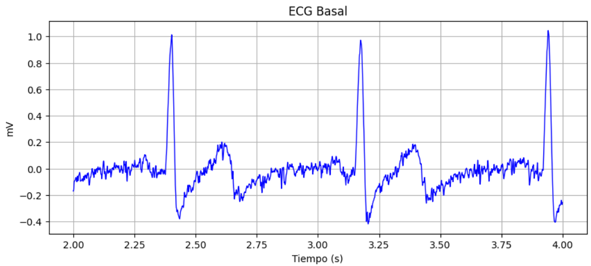
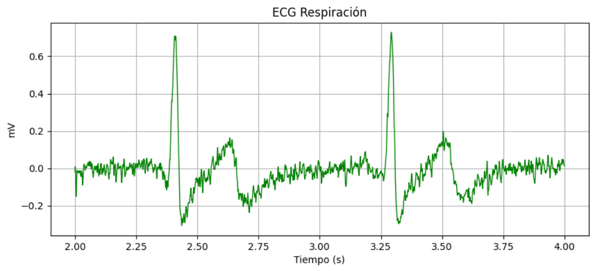
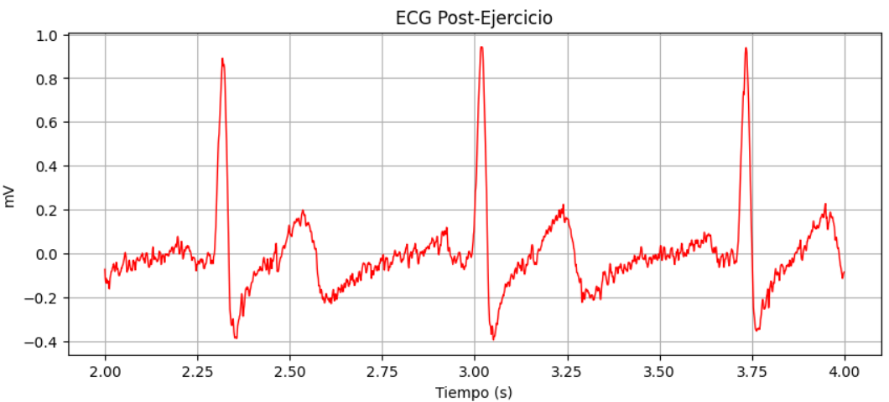
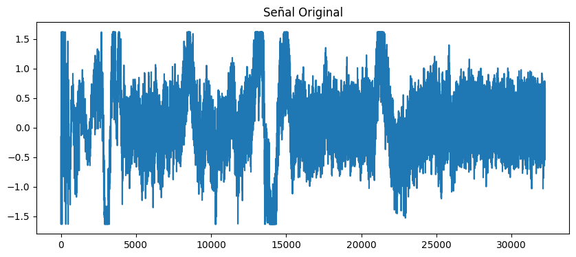
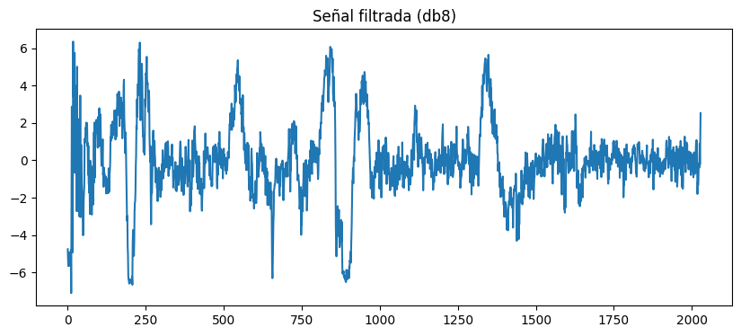
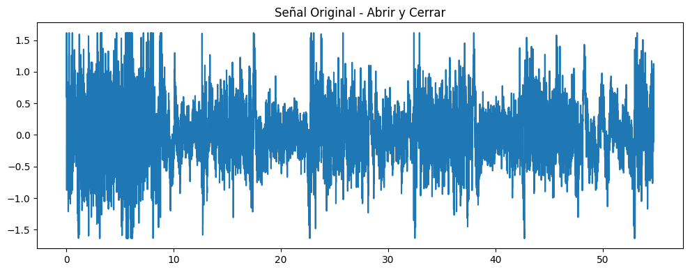
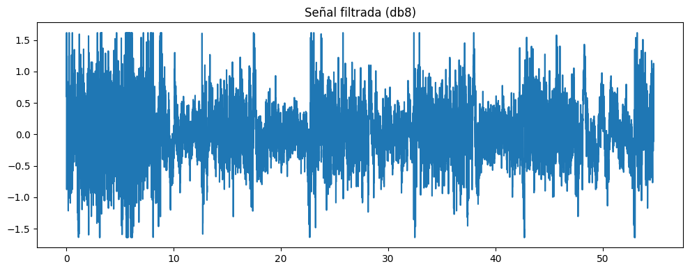
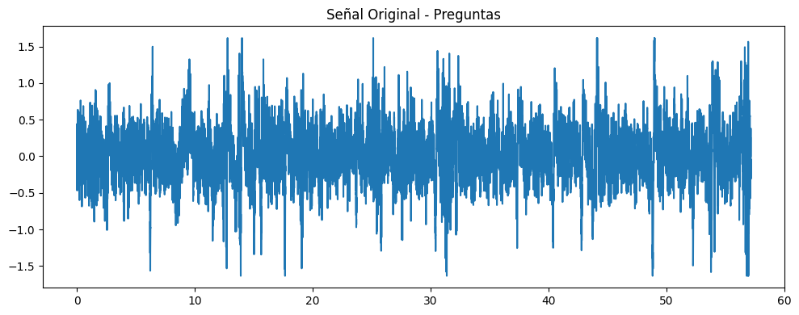

# INFORME LABORATORIO 7
## Lista de Participantes - Grupo 7

- Andrea Razuri Madrid
- Isabel Leon Luna
- Johanni Bohorquez Gutierrez
- Claudia Camacho Grimaldi
- Jaime Arista Cutipa 

## Tabla de Contenidos

1. [Introducción](#1-introducción)
2. [Objetivos](#2-objetivos)
3. [Materiales y equipos](#3-materiales-y-equipos)
4. [Metodología](#4-metodología)
5. [Resultados](#5-resultados)
6. [Discusión](#6-discusión)
7. [Conclusiones](#7-conclusiones)
8. [Bibliografía](#8-bibliografía)

## 1. Introducción

## 2. Objetivos
- Implementar y evaluar la eficacia de filtros wavelet para el procesamiento y mejora de la calidad de señales electrocardiográficas (ECG), electromiográficas (EMG) y electroencefalográficas (EEG), enfocándose en la reducción de ruido, la extracción de características relevantes y la mejora de la precisión en la detección de eventos clínicos significativos.
  
## 3. Materiales y equipos

|   Modelo      | Descripción   | Cantidad |
|---------------|---------------|----------|
| (R)EVOLUTION  | Kit BITalino  | 1        |
|      -      |Electrodos con gel| 3|
|       -       | Laptop o PC   | 1        |

## 4. Metodología

### 4.1. Análisis de Señales ECG

Las señales de electrocardiograma (ECG) fueron adquiridas durante diferentes condiciones experimentales: en estado basal (reposo), durante respiración controlada y después de ejercicio. Estas señales se almacenaron en formato de texto y se muestrearon a una frecuencia de 1000 Hz. Este muestreo asegura una adecuada captura de la dinámica cardíaca y cumple con el teorema de Nyquist, evitando la pérdida de información relevante durante el proceso de digitalización.

#### Aplicación del Filtro Wavelet
Para el procesamiento de las señales ECG, se implementó un enfoque basado en la transformada wavelet, utilizando específicamente la wavelet biortogonal 3.1 debido a sus propiedades de simetría y efectividad en el manejo de señales no estacionarias. El proceso se divide en varias etapas clave:

1. **Descomposición Wavelet:**
   - La señal de ECG se descompuso utilizando la transformada wavelet biortogonal 3.1. Este proceso permite separar las componentes de frecuencia de la señal en diferentes niveles, aislando los detalles y las aproximaciones de frecuencia baja y alta.

2. **Umbralización:**
   - Se aplicó una técnica de umbralización suave a los coeficientes wavelet para atenuar o eliminar el ruido. El umbral utilizado se basó en la fórmula `sqrt(2 * log(longitud de la señal))` , optimizada para la reducción del ruido mientras se conservan las características fundamentales de la señal ECG.

3. **Reconstrucción:**
   - Utilizando los coeficientes wavelet modificados, se reconstruyó la señal filtrada. Este paso es crucial para asegurar que los elementos esenciales de la señal, como los picos R, Q y S del complejo QRS, se mantengan claros y bien definidos, facilitando su identificación y análisis.

4. **Evaluación de la Frecuencia:**
   - La señal filtrada fue analizada mediante la Transformada Rápida de Fourier (FFT) para verificar la preservación de los componentes de frecuencia relevantes, especialmente aquellos asociados con el complejo QRS, crucial para el diagnóstico cardíaco.

#### Visualización

Las señales, tanto crudas como procesadas con el filtro wavelet, fueron visualizadas para permitir una comparación directa de los efectos del filtrado. Este análisis visual enfatizó la capacidad del filtro wavelet para preservar las formas características de la señal ECG y su efectividad en la eliminación del ruido, mejorando así la calidad de la señal para usos clínicos y de investigación.

### 4.2. Análisis de Señales EMG:

#### Adquisición de las señales

Se obtuvieron las señales de EMG en diferentes actividades músculares: Oposición, Reposo, Extensión y Flexión. Las señales se almacenaron en formato de texto y se muestrearon a una frecuencia de 1000 Hz. Para analizar las señales y reducir el ruido inherente a las mediciones de EMG, se aplicaron dos tipos de filtros digitales: Filtro FIR (Respuesta Impulsiva Finita) y filtro IIR (Respuesta Impulsiva Infinita).

#### Preprocesamiento de las señales

Aplicamos un filtro pasa-bajos para eliminar la alta frecuencia no deseada.

#### Aplicación del Filtro Wavelet

  1. **Descommposición mediante la Transformada de Wavelet**: escogemos una wavelet madre     adecuada, como la wavelet Daubechies (db4) o Symlet (syms5), según las características de tus señales EMG. Después, se descompone la señal EMG en varios niveles utilizando la Transformada Wavelet Discreta (DWT). Por ejemplo, se puede descomponer la señal en 5 niveles: $$\text{coeff} = [ca_5, cd_5, cd_4, cd_3, cd_2, cd_1]$$ donde `ca` son los coeficientes de aproximación y `cd` son los coeficientes de detalle [y].

  2. **Reducción de Ruido (Denoising)**: Acá se analizan los coeficientes de wavelet para estimar el nivel del reuido presente en la señal, y luego aplicamos un umbral suave o duro a los coeficientes de wavelet. El método de umbral suave reduce los coeficientes por una cantidad fija, mientras que el umbral duro elimina completamente si esetán por debajo de cierto valor [y].
     * **Modelo de Señal con Ruido**: La señal EMG con ruido se modela como: $$f(t)=s(t)+n(t)$$ donde s(t) es la señal de EMG y n(t) es el ruido Gaussiano blanco.
       
  4. **Umbralización**:
  * **Umbral suave (Soft Thresholding)**: Reduce gradualmente los coeficientes: $$w' = \text{sign}(w) \cdot (\lvert w \rvert - \lambda)_+$$
  * **Umbral duro (Hard Thresholding)**: Elimina completamente los coeficientes por debajo del umbral:

donde `w` son los coeficientes wavelet y `lambda` es el valor del umbral.

  3. **Reconstrucción de la señal**: Se utiliza los coeficientes wavelet ajustados (post-umbralización) para reconstruir la señal EMG utilizando la inversa de la Transformada Wavelet Discreta (IDWT) [y]. 

  4. **Extracción y Análisis**: Acá se calcula la energía de los coeficientes wavelet en cada nivel de descomposición como características: $$E_j = \sum_{k} (\text{coeff}_{j,k})^2$$
Una vez con ello, se forma un vector de características con las energías de los diferentes niveles y otras posibles características relevantes [y]. 

### 4.3. Análisis de Señales EEG:
Las señales de electroencefalograma (EEG) fueron adquiridas durante diferentes condiciones experimentales: en estado basal (reposo), durante ciclos de abrir y cerrar ojos, y durante la resolución de preguntas matemáticas. Estas señales se almacenaron en formato de texto y se muestrearon a una frecuencia de 1000 Hz.
    

#### Aplicación del Filtro Wavelet

Para el procesamiento de las señales EEG, se aplicó un filtro Wavelet Daubechies8 (db8), con 4 niveles de descomposición. Según bibliografía[x], este proceso nos ofrece una buena forma de eliminación de ruino en señales obtenidas de sujetos sanos. Este filtro está nfocado en la diferencia cuadrática media para encontrar la utilidad de la eliminación de ruido. Debido a sus propiedades de simetría y efectividad en el manejo de señales no estacionarias. En el proceso se tomó en cuenta lo siguiente: 

  1. **Descomposición:**

    - Se utilizó la db8, la cual es la octaba familia de Daubechies, la cual tiene 16 coeficientes en su filtro de descomposición. Este número de coeficientes determina la longitud de la Wavelet y afecta su capacidad para capturar detalles de la señal. 

  2. **Umbralización:**

   - Se aplicó una técnica de umbralización suave a los coeficientes wavelet para atenuar o eliminar el ruido. El valor del umbral se puede ponderar de acuerdo con los valores de los coeficientes por escala, de esta forma el umbral puede ser dependiente del ruido encontrado por niveles [xx]. Por tanto, se utilizó la ponderación de primer nivel, en donde se calcula el nivel del ruido de los coedificientes del primer nivel de descomposición a partir de las fórmulas:

    

    }), donde |C0|, |C1|,…,|Ccorte - 1| son los coeficientes wavelet y 0,6745 en el denominador cambia la escala del numerador para que sea un estimador adecuado para la desviación estándar del ruido blanco gaussiano.

  3. **Reconstrucción de la señal**:
    - Los coeficientes modificados se utilizan para reconstruir la señal original. Esta señal reconstruida tiene menos ruido y conserva las características esenciales de la señal original.
    - La función pywt.waverec realiza esta reconstrucción a partir de los coeficientes umbralizados.

## 5. Resultados

### 5.1. Análisis de Señales ECG
- Se analizaron las señales de electrocardiograma (ECG) con una frecuencia de muestreo de 1000 Hz. Utilizando Python, se extrajeron datos relevantes de la columna 6 de un archivo de texto. Estos datos, provenientes del sistema biTalino, emplean una configuración bipolar para medir la diferencia amplificada entre dos puntos de medición.

- Los datos digitales se convirtieron a mV utilizando una fórmula basada en el voltaje de referencia (VCC) de 3.3V y una resolución de 10 bits. Posteriormente, las señales se procesaron con un filtro wavelet para reducir el ruido y mejorar la visualización de los componentes cardíacos significativos como los complejos QRS.

| Campos          | Señal cruda | Filtro Wavelet |
|-----------------|-------------|----------------|
| Basal           |  |  |
| Respiración     |  |  |
| Post ejercicio  |  |  |

### 5.2. Análisis de Señales EMG:

Se tomaron muestras de 2 compañeros, en las posiciones de reposo, extensión, flexión y oposición. Para aplicar el filtro Wavelet, se cargaron los datos, se aplicó luego un filtro paso-bajos para eliminar el ruido de alta frecuencia.
Después, se utilizó la transformada de Wavelet para descomponer la señal y aplicar umbralizado (denoising), y luego se pudo observar la generación de las gráficas para las señal original, filtrada y desnoiseada.

- El primer compañero tuvo estos resultados cuando se le aplicó en filtro Wavelet:

| Ejercicio   | Señal original | Filtro Wavelet | 
|-----------------|-------------|------------|
| Oposición |   |  | 
| Reposo |    |   | 
| Extensión |    |  |
| Flexión |   |   |  

- El segundo compañero tuvo estos resultados cuando se le aplicó el filtro Wavelet:

| Ejercicio   | Señal original | Filtro Wavelet | 
|-----------------|-------------|------------|
| Oposición |  |    | 
| Reposo |    |   | 
| Extensión |   |   |
| Flexión |   |    |

### 5.3. Análisis de Señales EEG:
  - En este estudio se procesaron señales EEG registradas a una frecuencia de muestreo de 1000 Hz, empleando el dispositivo BiTalino junto con la disposición estándar de electrodos según el sistema internacional 10-20, y aplicando un método monopolar con dos electrodos posicionados en una región cerebral específica más un electrodo de referencia. Para la conversión de las señales a milivoltios, se utilizó una ecuación que considera un voltaje de referencia (VCC) de 3.3V y una resolución de 10 bits, permitiendo una cuantificación precisa de la señal EEG. Posteriormente, para mejorar la calidad de las señales eliminando ruidos no deseados, se implementaron filtros Wavelet, debido a su buena resolución en tiempo y en frecuencia, junto a su efectividad en la eliminación de ruido.

| Ejercicio   | Señal original | Filtro Wavelet | 
|-----------------|-------------|------------|
| Reposo |   | |
| Abrir y Cerrar los ojos |    | | 
| Preguntas matemáticas |    | | 

## 6. Discusión

### 6.1. Análisis de Señales ECG
- **Elección del Filtro y Configuración:**
  - **Filtro Wavelet Biortogonal 3.1:** Se seleccionó este filtro debido a sus propiedades de simetría y localización temporal, lo cual es crucial para analizar señales no estacionarias como las ECG, que presentan eventos significativos y breves como los complejos QRS. La elección está fundamentada en la capacidad de las wavelets biortogonales para manejar adecuadamente la variabilidad de las señales ECG, tal como se discute en el estudio "Design of wavelet transform based electrocardiogram monitoring system", que resalta la eficiencia de las transformadas wavelet en la denoising y detección de características relevantes en señales ECG [3].

- **Análisis de las Señales Filtradas:**
  - Las señales procesadas con el filtro wavelet mostraron una mejora significativa en la reducción del ruido, preservando las características esenciales de la señal ECG, especialmente los picos R, que son críticos para el diagnóstico cardíaco. Este resultado confirma la efectividad de la transformada wavelet en la limpieza de la señal ECG sin comprometer la información diagnóstica esencial. Los estudios como el mencionado anteriormente apoyan esta observación, demostrando que la transformada wavelet es particularmente adecuada para el procesamiento de ECG, dado su enfoque adaptativo y su capacidad para minimizar el error en comparación con otros métodos de filtrado.

### 6.2. Análisis de Señales EMG:

- **Análisis de resultados de primera prueba**:

i. Oposición: La señal original, muestra una amplia variabilidad en la amplitud con muchos picos y valles abruptos. La amplitud de la señal varía entre aproximadamente 300 y 700 unidades. Esto significa que la señal contiene tanto la actividad muscular real como ruido de alta frecuencia por posibles artefactos externos. La variabilidad puede indicar tanto contracciones musculares como ruido presente en la señal. 
Luego después de ser filtrada, la señal desnoiseada muestra una mayor reducción en el ruido residual, con amplitudes que varían aproximadamente entre 450 y 600 unidades, similar a la señal filtrada pero más refinada. La descomposoción wavelet y el umbralizado han eliminado adicionalmente el ruido residual que no fue captado por el filtro pasa-baja. Esto resulta en una señal más clara y precisa lo que facilita la identificación de eventos musculares y la evaluación de actividad muscular real. 

ii. Reposo: La señal original muestra una amplitud que varía entre aproximadamente 504 y 514 unidades, la señal tiene muchas variaciones rápdias, lo que indica la presencia de ruido y posiblemente algunos artefactos. La señal debe tener poca actividad muscular, por lo que las variaciones rápidas se deben al ruido. Una vez aplicado el filtro de Wavelet, la señal desnoiseada muestra una mayor reducción en el ruido residual comparada con la señal filtrada. Las amplitudes ahora varían entre aproximadamente 507 y 511 unidades, con menos variaciones rápidas. La descomposición wavelet y el umbralizado han eliminado adicionalmente el ruido residual que no fue capturado por el filtro pasa-bajos. Esto resulta en una señal más clara y precisa, reflejando mejor la falta de acitividad muscular esperada en una condición de reposo. 

iii. Extensión: Pa ra la señal original muestra una amplia variabilidad en amplitud con muchos picos y valles abruptos. La amplitud de la señal varía entre aproximadamente 300 y 600 unidades. La señal contiene la actividad muscular real como ruido de alta frecuencia y posibles artefactos.
Luego, la señal filtrada por Wavelet muestra una reducción mayor en el ruido residual, con amplitud que varían entre 460 y 560 unidades, similar a la señal filtrada pero más refinada. La descomposición wavelet y el umbralizado han eliminado adicionalmente el ruido residual que no fue capturado por el filtro pasa-bajos. Esto resulta en una señal más clara y precisa, lo que facilita la identificación de eventos musculares y la evaluación de la actividad muscular real.

iv. Flexión: La señal original muestra una variabilidad significativa en amplitud, con picos que alcanzan cerca de 600 unidades y valles que descienden hasta aproximadamente 300 unidades. Esta señal contiene tanto la actividad muscular real como el ruido de alta frecuencia y posibles artefactos. La amplitud y variabilidad de los picos indican contracciones musculares junto con ruido presente en la señal. 
Después para la señal desnoideada muestra una mayor reducción en el ruido residual, con amplitudes que varían entre aproximadamente 460 y 560 unidades, similar a la señal filtrada pero más refinada. La descomposición wavelet y el umbralizado han eliminado adicionalmente el ruido residual que no fue capturado por el filtro pasa-bajos. Esto resulta en una señal más clara y precisa, lo que facilita la identificación de eventos musculares y la evaluación de la actividad muscular real.

- **Análisis de resultados de segunda prueba**:

i. Oposición: La señal original muestra variabilidad constante a lo largo del tiempo con una amplitud que varía en un rango estrecho.

ii. Reposo: La señal original es predominantemente plana con pequeñas pero notables variaciones en amplitud. 

iii. Extensión: Similar a la señal de Oposición, con variabilidad en un rango estrecho pero con picos más definidos. 

iv. Flexión: La señal original presenta más variabilidad y amplitud que las otras actividades. 

### 6.3. Análisis de Señales EEG:
- Elección del Filtro y Configuración:
  -
- Análisis de las Señales Filtradas - IIR:
  - Reposo:
   
  - Abrir y cerrar ojos:
    
  - Preguntas:
    

- Análisis de las Señales Filtradas:
  - Reposo:
    
  - Abrir y cerrar ojos:
    
  - Preguntas:
   
- Análisis de las Señales Final:
  - En la medición en Reposo 1, durante la medición de en reposo se pueden ver las ondas alfa de baja frecuencia pero contiene muchos artefactos y ruido. Con el análisis de frecuencia podemos ver que el ruido continua en las otras pruebas, haciendo más difícil poder leer la información. Este ruido se puede deber al posicionamiento de los electrodos y su referencia, además de que el sujeto se encontraba cerca de 2 laptops y tenía una joya de acero.

  - En la medición de abrir y cerrar los ojos se observa los 5 ciclos realizados. Después de realizar los filtros, se señal es consistente con la activación cortical asociada con la percepción visual y el procesamiento de la información visual entrante [17]. Este ciclo de repetición se da por ejemplo entre 12 a 22s. Se podría considerar que se está encontrando ondas alfa, debido a que en este ejercicio la persona se encuentra en un estado mentalmente relajado pero despierto [18].

  - En la medición de preguntas matemáticas, después de realizar el filtrado, se podría considerar que se está visualizando onda beta y alfa, debido a que se está implicando actividades mentales que demandan mayor velocidad de transmisión además del parpadeo normal del sujeto de prueba [18].

## 7. Conclusiones
### 7.1. Señales ECG

A lo largo de este estudio, se implementó y evaluó la eficacia de la transformada wavelet biortogonal 3.1 para el procesamiento de señales de electrocardiograma (ECG) en diversas condiciones fisiológicas, incluyendo reposo basal, respiración controlada y post ejercicio. Las principales conclusiones son las siguientes:

1. **Efectividad del Filtro Wavelet:** La aplicación del filtro wavelet biortogonal 3.1 ha demostrado ser altamente efectiva en la reducción del ruido y la mejora de la claridad de las señales ECG. Esto se evidencia en la preservación de las formas características del ECG, particularmente los complejos QRS, que son vitales para diagnósticos clínicos precisos.

2. **Preservación de la Integridad de la Señal:** A diferencia de otros métodos de filtrado, la transformada wavelet ha mostrado una capacidad superior para mantener la integridad de las señales cardíacas durante el procesamiento. Esto es crucial en aplicaciones médicas donde la exactitud y la confiabilidad de la señal son imprescindibles.

3. **Adaptabilidad y Versatilidad:** La metodología basada en wavelets se adaptó eficientemente a las variaciones en las señales ECG provocadas por diferentes estados fisiológicos del paciente. Su flexibilidad para ajustar la descomposición a niveles específicos permite un enfoque más granular y preciso en comparación con filtros tradicionales.

4. **Aplicaciones Clínicas y Futuras Investigaciones:** Los resultados obtenidos sugieren que la transformada wavelet puede ser una herramienta valiosa no solo para el monitoreo clínico rutinario, sino también para investigaciones futuras que busquen optimizar el análisis y procesamiento de señales biomédicas.

Por lo que la transformada wavelet biortogonal 3.1 ha establecido su lugar como una técnica robusta y confiable para el procesamiento de señales ECG, ofreciendo un balance óptimo entre reducción de ruido y preservación de detalles críticos. Su implementación podría mejorar significativamente la calidad de la interpretación de ECG en entornos clínicos y de investigación.

### 7.2. Señales EMG

### 7.3. Señales EEG

## 8. Bibliografía
[1]

[3] A. Kumar, Rama Komaragiri, and M. Kumar, “Design of wavelet transform based electrocardiogram monitoring system,” ISA transactions, vol. 80, pp. 381–398, Sep. 2018, doi: https://doi.org/10.1016/j.isatra.2018.08.003.

[‌y] Z. Y. Zhang, "Wavelet Transform theory and its application in EMG signal processing," International Conference on Computer, Mechatronics, Control and Electronic Engineering (CMCE), Changchun, China, 2010, pp. 142-145. doi: 10.1109/CMCE.2010.5610403.

[xx] C. Guarnizo, “Análisis de reducción de ruido en señales eeg orientado al reconocimiento de patrones,” Instituto Tecnológico Metropolitano Colombia, vol. 21, pp. 67–80, Dec. 2008. Available in: https://www.redalyc.org/pdf/3442/344234274005.pdf 