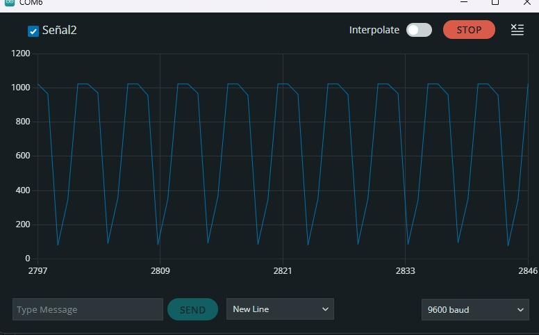
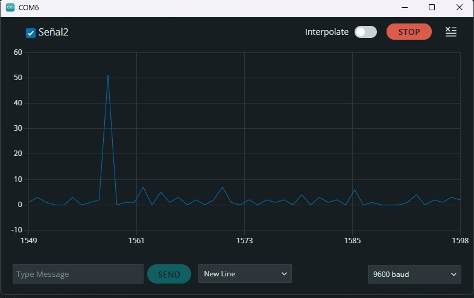

# INFORME LABORATORIO 2

## 1. OBJETIVOS
- Capturar diversas formas de ondas, tales como cuadradas, triangulares, sinusoidales y de rampa.
- Comprender cómo elegir adecuadamente la frecuencia de muestreo para diferentes señales.
- Operar y ajustar correctamente dispositivos como una fuente de poder ajustable, un multímetro digital, un generador de señales y un osciloscopio digital.

## 2. MATERIALES Y EQUIPOS


| Cantidad | Modelo         | Descripción                              |
|----------|----------------|-------------------------------------------|
| 1        | AFG1022        | Generador de Señales                     |
| 1        | TBS 1000C Series | Osciloscopio Digital                   |
| -        | Cable BNC Male-Male  |                                           |
| 1        | -              | Punta de osciloscopio con conector BNC (Male) |
| 1        | -              | Par de cables Male-Male                  |
| 1        | SAMD           | Arduino 33 IoT                           |

## 3. PROCEDIMIENTO

### Configuración de Generador de Señales:
En primer lugar, configuramos el Generador de Señales para proporcionar una señal sinusoidal de 100 Hz de frecuencia, 3V de Amplitud y 0V de offset, por el canal 1.
<p align="center">
  
</p>

### Visualización del Osciloscopio:
Se conectó directamente el generador de señales con el osciloscopio para visualizar una onda sinusoidal sin ruido.

<p align="center">
  
</p>


### Programación del Arduino 33 IoT
En el código utilizado se tomó en consideración los puertos, la frecuencia de sampleo y el periodo de la muestra utilizados para plotear la señal obtenida por el generador de señales sin ruido. Aquí se cambió la frecuencia de sampleo a 10 Hz. 

```c
unsigned long lastMsg = 0;
float F=100;                      // 1 hz
double Fs = 20*F;               // 10 hz
double Ts_ms = (1/Fs)*1000;     // 100 ms  

void setup() {
  Serial.begin(9600);
  while (!Serial);
}

void loop() {

  unsigned long now = millis();

  if (now - lastMsg > Ts_ms) {
    
    lastMsg = now;

    int r2 = analogRead(A1);

    Serial.print("Señal2:");
    Serial.println(r2);
  }
}
```
### Visualización en el Serial Plotter
Se obtuvo una señal parecida a la señal sinusoidal; sin embargo, aparece cortada. Con una amplitud de 1000 mV.
<p align="center">
  
</p>


### Cambio de voltaje en el Generador de Señales:
Para mejorar la señal, se cambió el voltaje de 3V a 1V del generador de señales, y se obtuvo una amplitud de 600 mV.
<p align="center">
  
</p>

### Uso de Condensador
Se añadió un condensador de 470μF.
<p align="center">
  
</p>
<p align="center">
  
</p>

## 4. DISCUSIONES
- La modificación del factor de multiplicación de 10 a 20 en el código es una estrategia efectiva para evitar el aliasing en el procesamiento de señales. Al aumentar este factor, se incrementa la frecuencia de muestreo, lo cual ayuda a cumplir con el criterio de Nyquist y así capturar con mayor precisión la señal analógica sin introducir distorsiones indeseadas.
- En el proceso de generación de señales mediante el uso de Arduino, se identificó inicialmente que al aplicar un voltaje de 3V, la onda sinusoidal resultante presentaba cortes. Por lo que se optó por reducir el voltaje a 1V, lo cual permitió una representación un poco más clara y precisa de la onda sinusoidal, con 600mV; sin embargo, esta sigue siendo diferente a la original, con una disminución de 400mV. Esto puede deberse a la extensión de los cables usados para hacer la lectura.
- Durante las pruebas, se observó que la señal deseada no se manifestaba al utilizar un capacitor. Esto podría deberse a que, aunque el capacitor es efectivo para atenuar el ruido, también puede tener el efecto no deseado de atenuar la señal de interés. 
- El uso de una capacitancia de 470uF sirve como un filtro pasa-baja, por tanto, nos sirve para filtrar una señal al reducir su amplitud. Los capacitores de mayor tamaño tienen una mayor capacidad para almacenar carga, lo que produce la atenuación de frecuencias más bajas efectivamente. 
- Al cambiar el valor de la capacitancia a 10uF, podríamos obtener un filtro pasa-alta, ya que tendrá una capacidad menor para almacenar carga en comparación con un capacitor de 470uF.
- Por otro lado, el uso de jumpers o cables de conexión puede influir en el ingreso de ruido a la lectura de la señal, para evitar eso se pueden utilizar cables blindados, ya que poseen una capa de material conductor que protege las señales eléctricas de las interferencias externas.

## 5. CONCLUSIONES
- Ajustar el factor de multiplicación en el código de Arduino de 10 a 20 ha demostrado ser una medida efectiva para prevenir el aliasing, alineándose con el criterio de Nyquist y permitiendo una captura más precisa de la señal analógica.
- La reducción del voltaje de operación de 3V a 1V ha resultado en una mejora en la claridad de la onda sinusoidal, aunque aún presenta una variación de 400mV respecto a la señal original, lo que indica que pueden ser necesarios ajustes adicionales o la consideración de otros factores que puedan estar afectando la señal.
- El uso de un capacitor de 470uF como filtro pasa-baja ha demostrado su eficacia en la reducción de la amplitud de la señal, pero también ha atenuado la señal deseada, lo que sugiere la necesidad de un equilibrio entre la filtración de ruido y la preservación de la señal.
- Cambiar a un capacitor de menor valor, como 10uF, podría convertir el sistema en un filtro pasa-alta, lo que podría ser más adecuado dependiendo de las características de la señal que se desee preservar.
- La interferencia de ruido introducida por el uso de jumpers o cables de conexión puede mitigarse mediante el uso de cables blindados, que ofrecen protección contra las interferencias electromagnéticas externas.


