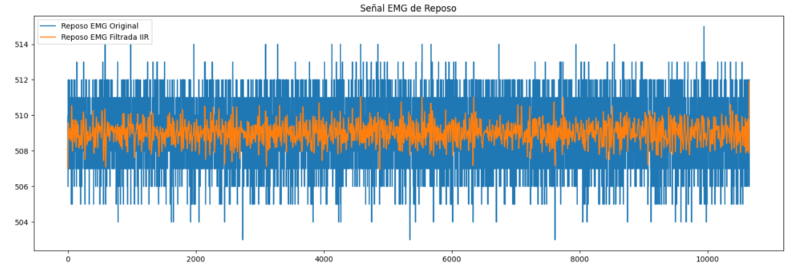
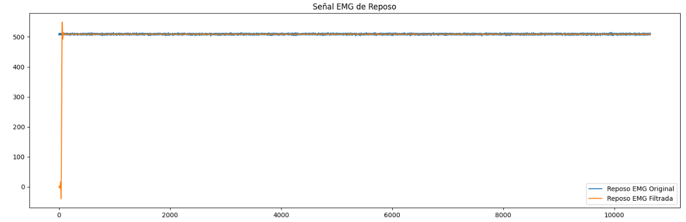
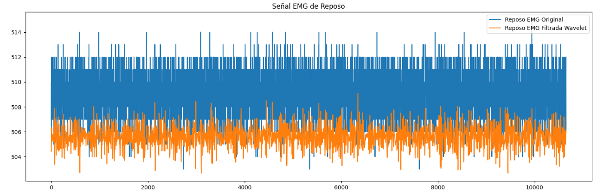
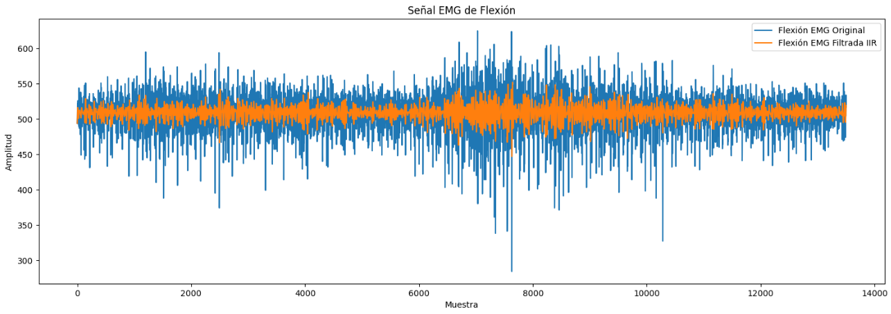
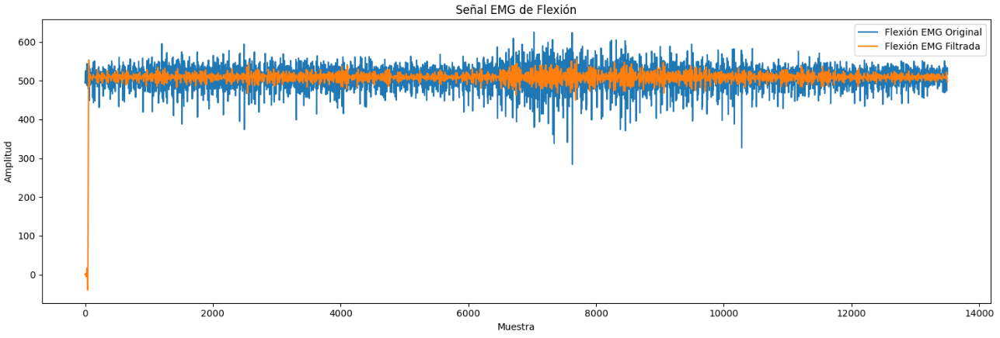

# INFORME LABORATORIO 8
## Lista de Participantes - Grupo 7

- Andrea Razuri Madrid
- Isabel Leon Luna
- Johanni Bohorquez Gutierrez
- Claudia Camacho Grimaldi
- Jaime Arista Cutipa 

## Tabla de Contenidos

1. [Introducción](#1-introducción)
2. [Metodología](#2-metodología)
3. [Resultados](#3-resultados)
4. [Discusión](#4-discusión)
5. [Conclusiones](#5-conclusiones)
6. [Bibliografía](#6-bibliografía)

## 1. Introducción

La señal electromiográfica (EMG) es una señal biomédica que mide las corrientes eléctricas generadas en los músculos durante su contracción, representando actividades neuromusculares. Como toda señal biomédica, la señal EMG es una función del tiempo que puede describirse en términos de amplitud, frecuencia y fase. Estas señales son complejas y controladas por el sistema nervioso, dependiendo de las propiedades anatómicas y fisiológicas de los músculos. Durante su viaje a través de diferentes tejidos, la señal EMG adquiere ruido, lo que complica su análisis y procesamiento [1].

El procesamiento de la señal EMG es esencial debido a la necesidad de obtener datos precisos y útiles para diversas aplicaciones biomédicas. Las señales EMG captadas, especialmente las registradas en la superficie de la piel, pueden incluir ruido de diferentes fuentes, como el ruido inherente de los equipos electrónicos, el ruido ambiental, los artefactos de movimiento y la inestabilidad intrínseca de la señal. Además, la interacción de señales de diferentes unidades motoras recogidas por el detector puede generar complicaciones adicionales. Por ello, el procesamiento de la señal EMG se convierte en un paso crucial para mejorar la relación señal-ruido y minimizar la distorsión de la señal [1].

Los avances recientes en modelos matemáticos y tecnologías de procesamiento de señales han hecho posible desarrollar técnicas avanzadas para la detección y análisis de EMG. Entre estas técnicas se incluyen la transformada wavelet, enfoques de tiempo-frecuencia como la distribución de Wigner-Ville, medidas estadísticas y estadísticas de orden superior, y enfoques de inteligencia artificial como las redes neuronales artificiales, etc [1].

## 2. Metodología

**2.1. Aplicación de filtros a las señales adquiridas:** 

En este estudio se utilizó una frecuencia de muestreo de 1000 Hz. Para la creación del filtro pasa alta en el filtro FIR, se utilizó 'firwin'. La configuración se ajustó a cada actividad de la siguiente manera:

- Oposición: 3 coeficientes, frecuencia de corte de 300 Hz.
- Reposo: 100 coeficientes, frecuencia de corte de 400 Hz para preservar la señal eliminando los componentes de baja frecuencia.
- Extensión: 3 coeficientes, frecuencia de corte de 10 Hz.
- Flexión: 3 coeficientes, frecuencia de corte de 300 Hz.

Sin embargo, tras probar estas frecuencias de corte no se notó ninguna diferencia significativa, así que para simplificar el código utilizado se usó solo una frecuencia de corte de 200 Hz.

En cuanto al filtro IIR, se utilizó un Butterworth de pasa baja para obtener una respuesta más suave. El filtro se configuró con un orden de 5 y una frecuencia de corte de 200 Hz. Este filtro IIR se aplicó a las mismas señales para comparar los efectos del filtrado FIR e IIR en la calidad de las señales procesadas.

Para aplicar el filtro Wavelet, se cargaron los datos y se aplicó primero un filtro paso-bajos para eliminar el ruido de alta frecuencia. Después, se utilizó la transformada de Wavelet de tipo Daubechies (db4) para descomponer la señal en 5 niveles y aplicar umbralizado (denoising). 

**2.2. Análisis para la elección del filtro:** 

Para validar la solidez y eficacia de los filtros aplicados (FIR, IIR y wavelet), en este estudio se empleará la relación señal-ruido(SNR), la cuál es una métrica destacada para medir la eficacia de la eliminación de ruido [2] [3].

$$
\text{SNR} = 10 \log \left[ \frac{\sum_{i=1}^{N} (s(i))^2}{\sum_{i=1}^{N} (s(i) - x(i))^2} \right]
$$ 
[2]

Donde s(i) es la señal original de EMG de superficie, x(i) es la señal filtrada y N es la longitud de la señal.

**2.3. Segmentación de las señales:** 

**2.4. Extracción de características:** 

## 3. Resultados

**3.1. Resultados de la aplicación de los distintos filtros:** 

| Ejercicio   | Filtro IIR | Filtro FIR | Filtro Wavelet | 
|-----------------|------------|------------|------------|
| Reposo |   |  |  |
| Flexión |  |  | |
| **SNR Reposo**  | 50.824073 | 23.382454 | 42.810184 |
| **SNR Flexión** | 27.707349 | 21.897949 | 18.347009 |

**3.2. Análisis la eficacia de los filtros: Elección del mejor**

**3.2. Extracción de características:**

## 4. Discusión

**4.1. Análisis de la elección del filtro:**

### EMG

#### Reposo:
- FIR: 23.382454
- IIR: 50.824073
- Wavelet: 42.810184

#### Flexión:
- FIR: 21.897949
- IIR: 27.707349
- Wavelet: 18.347009

### Análisis:

Para el ejercicio de reposo, el filtro IIR tiene el mayor SNR con un valor de 50.824073, seguido del filtro Wavelet con 42.810184, y el filtro FIR con 23.382454. Para el ejercicio de flexión, el filtro IIR también tiene el mayor SNR con un valor de 27.707349, seguido del filtro FIR con 21.897949, y el filtro Wavelet con 18.347009.

**4.2. Análisis de las características obtenidas:**

## 5. Conclusiones

## 6. Bibliografía

[1] M. B. I. Reaz, M. S. Hussain, and F. Mohd-Yasin, “Techniques of EMG signal analysis: detection, processing, classification and applications,” Biological procedures online, vol. 8, no. 1, pp. 11–35, Dec. 2006, doi: https://doi.org/10.1251/bpo115.
‌
[2] C. Ouyang, L. Cai, B. Liu, and T. Zhang, “An improved wavelet threshold denoising approach for surface electromyography signal,” EURASIP Journal on Advances in Signal Processing, vol. 2023, no. 1, Oct. 2023, doi: https://doi.org/10.1186/s13634-023-01066-3.
‌
[3] Z. Sun, X. Xi, C. Yuan, Y. Yang, and X. Hua, “Surface electromyography signal denoising via EEMD and improved wavelet thresholds,” Mathematical biosciences and engineering, vol. 17, no. 6, pp. 6945–6962, Jan. 2020, doi: https://doi.org/10.3934/mbe.2020359.
‌
