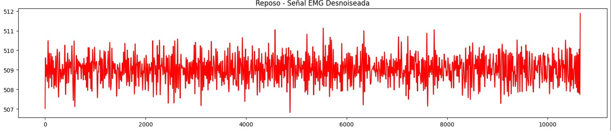
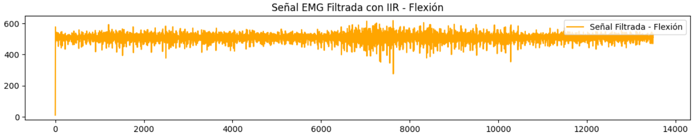

# INFORME LABORATORIO 8
## Lista de Participantes - Grupo 7

- Andrea Razuri Madrid
- Isabel Leon Luna
- Johanni Bohorquez Gutierrez
- Claudia Camacho Grimaldi
- Jaime Arista Cutipa 

## Tabla de Contenidos

1. [Introducción](#1-introducción)
2. [Objetivos](#2-objetivos)
3. [Materiales y equipos](#3-materiales-y-equipos)
4. [Metodología](#4-metodología)
5. [Resultados](#5-resultados)
6. [Discusión](#6-discusión)
7. [Conclusiones](#7-conclusiones)
8. [Bibliografía](#8-bibliografía)

## 1. Introducción

La señal electromiográfica (EMG) es una señal biomédica que mide las corrientes eléctricas generadas en los músculos durante su contracción, representando actividades neuromusculares. Como toda señal biomédica, la señal EMG es una función del tiempo que puede describirse en términos de amplitud, frecuencia y fase. Estas señales son complejas y controladas por el sistema nervioso, dependiendo de las propiedades anatómicas y fisiológicas de los músculos. Durante su viaje a través de diferentes tejidos, la señal EMG adquiere ruido, lo que complica su análisis y procesamiento [1].

El procesamiento de la señal EMG es esencial debido a la necesidad de obtener datos precisos y útiles para diversas aplicaciones biomédicas. Las señales EMG captadas, especialmente las registradas en la superficie de la piel, pueden incluir ruido de diferentes fuentes, como el ruido inherente de los equipos electrónicos, el ruido ambiental, los artefactos de movimiento y la inestabilidad intrínseca de la señal. Además, la interacción de señales de diferentes unidades motoras recogidas por el detector puede generar complicaciones adicionales. Por ello, el procesamiento de la señal EMG se convierte en un paso crucial para mejorar la relación señal-ruido y minimizar la distorsión de la señal [1].

Los avances recientes en modelos matemáticos y tecnologías de procesamiento de señales han hecho posible desarrollar técnicas avanzadas para la detección y análisis de EMG. Entre estas técnicas se incluyen la transformada wavelet, enfoques de tiempo-frecuencia como la distribución de Wigner-Ville, medidas estadísticas y estadísticas de orden superior, y enfoques de inteligencia artificial como las redes neuronales artificiales, etc [1].

## 2. Metodología

**2.1. Análisis para la elección del filtro:** 

En este estudio se utilizó una frecuencia de muestreo de 1000 Hz. Para la creación del filtro pasa alta en el filtro FIR, se utilizó 'firwin'. La configuración se ajustó a cada actividad de la siguiente manera:

- Oposición: 3 coeficientes, frecuencia de corte de 300 Hz.
- Reposo: 100 coeficientes, frecuencia de corte de 400 Hz para preservar la señal eliminando los componentes de baja frecuencia.
- Extensión: 3 coeficientes, frecuencia de corte de 10 Hz.
- Flexión: 3 coeficientes, frecuencia de corte de 300 Hz.

Sin embargo, tras probar estas frecuencias de corte no se notó ninguna diferencia significativa, así que para simplificar el código utilizado se usó solo una frecuencia de corte de 200 Hz.

En cuanto al filtro IIR, se utilizó un Butterworth de pasa baja para obtener una respuesta más suave. El filtro se configuró con un orden de 5 y una frecuencia de corte de 200 Hz. Este filtro IIR se aplicó a las mismas señales para comparar los efectos del filtrado FIR e IIR en la calidad de las señales procesadas.

Para aplicar el filtro Wavelet, se cargaron los datos y se aplicó primero un filtro paso-bajos para eliminar el ruido de alta frecuencia. Después, se utilizó la transformada de Wavelet para descomponer la señal y aplicar umbralizado (denoising). Finalmente, se generaron las gráficas para las señales original, filtrada y desnoiseada.

**2.2. Análisis para la elección del filtro:** 

**2.3. Segmentación de las señales:** 

**2.4. Extracción de características:** 

## 3. Resultados

**3.1. Resultados de la aplicación de los distintos filtros:** 

| Ejercicio   | Señal original | Filtro IIR | Filtro FIR | Filtro Wavelet | 
|-----------------|-------------|------------|------------|------------|
| Reposo |    | |  |  |
| Flexión |   | |  | |

**3.2. Análisis la eficacia de los filtros: Elección del mejor**

**3.2. Extracción de características:**

## 4. Discusión

**4.1. Análisis de la elección del filtro:**

**4.2. Análisis de las características obtenidas:**

## 5. Conclusiones

## 8. Bibliografía
[1] Haily, 'Filtro digital - Definición y explicación,' TechEdu, 26 oct. 2022. [En línea]. Disponible: https://techlib.net/techedu/filtro-digital/. [Accedido: 03-may-2024]

[2] Electropreguntas, 'Los Filtros Electrónicos Más Comunes Y Su Funcionamiento,' Electropreguntas, 2023. [En línea]. Disponible: https://electropreguntas.com/los-10-tipos-de-filtros-electronicos-mas-utilizados/. [Accedido: 03-may-2024].

[3] Industriapedia, 'Filtro Butterworth: Optimiza tu señal de forma eficiente,' Industriapedia, 2023. [En línea]. Disponible: https://industriapedia.com/que-es-el-filtro-butterworth/. [Accedido: 03-may-2024]

[4] Learning About Electronics, 'Filtro Paso Alto- Explicado,' Learning About Electronics, [En línea]. Disponible: http://www.learningaboutelectronics.com/Articulos/Filtro-paso-alto.php. [Accedido: 03-may-2024].

[5] Electrositio, '¿Qué Es Un Filtro Analógico? - Diferentes Tipos De Filtros Analógicos,' Electrositio, 2023. [En línea]. Disponible: https://electrositio.com/que-es-un-filtro-analogico-diferentes-tipos-de-filtros-analogicos/. [Accedido: 03-may-2024].

[6] B. Kuznetsov, J.D. Parker et al., "Differentiable IIR filters for machine learning applications," in Proceedings of the International Conference on Digital Audio Effects (DAFx), 2020. [Acceso en línea]: https://dafx2020.mdw.ac.at/proceedings/papers/DAFx2020_paper_52.pdf

[7] “What Are High-Pass Filters? How & When To Use Them (+ Tips),” Unison.audio, May 06, 2023. https://unison.audio/high-pass-filters/ (accessed May 04, 2024).

[8] D. Datta, H.S. Dutta, "High performance IIR filter implementation on FPGA," Journal of Electrical Systems and Information Technology, 2021. [Acceso en línea]: https://link.springer.com/article/10.1186/s43067-020-00025-4

[9] “Perform Analysis and Design for the Spectral Analysis Case Study - dummies,” Dummies.com, 2016. https://www.dummies.com/article/business-careers-money/careers/trades-tech-engineering-careers/perform-analysis-and-design-for-the-spectral-analysis-case-study-165562/ (accessed May 04, 2024).
‌
[10] S. Basu and Samiul Mamud, “Comparative Study on the Effect of Order and Cut off Frequency of Butterworth Low Pass Filter for Removal of Noise in ECG Signal,” Sep. 2020, doi: https://doi.org/10.1109/icce50343.2020.9290646.

[11] M. Das, R. Kumar, y B. Sahana, "Implementation of effective hybrid window function for ECG signal denoising," Traitement du Signal, vol. 37, no. 2, pp. 305-312, 2020. [En línea]. Disponible: https://www.researchgate.net/publication/340100534_Implementation_of_Effective_Hybrid_Window_Function_for_ECG_Signal_Denoising

[12] Y. A. Altay y A. S. Kremlev, "Polynomial filtering of low-and high-frequency noise for improving the accuracy of ECG signal processing: new advancements," Cardiometry, 2020. [En línea]. Disponible: https://www.researchgate.net/publication/343295169_Polynomial_filtering_of_low-_and_high-_frequency_noise_for_improving_the_accuracy_of_ECG_signal_processing_new_advancements

[13] Sabine , L. and Sarang, S.D. (2019) Reducing power line noise in EEG and MEG data via spectrum interpolation, Neuroimage, 2019 Apr 1. Disponible: https://www.ncbi.nlm.nih.gov/pmc/articles/PMC6456018/ (Accessed: 03 May 2024). 

[14] Bowman AD, Griffis JC, Visscher KM, Dobbins AC, Gawne TJ, DiFrancesco MW, Szaflarski JP. Relationship Between Alpha Rhythm and the Default Mode Network: An EEG-fMRI Study. J Clin Neurophysiol. 2017 Nov;34(6):527-533. doi: 10.1097/WNP.0000000000000411. PMID: 28914659; PMCID: PMC8428580.

[15] Mello, R. G. T., Oliveira, L. F., & Nadal, J. (2007). "Digital Butterworth filter for subtracting noise from low magnitude surface electromyogram". Computer Methods and Programs in Biomedicine, 87(1), 28–35. https://doi.org/10.1016/j.cmpb.2007.04.004.

[16] M. Boyer, L. Bouyer, J.-S. Roy, and Alexandre Campeau-Lecours, “Reducing Noise, Artifacts and Interference in Single-Channel EMG Signals: A Review,” Sensors, vol. 23, no. 6, pp. 2927–2927, Mar. 2023, doi: https://doi.org/10.3390/s23062927.
‌

[17] Gómez, L.J. (2016) Departamento de Automática, Ingeniería Eléctrica y Electrónica e Informática Industrial. Available at: https://oa.upm.es/44379/1/TFM_LEONARDO_JOSE_GOMEZ_FIGUEROA.pdf (Accessed: 26 April 2024).

[18] Ramos, R. (2020) Análisis de espectrogramas de señales EEG, Facultad de Ciencias de la Computación. Available at: https://repositorioinstitucional.buap.mx/server/api/core/bitstreams/92e27f78-4f9d-4d2e-9d69-9f90cd87c0b1/content (Accessed: 26 April 2024).
