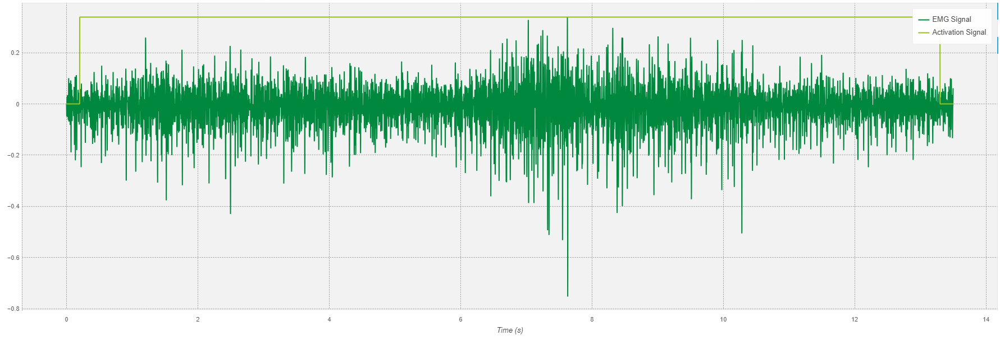
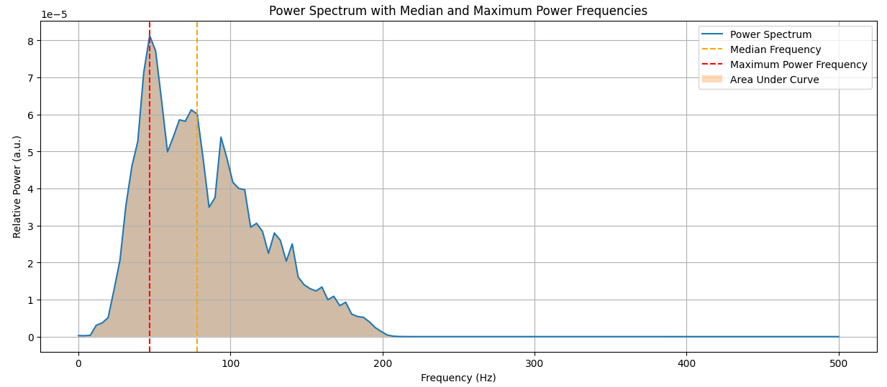

# INFORME LABORATORIO 8
## Lista de Participantes - Grupo 7

- Andrea Razuri Madrid
- Isabel Leon Luna
- Johanni Bohorquez Gutierrez
- Claudia Camacho Grimaldi
- Jaime Arista Cutipa 

## Tabla de Contenidos

1. [Introducción](#1-introducción)
2. [Metodología](#2-metodología)
3. [Resultados](#3-resultados)
4. [Discusión](#4-discusión)
5. [Conclusiones](#5-conclusiones)
6. [Bibliografía](#6-bibliografía)

## 1. Introducción

La señal electromiográfica (EMG) es una señal biomédica que mide las corrientes eléctricas generadas en los músculos durante su contracción, representando actividades neuromusculares. Como toda señal biomédica, la señal EMG es una función del tiempo que puede describirse en términos de amplitud, frecuencia y fase. Estas señales son complejas y controladas por el sistema nervioso, dependiendo de las propiedades anatómicas y fisiológicas de los músculos. Durante su viaje a través de diferentes tejidos, la señal EMG adquiere ruido, lo que complica su análisis y procesamiento [1].

El procesamiento de la señal EMG es esencial debido a la necesidad de obtener datos precisos y útiles para diversas aplicaciones biomédicas. Las señales EMG captadas, especialmente las registradas en la superficie de la piel, pueden incluir ruido de diferentes fuentes, como el ruido inherente de los equipos electrónicos, el ruido ambiental, los artefactos de movimiento y la inestabilidad intrínseca de la señal. Además, la interacción de señales de diferentes unidades motoras recogidas por el detector puede generar complicaciones adicionales. Por ello, el procesamiento de la señal EMG se convierte en un paso crucial para mejorar la relación señal-ruido y minimizar la distorsión de la señal [1].

Los avances recientes en modelos matemáticos y tecnologías de procesamiento de señales han hecho posible desarrollar técnicas avanzadas para la detección y análisis de EMG. Entre estas técnicas se incluyen la transformada wavelet, enfoques de tiempo-frecuencia como la distribución de Wigner-Ville, medidas estadísticas y estadísticas de orden superior, y enfoques de inteligencia artificial como las redes neuronales artificiales, etc [1].

## 2. Metodología

**2.1. Aplicación de filtros a las señales adquiridas:** 

En este estudio se utilizó una frecuencia de muestreo de 1000 Hz. Para la creación del filtro pasa alta en el filtro FIR, se utilizó 'firwin'. La configuración se ajustó a cada actividad de la siguiente manera:

- Oposición: 3 coeficientes, frecuencia de corte de 300 Hz.
- Reposo: 100 coeficientes, frecuencia de corte de 400 Hz para preservar la señal eliminando los componentes de baja frecuencia.
- Extensión: 3 coeficientes, frecuencia de corte de 10 Hz.
- Flexión: 3 coeficientes, frecuencia de corte de 300 Hz.

Sin embargo, tras probar estas frecuencias de corte no se notó ninguna diferencia significativa, así que para simplificar el código utilizado se usó solo una frecuencia de corte de 200 Hz.

En cuanto al filtro IIR, se utilizó un Butterworth de pasa baja para obtener una respuesta más suave. El filtro se configuró con un orden de 5 y una frecuencia de corte de 200 Hz. Este filtro IIR se aplicó a las mismas señales para comparar los efectos del filtrado FIR e IIR en la calidad de las señales procesadas.

Para aplicar el filtro Wavelet, se cargaron los datos y se aplicó primero un filtro paso-bajos para eliminar el ruido de alta frecuencia. Después, se utilizó la transformada de Wavelet de tipo Daubechies (db4) para descomponer la señal en 5 niveles y aplicar umbralizado (denoising). 

**2.2. Análisis para la elección del filtro:** 

Para validar la solidez y eficacia de los filtros aplicados (FIR, IIR y wavelet), en este estudio se empleará la relación señal-ruido(SNR), la cuál es una métrica destacada para medir la eficacia de la eliminación de ruido [2] [3].

$$
\text{SNR} = 10 \log \left( \frac{\displaystyle \sum_{i=1}^{N} (s(i))^2}{\displaystyle \sum_{i=1}^{N} (s(i) - x(i))^2} \right)
$$

Donde s(i) es la señal original de EMG de superficie, x(i) es la señal filtrada y N es la longitud de la señal [2].

**2.3. Segmentación de las señales:** 

Tomando en cuenta que el intervalo mínimo entre 2 contracciones es de 200 ms, y que existen 2 métodos fundamentales para segmentar datos: ventanas deslizantes superpuestas y ventanas deslizantes no superpuestas, se decidió utilizar una ventana de segmentación con un tamaño de 256 ms y con incremento de 64ms [4].

**2.4. Extracción de características:** 

Se usará el método Welch, el cuál consiste en calcular la densidad espectral de potencia, este método divide la señal en segmentos superpuestos, aplica una ventana a cada segmento, calcula la transformada de Fourier de cada uno y luego promedia los resultados. Es bastante útil para extraer características en el dominio del tiempo y en frecuencia [4].
En este estudio se usará la ventana Hamming que por defecto aplica una superposición máxima del 50% [4].

***Características en el dominio del tiempo: [4][5]***

- Número de Activaciones Musculares:e refiere al número de veces que el músculo se ha activado durante el período de registro. Indica la frecuencia con la que el músculo se contrae.
- Duración Máxima de Activación Muscular: La duración máxima de una activación muscular. Esto indica cuánto tiempo dura la activación más larga.
- Duración Mínima de Activación Muscular: La duración más corta durante la cual una activación muscular persistió durante el período de registro. Esto puede proporcionar información sobre las respuestas musculares más breves o espasmos.
- Duración Promedio de Activación Muscular: La duración media de todas las activaciones musculares. Proporciona una visión general de la duración típica de las activaciones musculares.
- Desviación Estándar de la Duración de Activación Muscular:  La desviación estándar de la duración de las activaciones musculares, lo que proporciona una medida de la variabilidad en las duraciones de las activaciones.

$$
\text{std}(\sigma) = \sqrt{\frac{1}{N-1} \sum_{n=1}^{N} (x_n - \mu)^2}
$$

  
- Valor Máximo de Muestra:  La amplitud más alta registrada en la señal EMG. Valores altos pueden indicar contracciones musculares fuertes.
- Valor Mínimo de Muestra: La amplitud más baja registrada en la señal EMG. Esto puede indicar el nivel de relajación muscular o el ruido de fondo en la señal.
- Valor Promedio de Muestra: El valor medio de las muestras de la señal EMG. Esto puede proporcionar una línea base alrededor de la cual oscila la actividad muscular.
- Desviación Estándar del Valor de Muestra: Una medida de la variabilidad en la amplitud de la señal. Valores más altos sugieren una mayor variabilidad en la actividad muscular.
- RMS (Root Mean Square): Representa el valor efectivo de la señal EMG y se utiliza para cuantificar el nivel general de activación muscular. En la ecuación, \(N\) es la longitud de la señal y \(x_i\) representa la señal EMG en un segmento.

$$
\text{RMS} = \sqrt{\frac{1}{N} \sum_{i=1}^{N} x_i^2}
$$

- Área: El área bajo la curva de la señal EMG, que puede representar la energía total de la señal.

***Características en el dominio de la frecuencia: [4][5]***

- Potencia Total del Espectro: La potencia total de la señal en el dominio de frecuencia. Esto indica la energía total de la señal EMG.

- Frecuencia Mediana: La frecuencia en la que el espectro de potencia se divide en dos mitades iguales. Se utiliza a menudo para evaluar la fatiga muscular, con una frecuencia mediana más baja indicando fatiga.

$$
\sum_{j=1}^{\text{MDF}} P_j = \sum_{j=\text{MDF}}^{M} P_j \quad P_j = \frac{1}{2} \sum_{j=1}^{M} P_j
$$

- Frecuencia de Máxima Potencia: La frecuencia con la mayor potencia en la señal. Puede indicar la frecuencia dominante de la activación muscular.

## 3. Resultados

**3.1. Análisis la eficacia de los filtros: Elección del mejor**

| Ejercicio   | Filtro IIR | Filtro FIR | Filtro Wavelet | 
|-----------------|------------|------------|------------|
| Reposo |   |  |  |
| Flexión |  |  | |
| **SNR Reposo**  | 50.824073 | 23.382454 | 42.810184 |
| **SNR Flexión** | 27.707349 | 21.897949 | 18.347009 |

**3.2. Extracción de características:**

- Detección y contabilidad de activaciones musculares

 

- Potencia total y algunos puntos de referencia en el dominio de la frecuencia

 

- Resultados de EMG

| Característica                                  | Valor                        |
|-------------------------------------------------|------------------------------|
| Number of Muscular Activations                  | 1                            |
| Maximum Muscular Activation Duration            | 13.099970368175418           |
| Minimum Muscular Activation Duration            | 13.099970368175418           |
| Average Muscular Activation Duration            | 13.099970368175418           |
| Standard Deviation of Muscular Activation Duration | 0.0                      |
| Maximum Sample Value                            | 0.33927615659936916          |
| Minimum Sample Value                            | -0.7526895780244606          |
| Average Sample Value                            | -0.00981739507679961         |
| Standard Deviation Sample Value                 | 0.07729475074507437          |
| RMS                                             | 0.07791572202602723          |
| Area                                            | -132.5648976504308           |
| Total Power Spect                               | 0.005892733550501693         |
| Median Frequency                                | 78.125                       |
| Maximum Power Frequency                         | 42.96875                     |

## 4. Discusión

**4.1. Análisis de la elección del filtro:**

#### Reposo:
- FIR: 23.382454
- IIR: 50.824073
- Wavelet: 42.810184

#### Flexión:
- FIR: 21.897949
- IIR: 27.707349
- Wavelet: 18.347009

### Análisis:

Para el ejercicio de reposo, el filtro IIR tiene el mayor SNR con un valor de 50.824073, seguido del filtro Wavelet con 42.810184, y el filtro FIR con 23.382454. Para el ejercicio de flexión, el filtro IIR también tiene el mayor SNR con un valor de 27.707349, seguido del filtro FIR con 21.897949, y el filtro Wavelet con 18.347009.

Si el valor de SNR que obtenemos es alto, significa mejor calidad de señal, menos ruido, mayor efectividad del filtro; sin embargo, si el valor obtenido es bajo, significa peor calidad de señal, más ruido, menor efectividad del filtro. En este contexto, el filtro IIR es el que presenta mejor resultado por lo que se el que se decidió usar para el procesamiento de las señales EMG en este estudio

**4.2. Análisis de las características obtenidas:**

Para este analisis tomamos varias caracteristicas comunmente utilizadas de señales emg. Estas se pueden utilizar en conjunto para evaluar caracteristicas del musculo como:

-Evaluación de fatiga muscular: Características como la frecuencia media y la eesviación estándar de la duración de ectivación muscular pueden ayudar a evaluar la fatiga muscular. Un desplazamiento de la frecuencia mediana hacia valores más bajos generalmente indica fatiga muscular.
-Evaluación de fatiga muscular: La frecuencia mediana y la desviación estándar de la duración de ectivación muscular pueden ayudar a evaluar la fatiga muscular. Un desplazamiento de la frecuencia mediana hacia valores más bajos generalmente indica fatiga muscular.

-Fuerza y resistencia muscular: La duración máxima y mínima de activación muscular, así como los valores de RMS, pueden proporcionar información sobre la fuerza y la resistencia del músculo. Valores más altos usualmente indican contracciones musculares más fuertes y sostenidas.

-Control y coordinación motora: El número de activaciones musculares y la variabilidad en estas pueden utilizarse para evaluar el control y la coordinación motora. Una alta variabilidad puede sugerir un pobre control motor o un rendimiento muscular inconsistente.

-Actividad muscular general: El area, la potencia total del espectro y los valores de RMS proporcionan una idea general de la actividad muscular.
Para este analisis tomamos varias caracteristicas comunmente utilizadas de señales emg. Estas se pueden utilizar en conjunto para evaluar caracteristicas del musculo como:

-Evaluación de fatiga muscular: Características como la frecuencia mediana y la eesviación estándar de la duración de ectivación muscular pueden ayudar a evaluar la fatiga muscular. Un desplazamiento de la frecuencia mediana hacia valores más bajos generalmente indica fatiga muscular.

-Fuerza y resistencia muscular: La duración máxima y mínima de activación muscular, así como los valores de RMS, pueden proporcionar información sobre la fuerza y la resistencia del músculo. Valores más altos usualmente indican contracciones musculares más fuertes y sostenidas.

-Control y coordinación motora: El número de activaciones musculares y la variabilidad en estas pueden utilizarse para evaluar el control y la coordinación motora. Una alta variabilidad puede sugerir un pobre control motor o un rendimiento muscular inconsistente.

-Actividad muscular general: El area, la potencia total del espectro y los valores de RMS proporcionan una idea general de la actividad muscular.

## 5. Conclusiones

En nuestro caso hubo una sola activacion muscular muy larga durante la flexion( aprox. 13s) esto se puede deber a la cantidad de ruido en nuestra señal, no es posible registrar el numero real de activaciones. Por esta misma razon los minimos y maximos de las duraciones de las activaciones son iguales y la desviacion estandar de la duracion de la activacion es 0.
el valor maximo de la muestra es de 0.33, es bastante bajo por lo que puede indicar que no se requirio demasiado esfuerzo durante la lectura, est es consistente con el rms bajo. Ademas la potencia total de espectro tambien indica lo mismo, una baja energia en la activacion.[6]

La frecuencia mediana de 78Hz se encuentra en un rango promedio, consistente con poca fatiga muscular y la frecuencia de maxima potencia es de 43Hz, indicando que la mayor parte de la energia se encuentran en las frecuencias mas bajas.
Las caracteristicas extraidas de la señal nos indican una actividad muscular larga, de baja amplitud y energia. Con una frecuencia mediana en un rango normal indicando que fue realizado sin fatiga pero no se raalizo una contraccion muy fuerte.

## 6. Bibliografía

[1] M. B. I. Reaz, M. S. Hussain, and F. Mohd-Yasin, “Techniques of EMG signal analysis: detection, processing, classification and applications,” Biological procedures online, vol. 8, no. 1, pp. 11–35, Dec. 2006, doi: https://doi.org/10.1251/bpo115.
‌

[2] C. Ouyang, L. Cai, B. Liu, and T. Zhang, “An improved wavelet threshold denoising approach for surface electromyography signal,” EURASIP Journal on Advances in Signal Processing, vol. 2023, no. 1, Oct. 2023, doi: https://doi.org/10.1186/s13634-023-01066-3.
‌

[3] Z. Sun, X. Xi, C. Yuan, Y. Yang, and X. Hua, “Surface electromyography signal denoising via EEMD and improved wavelet thresholds,” Mathematical biosciences and engineering, vol. 17, no. 6, pp. 6945–6962, Jan. 2020, doi: https://doi.org/10.3934/mbe.2020359.
‌

[4] A. Sultana, T. Islam, F. Ahmed, and Md Shafiul Alam, “A novel machine learning algorithm for finger movement classification from surface electromyogram signals using welch power estimation,” Healthcare analytics, vol. 5, pp. 100296–100296, Jun. 2024, doi: https://doi.org/10.1016/j.health.2023.100296.
‌

[5] Cemil Altin and O. Er, “Comparison of Different Time and Frequency Domain Feature Extraction Methods on Elbow Gesture’s EMG,” ResearchGate, Aug. 30, 2016. https://www.researchgate.net/publication/318538198_Comparison_of_Different_Time_and_Frequency_Domain_Feature_Extraction_Methods_on_Elbow_Gesture's_EMG (accessed May 26, 2024).

[6]L. A. C. Kallenberg and H. J. Hermens, "Behaviour of motor unit action potential rate, estimated from surface EMG, as a measure of muscle activation level," Journal of NeuroEngineering and Rehabilitation, vol. 3, no. 1, p. 15, 2006. Available: https://jneuroengrehab.biomedcentral.com/articles/10.1186/1743-0003-3-15.
‌
