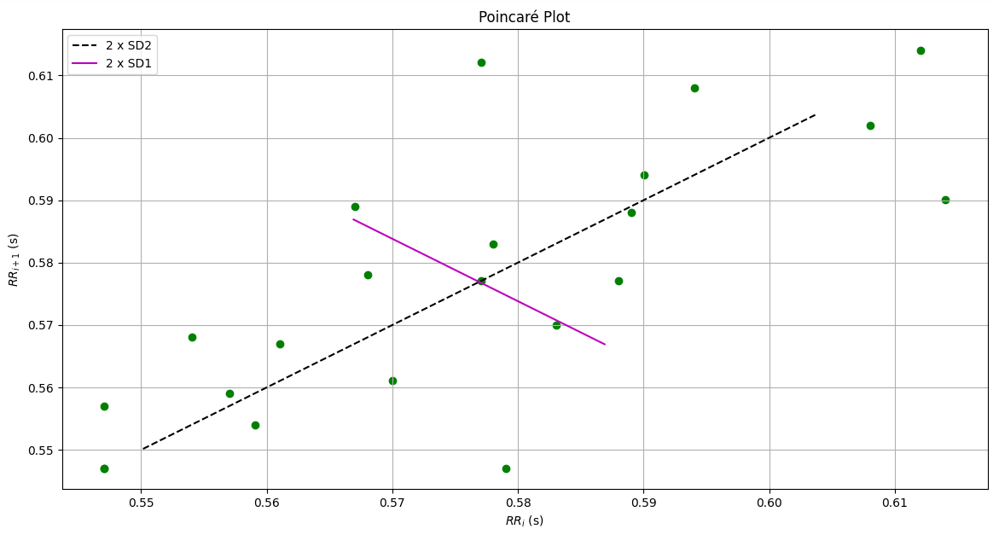

# INFORME LABORATORIO 9
## Lista de Participantes - Grupo 9

- Andrea Razuri Madrid
- Isabel Leon Luna
- Johanni Bohorquez Gutierrez
- Claudia Camacho Grimaldi
- Jaime Arista Cutipa 

## Tabla de Contenidos

1. [Introducción](#1-introducción)
2. [Objetivos](#2-objetivos)
3. [Materiales y equipos](#3-materiales-y-equipos)
4. [Metodología](#4-metodología)
5. [Resultados](#5-resultados)
6. [Discusión](#6-discusión)
7. [Conclusiones](#7-conclusiones)
8. [Bibliografía](#8-bibliografía)

## 1. Introducción

## 2. Objetivos

## 3. Materiales y equipos

## 4. Metodología

### 4.1. Adquisicion y procesamiento de la señal

### 4.2. Uso de funcion Taquigram

### 4.3 Extracción de características de HRV [4][5]

## 5. Resultados

Existen diferentes características de HRV que se pueden extraer y analizar para estudiar diversas condiciones de salud y estados fisiológicos.

#### Dominio de Tiempo

1. **SDNN (Desviación estándar de los intervalos NN):**
   - Mide la variabilidad general de los intervalos de tiempo entre latidos cardíacos consecutivos. Un SDNN alto indica buena salud cardiovascular y un sistema ANS equilibrado

     $$\text{SDNN} = \sqrt{\frac{1}{N-1} \sum_{j=1}^N (RR_j - \overline{RR})^2}$$

2. **RMSSD (Raíz cuadrada de la media de las diferencias al cuadrado entre intervalos NN sucesivos):**
   - Refleja la actividad del sistema nervioso parasimpático (PNS). Es sensible a los cambios rápidos en la frecuencia cardíaca.
     
     $$\text{RMSSD} = \sqrt{\frac{1}{N-1} \sum_{j=1}^N (RR_{j+1} - RR_j)^2}$$
     

3. **pNN50 (Porcentaje de intervalos NN con diferencias superiores a 50 ms):**
   - Indica la variabilidad de la frecuencia cardíaca en respuesta a la actividad del PNS.
   
     $$\text{pNN50} = \frac{\text{Número de intervalos NN > 50 ms}}{\text{Número total de intervalos NN}}$$
     

#### Dominio de Frecuencia

1. **VLF (Very Low Frequency, 0.0033-0.04 Hz):**
   - Asociada con la actividad del sistema nervioso simpático (SNS) y procesos de regulación a largo plazo.

2. **LF (Low Frequency, 0.04-0.15 Hz):**
   - Refleja tanto la actividad del SNS como del PNS. Es una medida de la actividad simpática y parasimpática combinada.

3. **HF (High Frequency, 0.15-0.4 Hz):**
   - Representa la actividad del PNS, particularmente la respiración.

4. **Ratio LF/HF:**
   - Utilizado para evaluar el equilibrio simpático-vagal (SNS/PNS). Un aumento en el ratio LF/HF indica una mayor actividad simpática en relación con la parasimpática.

#### Parámetros No Lineales

1. **SD1 y SD2 (Parámetros de la trama de Poincaré):**
   - **SD1**: Correlacionado con la variabilidad a corto plazo (actividad parasimpática).
   - **SD2**: Correlacionado con la variabilidad a largo plazo (actividad simpática y parasimpática combinada).
  
     
     $$\text{SD1} = \sqrt{\frac{1}{2} \text{RMSSD}^2}$$
  
     
     $$\text{SD2} = \sqrt{2 \cdot \text{SDNN}^2 - \frac{1}{2} \text{RMSSD}^2}$$
     

2. **ApEn (Entropía aproximada):**
   - Mide la regularidad y complejidad de la serie temporal de la frecuencia cardíaca. Un valor más bajo indica mayor regularidad y menor complejidad.

### Justificación de las Características del HRV

La selección de características de HRV para el análisis tiene una base sólida en la fisiología del sistema nervioso autónomo. Cada parámetro proporciona información específica sobre diferentes aspectos del control autonómico del corazón:

- **SDNN**: Proporciona una visión general de la variabilidad de la frecuencia cardíaca, esencial para evaluar la salud cardiovascular general y la respuesta del cuerpo al estrés.
- **RMSSD y pNN50**: Son más sensibles a la actividad parasimpática, siendo útiles para estudiar condiciones que afectan el sistema nervioso parasimpático, como el estrés y la recuperación física.
- **Parámetros de frecuencia (VLF, LF, HF)**: Permiten diferenciar entre las influencias simpáticas y parasimpáticas sobre el corazón, siendo críticos para entender el equilibrio autonómico y sus cambios en diferentes estados de salud y actividad.
- **Parámetros no lineales (SD1, SD2, ApEn)**: Capturan la complejidad y la dinámica a corto y largo plazo de la frecuencia cardíaca, proporcionando una visión más completa y matizada del control autonómico.

En conjunto, estos parámetros ofrecen una herramienta poderosa para la evaluación y monitorización de la salud cardiovascular, la detección de condiciones patológicas y la gestión de estados de estrés y recuperación.

## 5. Resultados

| Señales              | ECG Ejercicio | ECG Estado Basal | 
|----------------------|---------------|------------------|
| Sin filtrar          |   |  | 
| Picos detectados     |  |  |
| Picos definitivos    |  |  |
| Tacograma            |  |  |
| Diagrama de Poincaré | |  |