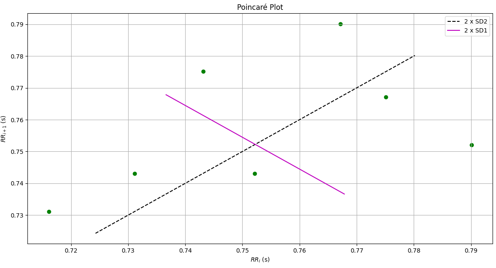

# INFORME LABORATORIO 9
## Lista de Participantes - Grupo 9

- Andrea Razuri Madrid
- Isabel Leon Luna
- Johanni Bohorquez Gutierrez
- Claudia Camacho Grimaldi
- Jaime Arista Cutipa 

## Tabla de Contenidos

1. [Introducción](#1-introducción)
2. [Metodología](#4-metodología)
3. [Resultados](#5-resultados)
4. [Discusión](#6-discusión)
5. [Bibliografía](#8-bibliografía)

## 1. Introducción
### Introducción[1]

El electrocardiograma (ECG) y los parámetros de variabilidad de la frecuencia cardíaca (HRV) son herramientas fundamentales para evaluar la salud cardiovascular. El ECG registra la actividad eléctrica del corazón, permitiendo detectar arritmias, infartos y otros trastornos cardíacos. Por su parte, la HRV mide la variación en el tiempo entre latidos consecutivos del corazón, reflejando el equilibrio entre el sistema nervioso simpático y parasimpático. 

La combinación del ECG y la HRV proporciona una visión comprensiva de la salud cardiovascular, útil en la detección temprana de enfermedades, monitorización de pacientes y evaluación de intervenciones terapéuticas. El preprocesamiento de la señal es crucial para eliminar el ruido y las interferencias, mejorando así la precisión de los análisis. Esto incluye técnicas como el filtrado de alta y baja frecuencia, la eliminación de artefactos y la normalización de la señal.[1]

Los avances tecnológicos, como los dispositivos portátiles y los algoritmos de inteligencia artificial, están mejorando la precisión y aplicabilidad de estas herramientas, revolucionando su uso en la práctica clínica y la investigación biomédica. En este informe, se explorarán los métodos para medir y analizar el ECG y la HRV, el preprocesamiento de la señal y su importancia y aplicaciones actuales.[3]

## 2. Metodología

### 2.1. Adquisicion y procesamiento de la señal
En este estudio se utilizó una frecuencia de muestreo de 1000 Hz para la adquisición de las señales ECG. Se ha seguido la metodología descrita en el artículo "Application of Artificial Intelligence for ECG Classification" [1]. Esta metodología incluye la aplicación de un filtro pasabanda Butterworth de tercer orden (rango de frecuencias: 5 Hz a 150 Hz) para eliminar el ruido de alta frecuencia. Posteriormente, se aplicó una transformada wavelet discreta (DWT) utilizando el wavelet Daubechies 4 (Db4) con umbralización dura, además de un filtro notch a 60 Hz para suprimir la interferencia de la línea de alimentación.

Sin embargo, en este trabajo no se aplicará el filtro pasabanda Butterworth debido a observaciones específicas en los datos analizados. Los otros dos métodos combinados, la DWT y el filtro notch, han demostrado ser suficientes para eliminar el ruido de alta frecuencia y la interferencia de la línea de alimentación sin alterar la morfología de la señal. Estos métodos son suficientes para el análisis de la variabilidad de la frecuencia cardíaca (HRV) ya que permiten limpiar la señal de ruido e interferencia sin comprometer la detección de los picos R. Esto asegura la preservación de la calidad de la señal y la precisión del análisis de HRV.

### 2.2. Uso de funcion Taquigram[2][3]
Para el estudio de las caracteristicas HRV de un ECG necesitamos ver el registro de los intervalos entre latidos, estos no son constantes por lo que un tacograma, serie de intervalos RR, es una herramienta útil.  Est se debe a las siguientes razones.
1. Alta precisión: Se tienen los tiempos exactos de cada latido.
   
2. Permite extraer directamente las caracteristicas del dominio de tiempo.
   
3. Usando métodos como FFT se pueden extraer las características del dominio de la frecuencia.
4. Análisis no linear: Permiten el analisis no linear del ritmo cardiaco, incluye a los parámetros:
   -Gráficas Poincaré
   -Mediciones de entropía
5. Visualización: Permite poder ver la variabilidad en el ritmo cardiaco. Para ver patrones tendencias o anomalías.
Para facilitar la complejidad del código, se utilizará la librería biosignalnotebooks que ya incluye funciones para simplificar la ubicación de los picos R y utilizarlos para crear un tacograma del cual extraeremos los parametros HRV. 
   
### 2.3 Extracción de características de HRV [3][4]

Existen diferentes características de HRV que se pueden extraer y analizar para estudiar diversas condiciones de salud y estados fisiológicos.

#### Dominio de Tiempo

1. **SDNN (Desviación estándar de los intervalos NN):**
   - Mide la variabilidad general de los intervalos de tiempo entre latidos cardíacos consecutivos. Un SDNN alto indica buena salud cardiovascular y un sistema ANS equilibrado.

     $$\text{SDNN} = \sqrt{\frac{1}{N-1} \sum_{j=1}^N (RR_j - \overline{RR})^2}$$
     
   - Valores normales de SDNN son típicamente mayores a 50 ms.

2. **RMSSD (Raíz cuadrada de la media de las diferencias al cuadrado entre intervalos NN sucesivos):**
   - Refleja la actividad del sistema nervioso parasimpático (PNS). Es sensible a los cambios rápidos en la frecuencia cardíaca.
     
     $$\text{RMSSD} = \sqrt{\frac{1}{N-1} \sum_{j=1}^N (RR_{j+1} - RR_j)^2}$$
     
   - Valores normales de RMSSD son típicamente mayores a 20 ms.

3. **pNN50 (Porcentaje de intervalos NN con diferencias superiores a 50 ms):**
   - Indica la variabilidad de la frecuencia cardíaca en respuesta a la actividad del PNS.
   
     $$\text{pNN50} = \frac{\text{Número de intervalos NN > 50 ms}}{\text{Número total de intervalos NN}}$$
     
   - Valores normales de pNN50 son típicamente mayores a 3%.

4. **NN50 (Número de intervalos NN con diferencias superiores a 50 ms):**
   - Indica la cantidad absoluta de intervalos NN con diferencias mayores a 50 ms.
   
     $$\text{NN50} = \sum_{i=1}^{N-1} \Theta(|RR_{i+1} - RR_i| - 50 \text{ ms})$$
     
   - Donde $\(\Theta(x)\)$ es la función escalón de Heaviside, que vale 1 si $\(x \geq 0\)$ y 0 en caso contrario.
   - Valores normales de NN50 varían dependiendo de la población y las condiciones del estudio, pero suelen estar en el rango de varios cientos en registros de 24 horas.

#### Dominio de Frecuencia

1. **VLF (Very Low Frequency, 0.0033-0.04 Hz):**
   - Asociada con la actividad del sistema nervioso simpático (SNS) y procesos de regulación a largo plazo.

2. **LF (Low Frequency, 0.04-0.15 Hz):**
   - Refleja tanto la actividad del SNS como del PNS. Es una medida de la actividad simpática y parasimpática combinada.

3. **HF (High Frequency, 0.15-0.4 Hz):**
   - Representa la actividad del PNS, particularmente la respiración.

4. **Ratio LF/HF:**
   - Utilizado para evaluar el equilibrio simpático-vagal (SNS/PNS). Un aumento en el ratio LF/HF indica una mayor actividad simpática en relación con la parasimpática.

#### Parámetros No Lineales

1. **SD1 y SD2 (Parámetros de la trama de Poincaré):**
   - **SD1**: Correlacionado con la variabilidad a corto plazo (actividad parasimpática).
   - **SD2**: Correlacionado con la variabilidad a largo plazo (actividad simpática y parasimpática combinada).
  
     $$\text{SD1} = \sqrt{\frac{1}{2} \text{RMSSD}^2}$$
  
     $$\text{SD2} = \sqrt{2 \cdot \text{SDNN}^2 - \frac{1}{2} \text{RMSSD}^2}$$
     
   - Valores normales de SD1/SD2 son típicamente entre 0.5 y 1.5.

2. **ApEn (Entropía aproximada):**
   - Mide la regularidad y complejidad de la serie temporal de la frecuencia cardíaca. Un valor más bajo indica mayor regularidad y menor complejidad.

Todos estos parámetros ofrecen una herramienta poderosa para la evaluación y monitorización de la salud cardiovascular, la detección de condiciones patológicas y la gestión de estados de estrés y recuperación.

## 3. Resultados

| Señales              | ECG Ejercicio | ECG Estado Basal | 
|----------------------|---------------|------------------|
| Señal Filtrada       |   |  | 
| Picos R detectados   |  |  |
| Picos definitivos    |  |  |
| Tacograma            |  |  |
| Diagrama de Poincaré | |  |

1. **HRV de ECG en Estado Basal**

**RR Intervals and BPM**

| Parameter  | Value                        |
|------------|------------------------------|
| **RR Intervals** |                          |
| Maximum    | 0.7901197151083501           |
| Minimum    | 0.7161085012880739           |
| Average    | 0.752238975602364            |
| **BPM**    |                              |
| Maximum    | 83.78618588115795            |
| Minimum    | 75.93785960874565            |
| Average    | 79.76188677534863            |

**Heart Rate Variability (HRV)**

| Parameter  | Value                        |
|------------|------------------------------|
| SDNN       | 0.022633263020065457         |
| SD1        | 0.015601945296498526         |
| SD2        | 0.027948318247007147         |
| SD1/SD2    | 0.5582427235373729           |
| RMSSD      | 0.022399184236572067         |
| NN20       | 3                            |
| PNN20      | 42%                          |
| NN50       | 0                            |
| PNN50      | 0%                           |
| **Power values** |                        |
| ulf_band   | 0.0                          |
| vlf_band   | 0.0                          |
| lf_band    | 0.0                          |
| hf_band    | 0.00012                      |
| **Total power** | 0.00012                 |

2. **HRV de ECG en estado de Ejercicio**
**RR Intervals and BPM**

| Parameter  | Value                        |
|------------|------------------------------|
| **RR Intervals** |                          |
| Maximum    | 0.614042202213211            |
| Minimum    | 0.5470375970857102           |
| Average    | 0.5769092153352837           |
| **BPM**    |                              |
| Maximum    | 109.6816751163799            |
| Minimum    | 97.71315356459242            |
| Average    | 104.00249884226524           |

**Heart Rate Variability (HRV)**

| Parameter  | Value                        |
|------------|------------------------------|
| SDNN       | 0.020198900674225577         |
| SD1        | 0.009994951822617493         |
| SD2        | 0.02675989751396698          |
| SD1/SD2    | 0.3735048617955565           |
| RMSSD      | 0.014173611019501443         |
| NN20       | 4                            |
| PNN20      | 18%                          |
| NN50       | 0                            |
| PNN50      | 0%                           |
| **Power values** |                        |
| ulf_band   | 0.0                          |
| vlf_band   | 0.0                          |
| lf_band    | 0.0                          |
| hf_band    | 6e-05                        |
| **Total power** | 6e-05                   |

## 4. Discusión

#### 4.1. RR Intervals: 
##### Estado Basal:

* Máximo: 0.790 s
* Mínimo: 0.716 s
* Promedio: 0.752 s

##### Estado Ejercicio:

* Máximo: 0.614 s
* Mínimo: 0.547 s
* Promedio: 0.577 s

Los intervalos RR son el tiempo entre dos picos consecutivos de las ondas R en un ECG, que representan un ciclo completo de latido cardíaco. En estado basal, los valores proemdio de los intervalos RR son más altos, lo que indica una frecuencia cardíaca más baja. Durante el ejercicio, los intervalos RR disminuyen, lo que corresponde a un aumento en la frecuencia cardíaca debido a la mayor demanda de oxígeno y nutrientes por los músculos. 

Los valores de los intervalos RR en estado basal (promedio de 0.752 segundos) corresponden a una frecuencia cardíaca de aproximadamente 80 BPM, lo cual está dentro del rango normal de 60-100 BPM en reposo para adultos​ [5].

Durante el ejercicio, los intervalos RR se acortan significativamente, con un promedio de 0.577 segundos, correspondiente a una frecuencia cardíaca de aproximadamente 104 BPM. Este valor es adecuado y esperado durante la actividad física, reflejando una respuesta normal del sistema cardiovascular a la actividad aumentada​ [5].

#### 4.2 BPM: 
##### Estado Basal:

* Máximo: 83.79 BPM
* Mínimo: 75.94 BPM
* Promedio: 79.76 BPM

##### Estado Ejercicio:

* Máximo: 109.68 BPM
* Mínimo: 97.71 BPM
* Promedio: 104.00 BPM

La frecuencia cardíaca (BPM) es una medida crucial del funcionamiento del sistema cardiovascular. En estado basal, la frecuencia cardíaca promedio de 79.76 BPM está dentro del rango normal para un adulto en reposo (60-100 BPM). Esto sugiere que el sujeto tiene un ritmo cardíaco saludable cuando está en reposo [6].

Durante el ejercicio, el aumento de la frecuencia cardíaca promedio a 104.00 BPM es una respuesta normal y esperada a la mayor demanda física. Este rango es típico para una intensidad de ejercicio moderada a intensa, dependiendo de la condición física del individuo. Un aumento adecuado en la frecuencia cardíaca durante el ejercicio indica que el sistema cardiovascular está respondiendo apropiadamente a las necesidades aumentadas de oxígeno y nutrientes del cuerpo​ [6].

#### 4.3 Parámetros de HRV: 

#### Dominio del Tiempo: SDNN, RMSSD, pNN50, NN50, pNN20, NN20

##### Estado Basal:

* SDNN: 0.0226 segundos
* RMSS: 0.0224 segundos
* PNN20: 42%
* PNN50: 0%
  
El valor de SDNN (0.0226 segundos) está por debajo del valor típico normal (>50 ms), lo que sugiere una menor variabilidad de la frecuencia cardíaca en estado basal. Esto puede indicar un tono simpático predominante o una baja actividad parasimpática. Se puede considerar que en el estado de reposo, el cuerpo no está sometido a estrés físico, por lo que la variabilidad de los intervalos RR tiende a ser mayor. 
Por otro lado, el valor del RMSS sugiere una buena variabilidad de la frecuencia cardíaca, lo cual es típico en un individuo en reposo, ya que, la influencia del sistema nervioso parasimpático es mayor, lo que resulta en una mayor variabilidad de los intervalos RR [3].
Un PNN20 del 42% indica que el 42% de los intervalos RR difieren en más de 20 ms, lo cual es un buen indicador de variabilidad a corto plazo. Sin embargo, el PNN50 del 0% muestra que no hay intervalos con diferencias mayores a 50 ms, sugiriendo una menor actividad parasimpática.
  
##### Estado Ejercicio:

* SDNN: 0.0202 segundos
* RMSSD: 0.0142 segundos
* PNN20: 18%
* PNN50: 0%

Durante el ejercicio, el valor de SDNN disminuye aún más (0.0202 segundos), lo cual es consistente con una disminución de la variabilidad de la frecuencia cardíaca debido al aumento del tono simpático. La disminución en SDNN durante el ejercicio refleja la respuesta normal del cuerpo al estrés físico, donde el ritmo cardíaco se vuelve más regular y controlado principalmente por el sistema nervioso simpático para satisfacer las demandas del ejercicio. De acuerdo al valor del RMSS podemos ver que su disminución durante el ejercicio indica una menor influencia del sistema nervioso parasimpático y una mayor regularidad en los intervalos RR [3].
El PNN20 disminuye a 18%, indicando una reducción en la variabilidad a corto plazo durante el ejercicio. El PNN50 sigue siendo 0%, lo cual es consistente con la baja variabilidad observada durante el ejercicio.

#### Dominio de Frecuencia

- **Potencia en ULF, VLF y LF:**

Las bandas ULF y VLF capturan variaciones de la frecuencia cardíaca que ocurren a lo largo de periodos más largos. La banda ULF (0.0 - 0.003 Hz) requiere señales de varias horas para ser adecuadamente evaluada, mientras que la banda VLF (0.003 - 0.04 Hz) requiere señales de al menos 5 minutos para capturar las variaciones correspondientes [3].
Dado que nuestras señales tienen una duración máxima de 1 minuto, es comprensible que no se observe potencia en estas bandas en ninguna de las 2 pruebas, ya sea en reposo o en ejercicio. En el caso de la banda LF (0.04 - 0.15Hz) también captura variaciones que ocurren en un rango de tiempo mayor al que se trabajó en este estudio. Necesitaríamos mayor resolución temporal y señales de mayor duración.

- **Potencia en banda HF:**
- 
Esta banda está relacionada con la actividad parasimpática (vagal) y la respiración. En estado basal, la potencia en la banda HF fue de 0.00012, mientras que durante el ejercicio disminuyó a 6e-05.

 	- En estado basal, una mayor potencia en la banda HF indica una mayor actividad del nervio vago, que es responsable de la regulación del sistema nervioso parasimpático. La reducción observada durante el ejercicio es consistente con la respuesta fisiológica esperada, donde la actividad simpática aumenta y la parasimpática disminuye para acomodar la demanda física del ejercicio​​[2][3].

	- La literatura indica que la banda HF está directamente modulada por la respiración. Durante el ejercicio, la frecuencia y el patrón respiratorio cambian, lo que también puede contribuir a la reducción de la potencia en la banda HF​​ [2].

#### Parámetros No Lineales

##### Estado Basal:
* SD1: 0.0156 segundos
* SD2: 0.0279 segundos
* SD1/SD2: 0.558

Los valores de SD1 y SD2 también indican una baja variabilidad, siendo SD1 representativo de la actividad parasimpática y SD2 de la actividad simpática y parasimpática combinada. El ratio SD1/SD2 menor a 1 indica una predominancia del sistema simpático [3].

##### Estado Ejercicio:
* SD1: 0.0100 segundos
* SD2: 0.0268 segundos
* SD1/SD2: 0.374

 Los valores de SD1 y SD2 siguen mostrando una baja variabilidad, y el ratio SD1/SD2 (0.374) sugiere una dominancia simpática más pronunciada que en estado basal [3].

### Análisis de Gráficos
- **Señal Filtrada**: Muestra la señal ECG en ambos estados, con más picos (latidos) en ejercicio indicando un ritmo cardíaco más rápido.
- **Picos R Detectados**: Los picos R son más frecuentes en ejercicio.
- **Tacograma**: Muestra la variación de intervalos RR en el tiempo, más estable en estado basal.
- **Diagrama de Poincaré**: Muestra la dispersión de los intervalos RR, mayor dispersión en estado basal indicando mayor variabilidad.

## 5. Bibliografía

[1] Mouna Benchekroun, B. Chevallier, D. Istrate, V. Zalc, and D. Lenne, “Preprocessing Methods for Ambulatory HRV Analysis Based on HRV Distribution, Variability and Characteristics (DVC),” Sensors, vol. 22, no. 5, pp. 1984–1984, Mar. 2022, doi: https://doi.org/10.3390/s22051984.

[2] M. Janssen, C. A. Swenne, J. de Bie, O. Rompelman, and J. V. van Bemmel, "Methods in heart rate variability analysis: which tachogram should we choose?," Computer Methods and Programs in Biomedicine, vol. 41, no. 1, pp. 1-8, 1993. doi: 10.1016/0169-2607(93)90061-O.

[3] F. Shaffer and J. P. Ginsberg, “An Overview of Heart Rate Variability Metrics and Norms,” Frontiers in public health, vol. 5, Sep. 2017, doi: https://doi.org/10.3389/fpubh.2017.00258.

[4] S. Ishaque, Naimul Mefraz Khan, and S. Krishnan, “Trends in Heart-Rate Variability Signal Analysis,” Frontiers in digital health, vol. 3, Feb. 2021, doi: https://doi.org/10.3389/fdgth.2021.639444.
‌

[5] "Assessment of Cardiovascular Function," Medicine LibreTexts, Feb. 2023. [Online]. Available: https://med.libretexts.org/Bookshelves/Anatomy_and_Physiology/Labs%3A_A_Mixed_Course_Based_Research_Approach_to_Human_Physiology_(Whitmer)/02%3A_Labs/2.11%3A_Assessment_of_Cardiovascular_Function. 

[6] "Heart rate: What's normal?" Mayo Clinic, Oct. 2022. [Online]. Available: https://www.mayoclinic.org/healthy-lifestyle/fitness/expert-answers/heart-rate/faq-20057979. 
